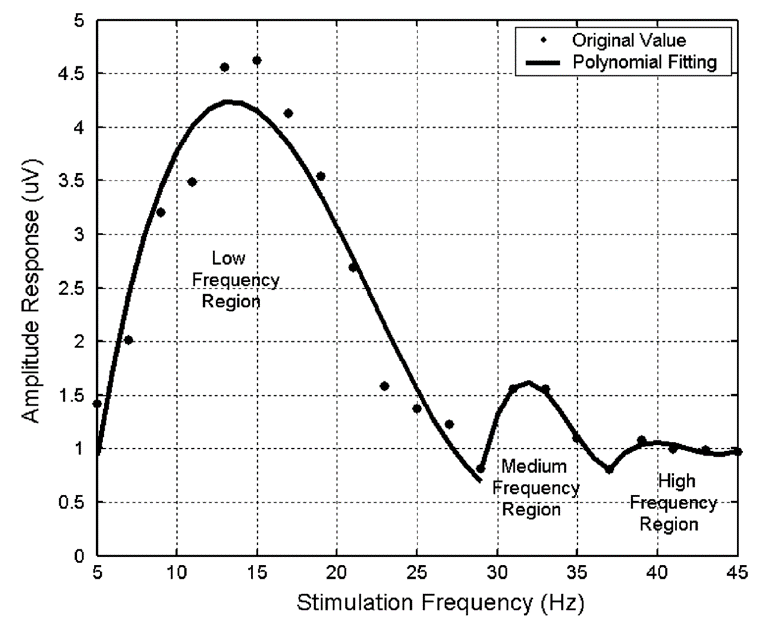

# 中高频SSVEP-BCI系统研究综述-文献调研

## 频率范围定义
不同文献对于 SSVEP 刺激频率区间的划分方式大同小异：*Yijun Wang* 在 2007 年的[早期研究][0216-1]中粗略地将其划分为三个频段：低频段（5-30 Hz）、中频段（31-35 Hz）以及高频段（39-45 Hz）。这种划分方式的主要依据是特征信号的平均幅-频响应拟合曲线图，区分标准取决于很多因素：受试者脑电特征的强弱、实验数据采集是否规范、数据处理流程是否合适等等。

## 编码范式

## 解码算法

[0216-1]: http://ieeexplore.ieee.org/document/1499837/
