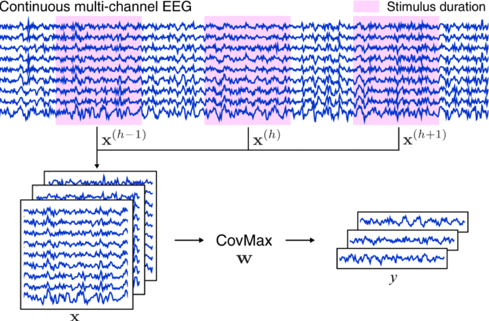

# 普通/集成 TRCA
## (Ensemble) Task-Related Component Analysis, (e)TRCA

### [论文链接][TRCA]

与此前基于 CCA 改进的 SSVEP 算法相比，TRCA 在构建思路上存在较大差别，具体表现在其关注对象（即信号模板）不再限定为具有正余弦波动性质的传统模型，而是充分包含了个体信息的 “任务相关成分”（Task-related components, TRCs）。关于TRC可以简单理解为：当受试者在多次接受相同任务时，其 EEG 信号中应当包含具有相同性质的诱发成分。由此可见，TRCA 在理论上适用于任何诱发信号具有稳定波形特征的 BCI 范式特征信号解码。



Nakanishi 等人首次将 TRCA 应用至 SSVEP 信号解码上时，在公式推导部分使用了一个非常讨巧的办法：**跨试次信号相关性最大化**。之所以称其“讨巧”，是因为原版 TRCA 公式回避了很多关键物理意义问题，用几近感性认识一般的操作去掩盖了实际上非常重要的物理过程，这就导致理论与实践过程的脱节：例如分子中强调的**跨试次协方差计算**操作，在编程过程中会产生大量冗余计算步骤；分母的**矩阵拼接**操作也缺乏明确的物理意义对应说明。而上述“瑕疵”在后续算法改进工作中被不断研究透彻。因此本文不再按照原文思路推导算法，仅给出相对成熟的阐释：

对于第 $k$ 类别、第 $i$、$j$ 试次数据 $\pmb{X}_k^i$、$\pmb{X}_k^j \in \mathbb{R}^{N_c \times N_p}$（假定 $i \ne j$），其跨试次样本协方差以及单试次样本方差（自协方差）分别为：
$$
{\rm Cov} \left(\pmb{w}_k \pmb{X}_k^i, \pmb{w}_k \pmb{X}_k^j \right) = \dfrac{1} {N_p-1} \pmb{w}_k \pmb{X}_k^i {\pmb{X}_k^j}^T {\pmb{w}_k}^T, i \ne j
\tag{1}
$$
$$
{\rm Var} \left(\pmb{w}_k \pmb{X}_k^i \right) = {\rm Cov} \left(\pmb{w}_k \pmb{X}_k^i, \pmb{w}_k \pmb{X}_k^j \right) = \dfrac{1}{N_p-1} \pmb{w}_k \pmb{X}_k^i {\pmb{X}_k^i}^T {\pmb{w}_k}^T 
\tag{2}
$$
因此，TRCA 的目标函数可写为：
$$
\hat{\pmb{w}}_k = 
\underset{\pmb{w}_k} \argmax
\dfrac{\sum_{j=1, j \ne i}^{N_t} \sum_{i=1}^{N_t} {\rm Cov} \left(\pmb{w}_k \pmb{X}_k^i, \pmb{w}_k \pmb{X}_k^j \right)} {\sum_{i=1}^{N_t} {\rm Var} \left(\pmb{w}_k \pmb{X}_k^i \right)} = 
\underset{\pmb{w}_k} \argmax 
\dfrac{\pmb{w}_k \pmb{S}_k {\pmb{w}_k}^T} {\pmb{w}_k \pmb{Q}_k {\pmb{w}_k}^T}
\tag{3}
$$
$$
\pmb{S}_k = \sum_{j=1,j \ne i}^{N_t} \sum_{i=1}^{N_t} \pmb{X}_k^i {\pmb{X}_k^j}^T, \ \pmb{Q}_k = \sum_{i=1}^{N_t} \pmb{X}_k^i {\pmb{X}_k^i}^T
\tag{4}
$$
根据广义瑞利商的结论，上述目标函数的单维度最优解即为方阵 ${\pmb{Q}_k}^{-1} \pmb{S}_k$ 的最大特征值对应的特征向量。接下来对TRCA的目标函数作进一步分析：
$$
\pmb{S}_k = \sum_{j=1}^{N_t} \sum_{i=1}^{N_t} \pmb{X}_k^i {\pmb{X}_k^j}^T - \pmb{Q}_k = 
{N_t}^2 \bar{X}_k {\bar{X}_k}^T - \pmb{Q}_k = 
\pmb{S}_k^{'} - \pmb{Q}_k
\tag {5}
$$
$$
\dfrac{\pmb{w}_k \pmb{S}_k {\pmb{w}_k}^T} {\pmb{w}_k \pmb{Q}_k {\pmb{w}_k}^T} = 
\dfrac{\pmb{w}_k \pmb{S}_k^{'} {\pmb{w}_k}^T} {\pmb{w}_k \pmb{Q}_k {\pmb{w}_k}^T} - 1
\tag {6}
$$
相比于直接计算 $\pmb{S}_k$，经由 $\pmb{S}_k^{'}$ 替换或计算得到 $\pmb{S}_k$ 能够大幅提升运算速度。其原因如下：将单次浮点数相乘与相加设为两种单位操作，其耗时分别为 $T_{\times}$ 和 $T_+$，对应时间复杂度分别为 $O_{\times}$ 与 $O_+$。则针对 $\pmb{X}_k^i$ 执行一次矩阵乘法 $\pmb{X}_k^i {\pmb{X}_k^i}^T$ 或矩阵加法 $\pmb{X}_k^i + \pmb{X}_k^j$ 所需的理论运行时间 $T_{M \times}$、$T_{M+}$ 分别为：
$$
T_{M \times} = \left({N_c}^2 N_p \right) T_+ + \left[{N_c}^2 (N_p-1) \right]T_{\times}
\tag{7}
$$
$$
T_{M+} = (N_c N_p)T_+
\tag{8}
$$
对于具有 $\mathbb{R}^{N_t \times N_c \times N_p}$ 维度的训练数据张量 $\pmb{X}_k$，求解 $\pmb{S}_k$ 的总计理论时间 $T_1$ 与时间复杂度 $O_1$ 分别为：
$$
T_1 = N_t \left(N_t-1 \right) T_{M \times} + \left[N_t(N_t-1)-1 \right] T_{M+}
\tag{9}
$$
$$
O_1 = O_{\times} \left({N_t}^2 {N_c}^2 N_p \right) + O_+ \left({N_t}^2 {N_c}^2 N_p \right) 
\tag{10}
$$
而使用 $\pmb{S}_k^{'}$ 时，首先计算按试次平均后的个体模板 $\bar{\pmb{X}}_k$，其理论运行时间 $T_0$ 为：
$$
T_0 = \left(N_c N_p \right)T_{\times} + \left(N_t-1 \right) T_{M+}
\tag{11}
$$
$\pmb{S}_k^{'}$ 的总计理论计算时间 $T_2$ 与时间复杂度 $O_2$ 分别为：
$$
T_2 = T_0 + T_{M \times}
\tag{12}
$$
$$
O_2 = O_{\times} \left({N_c}^2 N_p \right) + O_+ \left[\max \left(N_t N_c N_p, {N_c}^2 N_p \right) \right]
\tag {13}
$$
对比 $O_1$ 与 $O_2$ 可见，样本数量越多，采用该种替换方法与原始情况所产生的偏差越小、速度提升越大。

综上所述，通过训练数据获取当前类别专属的空间滤波器 $\hat{\pmb{w}}_k$ 以及信号模板 $\hat{\pmb{w}}_k \bar{\pmb{X}}_k$，基于一维 Pearson 相关系数公式，对单试次测试数据 $\pmb{\chi}$ 应用空间滤波后与模板信号计算判别系数：
$$
\rho_k = {\rm corr} \left(\hat{\pmb{w}}_k \bar{\pmb{X}}_k, \hat{\pmb{w}}_k \pmb{\chi} \right)
\tag {14}
$$
eTRCA 是基于 TRCA 的集成学习版本，它把各类别 $\hat{\pmb{w}}_k \in \mathbb{R}^{1 \times N_c}$ 按行拼接在一起组成高维滤波器 $\hat{\pmb{W}}$，通过计算二维 Pearson 相关系数完成信号的模式识别：
$$
\begin{cases}
\hat{\pmb{W}} = 
\begin{bmatrix}
\hat{\pmb{w}}_1\\
\hat{\pmb{w}}_2\\
\vdots\\
\hat{\pmb{w}}_{N_e}\\
\end{bmatrix} \in \mathbb{R}^{N_e \times N_c}\\
\\
\rho_k = {\rm corr}2 \left(\hat{\pmb{W}} \bar{\pmb{X}}_k, \hat{\pmb{W}} \pmb{\chi} \right)
\end{cases}
\tag {15}
$$
其中 ${\rm corr}2()$ 函数本质上就是先把一个二维矩阵按行拉平变成一维序列，之后再计算一维 Pearson 系数。关于这个过程，Matlab 的 **corr2()** 函数给出了一种更适合编程的高效运算方法。对于同维度二维矩阵 $\pmb{A} = [a_{ij}]_{m \times n}$，$\pmb{B} = [b_{ij}]_{m \times n}$，计算矩阵中心 $\bar{\bar{\pmb{A}}}$、$\bar{\bar{\pmb{B}}}$：
$$
\bar{\bar{\pmb{A}}} = \sum_{j=1}^m \sum_{i=1}^n a_{ij} = \sum\sum a_{ij},  \ \bar{\bar{\pmb{B}}} = \sum\sum b_{ij}
\tag{16}
$$
$$
{\rm corr}2(\pmb{A}, \pmb{B}) = \dfrac{\sum\sum \left(a_{ij} - \bar{\bar{\pmb{A}}}\right)\left(b_{ij} - \bar{\bar{\pmb{B}}}\right)} {\sqrt{\sum\sum \left(a_{ij} - \bar{\bar{\pmb{A}}} \right)^2} \sqrt{\sum\sum \left(b_{ij} - \bar{\bar{\pmb{B}}} \right)^2}}
\tag{17}
$$
别被式 (17) 一层又一层的叠加操作唬住了，在 `ndarray` 的基础上很容易就能将其复现出来。由于避免了大矩阵变量的维度变换，运算速度会有显著提升：
```python
import numpy as np
def {\rm corr}2_coef(X, Y):
    """2-D Pearson {\rm corr}elation coefficient
    Args:
        X (ndarray): (m,n)
        Y (ndarray): (m,n)
    Returns:
        coef (float)
    """
    mean_X, mean_Y = X.mean(), Y.mean()  # matrix center
    decen_X, decen_Y = X-mean_X, Y-mean_Y  # decentralized matrix
    numerator = np.einsum('ij->', decen_X*decen_Y)
    denominator_X = np.einsum('ij->', decen_X**2)
    denominator_Y = np.einsum('ij->', decen_Y**2)
    coef = numerator/np.sqrt(denominator_X*denominator_Y)
    return coef
```
论文中关于所谓的集成思想有这样一段描述：
> Since there are $N_f$ individual calibration data {\rm corr}esponding to all visual stimuli, $N_f$ different spatial filters can be obtained. Ideally, they should be similar to each other because the mixing coefficients from SSVEP source signals to scalp recordings could be considered similar within the used frequency range, which indicates the possibility of further improvements by intergrating all spatial filters.

翻译一下，Nakanishi 认为 8 - 15.8 Hz 刺激诱发的共计 40 类 SSVEP，彼此之间对应的空间滤波器应当是相似的，因为刺激频段比较窄，诱发脑电的头皮分布模式不至于产生过大的变化。所以根据 8 Hz SSVEP 训练得到的空间滤波器（注意这个“**适用**”应当与 TRCA 的目标函数结合理解），将其应用至其它频率信号时，理论上其目标函数，即式 (2) 也能达到比较高的水平，当然这样滤波后的信号质量显然不如“一个萝卜一个坑”，但多多少少能保留相当程度的特征成分。所以将其它类别专属的滤波器用在当前类别上，是变相地扩增了信号模板的空间维度信息。

依我愚见，eTRCA 虽然性能更为强劲，但该算法可能存在原理性缺陷：容易产生冗余成分。在刺激目标较多时，全类别集成似乎并无必要。这一点在 2021 年清华大学 Liu Binchuan 发表的 [TDCA][TDCA] 算法文章中也有所指出，当然人家是大佬，成果已经产出了。鄙人的具体研究工作仍在进行（~~构思~~）中。

至此我们有必要再回顾一下 TRCA 的目标函数：
$$
\hat{\pmb{w}}_k = 
\underset{\pmb{w}_k} \argmax 
\dfrac{\pmb{w}_k \bar{\pmb{X}}_k {\bar{\pmb{X}}_k}^T {\pmb{w}_k}^T} {\pmb{w}_k \left(\sum_{i=1}^{N_t} \pmb{X}_k^i {\pmb{X}_k^i}^T\right) {\pmb{w}_k}^T}
\tag{18}
$$
（i）分子中 $\pmb{w}_k \bar{\pmb{X}}_k {\bar{\pmb{X}}_k}^T {\pmb{w}_k}^T$ 的本质为“**滤波后特征信号的能量**”。训练样本数目越多，叠加平均操作获取的信号模板质量越高，即随机信号成分削减越充分。而且分子能够决定目标函数的最终优化上限。

（ii）分母 $\pmb{w}_k \left(\sum_{i=1}^{N_t} \pmb{X}_k^i {\pmb{X}_k^i}^T\right) {\pmb{w}_k}^T$ 的本质为“**滤波后各试次信号能量之和**”。

（iii）结合上述两点可见，TRCA 的性能优越是原理性的，其结构相当完善。唯一的缺陷在于训练样本数目：当 $N_t$ 较小时，由（i）可知优化目标将产生无法弥补的偏差。因此后续关于 TRCA 的改进，大多针对少样本下获取更稳健的信号模板估计入手，我们将在 (e)TRCA-R、sc-(e)TRCA 等算法中观察到这一倾向。
***

[TRCA]: https://ieeexplore.ieee.org/document/7904641/