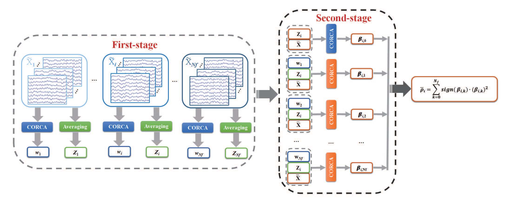

# 双步相关成分分析 TS-CORRCA
## Two-Stage Correlation Component Analysis, TS-CORRCA
***

[论文链接][TS-CORRCA]

在 SSVEP-BCI 的编解码算法领域，殊途同归的事情时有发生。2018 年 Zhang 等人发表在 TNSRE 期刊上的 [CORRCA][CORRCA] 算法，在数学实质上与 TRCA 算法一致，理应导致相同的结果。然而他们在文章中声称获得了超越 TRCA 的分类性能，这一结果可能是数据泄露、预处理方法存在差异等因素导致的。仅仅两个月后，Zhang 等人又发表了 CORRCA 的改进版本。这次他们似乎学乖了，不再碰瓷 (e)TRCA，转头对比了 CCA、eCCA、FBCCA 等性能稍弱的算法，并取得优势结果。

[CORRCA]: https://ieeexplore.ieee.org/document/8337800/
[TS-CORRCA]: https://ieeexplore.ieee.org/document/8387802/