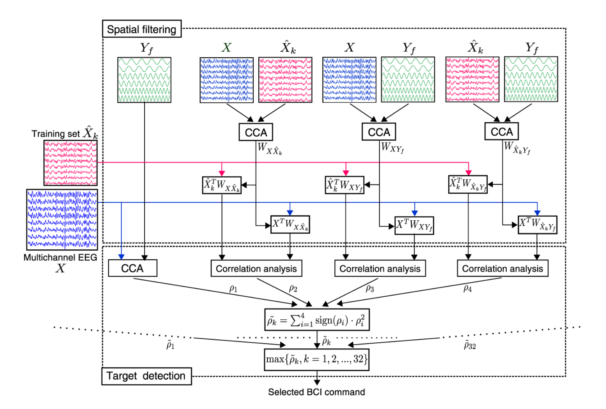

# 扩展 CCA：
## Extended CCA, eCCA
***

### [论文链接][eCCA]

扩展扩展，顾名思义就是个缝合怪（~~不是~~）。根据 CCA 与 itCCA，大伙不难发现，只要替换一下送进目标函数的数据矩阵，就能“创造”出一种新的 CCA 算法。把常用的 $\pmb{\mathcal{X}}$、$\pmb{Y}_k$、$\bar{\pmb{X}}_k$ 都往里套，在滤波器计算以及后端模板匹配上进行各种组合，最终就形成了 eCCA。

这个算法说起来也算是劳模了（~~颇有一稿多投之嫌~~），我给大家缕一缕这个感情线。Nakanishi 以一作身份在 2014 年发表的[文章][ex2] 中提出了名为 “CCA with SSVEP training data” 的算法，使用了 4 种判别系数，还给出了一张我认为目前逻辑最清楚的示意图：

同年 EMBC [会议][ex3]上，Yijun Wang 等人炒了一遍冷饭，算法细节一模一样；

下一年（2015），Xiaogang Chen 等人在顶刊 PNAS 上提出了名为“CCA with individual calibration data”的算法，使用了 5 种判别系数。虽然没有明确使用“eCCA”这个名称，但是自此之后，大家提到 eCCA 时，默认使用的都是发表在 PNAS 上的这个版本。

尽管前后三篇文章一作不同，但兜兜转转总是那么几个人，真可谓“肥水不流外人田”了。言归正传，我们来看看算法。之前也有提到，eCCA 是各种单体 CCA 的集合，因此具体目标函数我就不再赘述了，以 $CCA(*)$ 表示滤波器的相应计算过程：
$$
\begin{cases}
\hat{\pmb{u}}_{\pmb{\mathcal{X}} \pmb{Y}, k}, \hat{\pmb{v}}_{\pmb{\mathcal{X}} \pmb{Y}, k} = {\rm CCA}(\pmb{\mathcal{X}},\pmb{Y}_k)\\
\ \\
\hat{\pmb{u}}_{\pmb{\mathcal{X}} \bar{\pmb{X}}, k}, \hat{\pmb{v}}_{\pmb{\mathcal{X}} \bar{\pmb{X}},k} = {\rm CCA}(\pmb{\mathcal{X}},\bar{\pmb{X}}_k)\\
\ \\
\hat{\pmb{u}}_{\bar{\pmb{X}} \pmb{Y},k}, \hat{\pmb{v}}_{\bar{\pmb{X}} \pmb{Y},k} = {\rm CCA}(\bar{\pmb{X}}_k,\pmb{Y}_k)\\
\end{cases}
\tag{1}
$$
三种数据，六个滤波器，除了正余弦模板的维度比较特殊以外，剩下的任意“数据 + 滤波器”都能获得一种投影序列，彼此之间又能计算相关系数：
$$
\begin{cases}
\pmb{\mathcal{X}}: \ \hat{\pmb{u}}_{\pmb{\mathcal{X}} \pmb{Y}, k}, \ \hat{\pmb{u}}_{\pmb{\mathcal{X}} \bar{\pmb{X}}, k}, \ \hat{\pmb{v}}_{\pmb{\mathcal{X}} \bar{\pmb{X}},k}, \ \hat{\pmb{u}}_{\bar{\pmb{X}} \pmb{Y},k} \ \rightarrow (4)\\
\ \\
\bar{\pmb{X}}_k: \ \hat{\pmb{u}}_{\pmb{\mathcal{X}} \pmb{Y}, k}, \ \hat{\pmb{u}}_{\pmb{\mathcal{X}} \bar{\pmb{X}}, k}, \ \hat{\pmb{v}}_{\pmb{\mathcal{X}} \bar{\pmb{X}},k}, \ \hat{\pmb{u}}_{\bar{\pmb{X}} \pmb{Y},k} \ \ \rightarrow (4)\\
\ \\
\pmb{Y}_k: \ \hat{\pmb{v}}_{\pmb{\mathcal{X}} \pmb{Y}, k}, \ \hat{\pmb{v}}_{\bar{\pmb{X}} \pmb{Y},k} \ \ \rightarrow (2)\\
\end{cases}
\tag{2}
$$
由上可知，共有 $4 \times 4 + 4 \times 2 \times 2 = 32$ 种组合。你说把这些相关系数都加起来……也不是不行。单从编程角度来看是不复杂的，无非是写几个循环罢了。但是不同系数所代表的物理含义、作用大小必然是各不一样。是否分配相等的权重？如何分配权重等等诸如此类的问题很难进行有价值的深入探讨，因此我们通常需要对其进行筛选。先来说说**最好予以剔除**的组合：

（1）经过不同滤波器处理后的**相同数据**：我们很难仅凭滤波器的信号质量优化差异判断出所属类别；

（2）**叠加平均信号**与**人工正余弦模板**：道理与 (1) 类似。除此之外，$\pmb{Y}_k$、$\bar{\pmb{X}}_k$ 作为模板，在实际测试过程中需要控制类别相同，进一步说明这类系数不具备类别筛选的作用。

再来看看可以保留的部分：

（3）根据 (1) 的前两个 CCA 模型可以直接确定两个判别系数（由 (2) 可知，第三个模型不以这种形式使用）：
$$
\begin{cases}
\rho_{k1} = {\rm corr} \left( \hat{\pmb{u}}_{\pmb{\mathcal{X}} \pmb{Y}, k} \pmb{\mathcal{X}}, \ \hat{\pmb{v}}_{\pmb{\mathcal{X}} \pmb{Y}, k} \pmb{Y}_k \right) \ ({\rm CCA})\\
\ \\
\rho_{k2} = {\rm corr} \left( \hat{\pmb{u}}_{\pmb{\mathcal{X}} \bar{\pmb{X}}, k} \pmb{\mathcal{X}}, \hat{\pmb{v}}_{\pmb{\mathcal{X}} \bar{\pmb{X}}, k} \bar{\pmb{X}}_k \right) \ ({\rm itCCA})\\
\end{cases}
\tag{3}
$$
（4）式 (1) 的第一个 CCA 模型强化的是测试数据与某频率人工正余弦模板的相似度，第三个模型强化的是该频率训练数据与对应正余弦模板的相似度。而模板匹配的原则就是假设测试数据与匹配对象具有**统一性**，之后再去设法考察统一性的大小水平。基于这种假设，$\bar{\pmb{X}}$ 与 $\pmb{\mathcal{X}}$ 的 CCA 滤波器是可以通用的：
$$
\begin{cases}
\rho_{k3} = {\rm corr} \left( \hat{\pmb{u}}_{\pmb{\mathcal{X}} \pmb{Y}, k} \pmb{\mathcal{X}}, \ \hat{\pmb{u}}_{\pmb{\mathcal{X}} \pmb{Y}, k} \bar{\pmb{X}}_k \right)\\
\ \\
\rho_{k4} = {\rm corr} \left( \hat{\pmb{u}}_{\bar{\pmb{X}} \pmb{Y},k} \pmb{\mathcal{X}}, \hat{\pmb{u}}_{\bar{\pmb{X}} \pmb{Y},k} \bar{\pmb{X}}_k \right)\\
\end{cases} \ ({\rm CCA} + {\rm itCCA})
\tag{4}
$$
（5）这篇 PNAS 的作者团队硬是打破了 (1) 的界限，强行加上了一个系数用来比较**滤波器之间的相似性**。目前没有明确证据表明，增加这个系数有助于提高分类器性能（~~都发顶刊了一般人也不会想着去质疑他们吧~~）。我 CCA 算法用得比较少，因此不做定性判断：
$$
\rho_{k5} = {\rm corr} \left( \hat{\pmb{u}}_{\pmb{\mathcal{X}} \bar{\pmb{X}}, k} \bar{\pmb{X}}_k, \ \hat{\pmb{v}}_{\pmb{\mathcal{X}} \bar{\pmb{X}}, k} \bar{\pmb{X}}_k \right)
\tag{5}
$$
按理来说， (5) 能用，剩下那些组合都有登场的潜力，感兴趣的朋友可以自行测试。综上所述，目前一般语义下的 eCCA 包含五种判别系数：
$$
\hat{k} = \underset{k} \argmax{\{\sum_{i=1}^5{\rho_{ki}} \ | \ k=1,2,\cdots,N_e \}}
\tag{6}
$$
***

[ex2]: https://www.worldscientific.com/doi/abs/10.1142/S0129065714500191
[ex3]: http://ieeexplore.ieee.org/document/6944263/
[eCCA]: http://www.pnas.org/lookup/doi/10.1073/pnas.1508080112