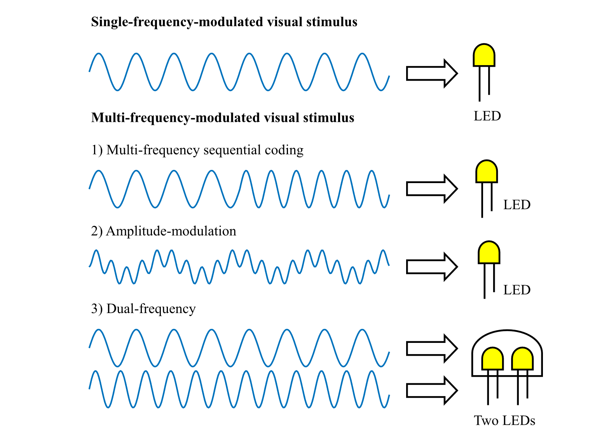
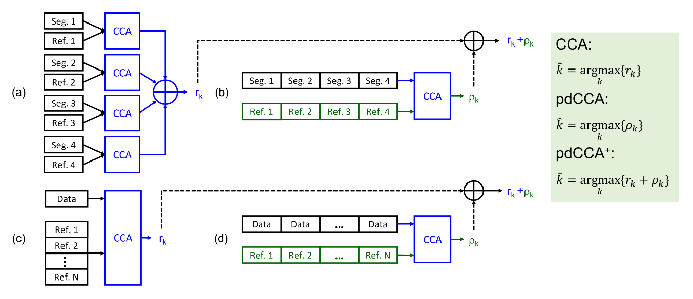
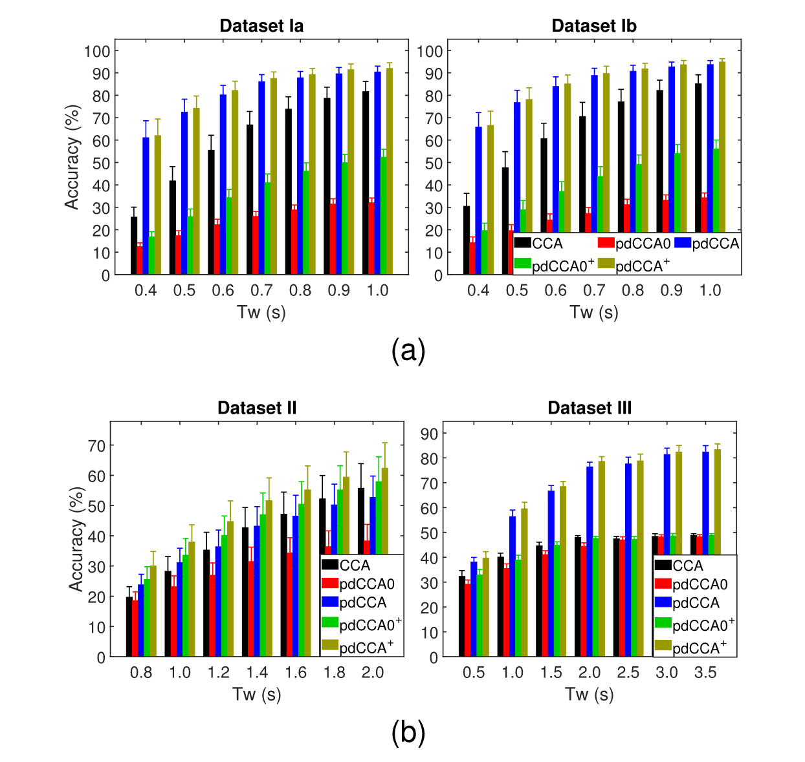

# 相位差异约束 CCA
## Phase Difference Constrained CCA, pdCCA
***

[论文链接][pdCCA]

没想到总有一天，我也会期待 Wong 发表的论文。抛开数学墙的问题不谈，他的公式推导虽然复杂，但在数学逻辑上绝对靠谱。（~~这里点名批评 TDCA~~）这次 Wong 发表在 TNSRE 上的无监督算法 pdCCA 走起了亲民路线，pdCCA 与标准 CCA 在运算流程上并无二样，关键差异在于他为一些特殊 SSVEP 范式量身定制的人工参考模板。Wong 成功地让这些冷门范式设计以及相应的公开数据集重回研究者视野，并给这盘回锅肉加上了特制料汁（希腊字母变量）与独家香料（simple ideas, complex formula），让人一眼就能认出是他的手笔。

pdCCA 面向的范式主要有三种：Code Words、双频刺激以及幅度调制（Amplitude-modulation）刺激。

（i）Code Words 范式是一类基于频控键移（Frequency Shift Keying, FSK）或多频序列（Multiple Frequencies Sequential Coding, MFSC）技术设计的、具有时间编码特性的 SSVEP 范式，将短时长 SSVEP 刺激作为单位码元，通过有限频率与编码技术的组合能够极大程度地提高可用编码指令集数目。

（ii）双频刺激通过同时施加两种频率诱发具有复合频率成分的特征信号。双频刺激通常有两种实现方式，其一是组合两个具有不同闪烁频率的 LED 构成刺激单元，其二是为刺激区域（显示屏）中相邻像素点分配两种闪烁频率。双频刺激诱发信号除了具备两种刺激频率（主频 $f_1$、$f_2$）及其各自谐频成分以外，还有丰富的交叉调制（cross-modulation）频率成分，如 $f_1 + f_2$、$f_1 - f_2$、$f_1 + n f_2$、$nf_1 + f_2$、$nf_1 + nf_2$ 等。

（iii）幅度调制刺激是另一种简单直接的范式，其诱发成分相比双频刺激而言要单纯许多，通常仅包含载波、调制波以及两者之和的基频与多次倍频成分。

在了解了特殊 SSVEP 刺激范式之后，我们来关注算法细节。在文章的开头 Wong 给我们展示了一张“太长不看”风格的算法示意图，新算法的全部要义都在绿色方框之中。

对于 MFSC 范式，基于 CCA 的传统无监督算法（以下简称 CCA 算法）通常面向单位码元进行逐次识别判定。对于 $N_e$ 指令集、$N_m$ 编码长度的 MFSC 范式，训练数据中第 $i$ 试次、第 $k$ 个 Code Words 记为 $\pmb{\mathcal{X}}_k^i$，其中第 $m$ 个 Code 记为 $\pmb{X}_{k,m}^i$，对应的人工正余弦模板记为 $\pmb{Y}_{f_{k,m},\phi_{k,m}}$。$f_{k,m}$、$\phi_{k,m}$ 分别表示当前 Code 的理论刺激频率与初始相位，$\pmb{\Gamma}_{f_{k,m}, \phi_{k,m}} \in \mathbb{R}^{2\times N_p}$ 表示频率 $f_{k,m}$、相位 $\phi_{k,m}$ 的正余弦组合时间向量：
$$
    \begin{align}
        \notag
        \pmb{\mathcal{X}}_k^i &= 
        \begin{bmatrix}
            \pmb{X}_{k,1}^i & \pmb{X}_{k,2}^i & \cdots & \pmb{X}_{k,N_m}^i
        \end{bmatrix} \in \mathbb{R}^{N_c \times \left(N_m N_p \right)}, \ \ \pmb{X}_{k,m}^i \in \mathbb{R}^{N_c \times N_p}\\
        \notag \ \\
        \notag
        \pmb{Y}_{f_{k,m},\phi_{k,m}} &= 
        \begin{bmatrix}
            \sin \left( 2 \pi f_{k,m} \pmb{t} +\phi_{k,m} \right)\\
            \cos \left( 2 \pi f_{k,m} \pmb{t} +\phi_{k,m} \right)\\
            \sin \left( 4 \pi f_{k,m} \pmb{t} + 2 \phi_{k,m} \right)\\
            \cos \left( 4 \pi f_{k,m} \pmb{t} + 2 \phi_{k,m} \right)\\
            \vdots \\
            \sin \left( 2 \pi N_h f_{k,m} \pmb{t} + N_h \phi_{k,m} \right)\\
            \cos \left( 2 \pi N_h f_{k,m} \pmb{t} + N_h \phi_{k,m} \right)\\
        \end{bmatrix} = 
        \begin{bmatrix}
            \pmb{\Gamma}_{f_{k,m}, \phi_{k,m}}\\
            \ \\
            \pmb{\Gamma}_{2 f_{k,m}, 2 \phi_{k,m}}\\
            \ \\
            \vdots\\
            \ \\
            \pmb{\Gamma}_{N_h f_{k,m}, N_h \phi_{k,m}}\\
        \end{bmatrix} \in \mathbb{R}^{2N_h \times N_p}, \ \ \pmb{t} = 
        \begin{bmatrix}
            \dfrac{1}{f_s},\dfrac{2}{f_s},\cdots,\dfrac{N_p}{f_s}
        \end{bmatrix}
    \end{align}
    \tag{1}
$$
基于 CCA 的判别系数 $\rho_k^i$ 计算方法如下：
$$
    \begin{align}
        \notag
        \hat{\pmb{u}}_{k,m}^i, \hat{\pmb{v}}_{k,m}^i &= \underset{\pmb{u}_{k,m}^i,\pmb{v}_{k,m}^i} \argmax \dfrac{\pmb{u}_{k,m}^i \pmb{X}_{k,m}^i {\pmb{Y}_{f_{k,m},\phi_{k,m}}}^T {\pmb{u}_{k,m}^i}^T} {\sqrt{\pmb{u}_{k,m}^i \pmb{X}_{k,m}^i {\pmb{X}_{k,m}^i}^T {\pmb{u}_{k,m}^i}^T} \sqrt{\pmb{v}_{k,m}^i \pmb{Y}_{f_{k,m},\phi_{k,m}} {\pmb{Y}_{f_{k,m},\phi_{k,m}}}^T {\pmb{v}_{k,m}^i}^T}}\\
        \notag \ \\
        \notag
        \rho_k^i &= \sum_{m=1}^{N_m} {\rm corr} \left( \hat{\pmb{u}}_{k,m}^i \pmb{X}_{k,m}^i, \ \hat{\pmb{v}}_{k,m}^i \pmb{Y}_{f_{k,m},\phi_{k,m}} \right) = \sum_{m=1}^{N_m} {\rm CCA} \left( \pmb{X}_{k,m}^i, \ \pmb{Y}_{f_{k,m},\phi_{k,m}} \right)
    \end{align}
    \tag{2}
$$
CCA 的运算流程在其它章节已有详细介绍，下文将用 ${\rm CCA} \left( \pmb{X}, \ \pmb{Y} \right)$ 予以代替。该方法存在两个主要缺陷：

（i）有效信号的识别长度偏短：单位码元的长度通常在 1 s 以内，且相邻码元的切换过程可能会对信号波形产生不可知的影响，因此实际有效信号长度会更短；

（ii）编码集设计影响识别效果：对于稠密编码集（如二进制满容量编码），当 Code Words 中的某一个 Code 识别错误时，即使剩下的 Code 全部识别正确，最终输出结果也是错误的。对于稀疏编码集，即使部分 Code 识别错误，由于编码集中没有对应的 Code Words，因此通过一些排杂的纠错机制依然有机会输出正确的结果。例如将“1234”识别成“1235”时，由于编码集中没有其它“123x”类型的 Code Words，因此根据先验知识我们能够将其纠正为“1234”并输出。

针对上述缺陷，pdCCA 构建了完整长度的人工模板 $\pmb{\mathcal{Y}}_k$ 对 Code Words 进行整体识别，识别结果可作为传统 CCA 方法的补充：
$$
    \begin{align}
        \notag
        \pmb{\mathcal{Y}}_k &= 
        \begin{bmatrix}
            \pmb{Y}_{f_{k,1},\phi_{k,1}} & \pmb{Y}_{f_{k,2},\phi_{k,2}} & \cdots & \pmb{Y}_{f_{k,N_m},\phi_{k,N_m}}
        \end{bmatrix} \in \mathbb{R}^{2N_h \times \left( N_m N_p \right)}\\
        \notag \ \\
        \notag
        \pmb{\mathcal{Y}}_{k,(0)} &= 
        \begin{bmatrix}
            \pmb{Y}_{f_{k,1},0} & \pmb{Y}_{f_{k,2},0} & \cdots & \pmb{Y}_{f_{k,N_m},0}
        \end{bmatrix} \in \mathbb{R}^{2N_h \times \left( N_m N_p \right)}\\
    \end{align}
    \tag{3}
$$
$\pmb{\mathcal{Y}}_{k,(0)}$ 是 $\pmb{\mathcal{Y}}_k$ 去除了相位信息的版本（对照组），文章内用于说明相位差异信息对于人工构建正余弦模板的重要性。本文设计了四种算法：pdCCA $\left( \eta_k^i \right)$、pdCCA$^+$ $\left( \eta_k^{i,+} \right)$、pdCCA$_{(0)}$ $\left( \eta_{k,(0)}^i \right)$、pdCCA$_{(0)}^+$ $\left( \eta_{k,(0)}^{i,+} \right)$，各判别系数计算方法分别如下所示：
$$
    \begin{align}
        \notag
        \eta_k^i &= {\rm CCA} \left( \pmb{\mathcal{X}}_k^i, \ \pmb{\mathcal{Y}}_k \right), \ \ \eta_k^{i,+} = \eta_k^i + \rho_k^i\\
        \notag \ \\
        \notag
        \eta_{k,(0)}^i &= {\rm CCA} \left( \pmb{\mathcal{X}}_k^i, \ \pmb{\mathcal{Y}}_{k,(0)} \right), \ \ \eta_{k,(0)}^{i,+} = \eta_{k,(0)}^i + \rho_k^i\\
    \end{align}
    \tag{4}
$$

对于双频 SSVEP 范式，CCA 算法通常将所有预设频率成分对应的正余弦模板按空间维度拼接构成新的人工模板。例如第 $k$ 类刺激（主频 $f_{k,1}$、$f_{k,2}$，初始相位 $\phi_{k,1}$、$\phi_{k,2}$）的模板 $\pmb{\mathcal{Y}}_k^{\rm{CCA}}$ 为：
$$
    \pmb{\mathcal{Y}}_k^{\rm{CCA}} = 
    \begin{bmatrix}
        \pmb{Y}_{f_{k,1},0} \\
        \pmb{Y}_{f_{k,2},0} \\
        \pmb{Y}_{f_{k,1}+f_{k,2},0} \\
        \pmb{\Gamma}_{2f_{k,1}+f_{k,2},0} \\
        \vdots \\
        \pmb{\Gamma}_{N_h f_{k,1}+f_{k,2},0} \\
        \pmb{\Gamma}_{f_{k,1}+ 2f_{k,2},0} \\
        \vdots \\
        \pmb{\Gamma}_{f_{k,1}+N_h f_{k,2},0}
    \end{bmatrix} \in \mathbb{R}^{(10N_h-4) \times N_p}
    \tag{5}
$$
这种仅集中于空间维度的过度逆向分解（正向合成）可能会导致有效特征的淹没。因此 pdCCA 选择在时间维度扩增原始信号 $\pmb{\mathcal{X}}_k^i = \left[\pmb{X}_k^i \ \ \pmb{X}_k^i \ \ \pmb{X}_k^i \ \ \pmb{X}_k^i \ \ \pmb{X}_k^i \right]$，在时-空维度扩增模板信号，同时引入刺激源的相位信息。定义主频 $f_{k,1}$ 的交叉调制信号模板为 $\pmb{{Y}}_{mf_{k,1}+f_{k,2},m\phi_{k,1}+\phi_{k,2}}$：
$$
    \pmb{Y}_{mf_{k,1}+f_{k,2},m\phi_{k,1}+\phi_{k,2}} = 
    \begin{bmatrix}
        \pmb{\Gamma}_{f_{k,1}+f_{k,2},\phi_{k,1}+\phi_{k,2}}\\
        \ \\
        \pmb{\Gamma}_{2f_{k,1}+f_{k,2},2\phi_{k,1}+\phi_{k,2}}\\
        \ \\
        \vdots\\
        \ \\
        \pmb{\Gamma}_{N_h f_{k,1}+f_{k,2},\phi_{k,1}+\phi_{k,2}}\\
    \end{bmatrix} \in \mathbb{R}^{2N_h \times N_p}
    \tag{6}
$$
pdCCA 设计的人工模板为：
$$
    \begin{align}
        \notag \pmb{\mathcal{Y}}_k^{\rm{pdCCA}} &= 
            \begin{bmatrix}
                \pmb{\Gamma}_{f_{k,1},\phi_{k,1}} & \pmb{\Gamma}_{f_{k,2},\phi_{k,2}} & \pmb{\Gamma}_{f_{k,1}+f_{k,2},\phi_{k,1}+\phi_{k,2}} & \pmb{\Gamma}_{f_{k,1}+f_{k,2},\phi_{k,1}+\phi_{k,2}} & \pmb{\Gamma}_{f_{k,1}+f_{k,2},\phi_{k,1}+\phi_{k,2}}\\
                \ \\
                \pmb{\Gamma}_{2f_{k,1},2\phi_{k,1}} & \pmb{\Gamma}_{2f_{k,2},2\phi_{k,2}} & \pmb{\Gamma}_{2 \left(f_{k,1}+f_{k,2} \right), 2\left( \phi_{k,1}+\phi_{k,2} \right)} & \pmb{\Gamma}_{2f_{k,1}+f_{k,2},2\phi_{k,1}+\phi_{k,2}} & \pmb{\Gamma}_{f_{k,1}+2f_{k,2},\phi_{k,1}+2\phi_{k,2}}\\
                \ \\
                \vdots & \vdots & \vdots & \vdots & \vdots\\
                \ \\
                \pmb{\Gamma}_{N_h f_{k,1},N_h \phi_{k,1}} & \pmb{\Gamma}_{N_f f_{k,2},N_h \phi_{k,2}} & \pmb{\Gamma}_{N_h \left(f_{k,1}+f_{k,2} \right), N_h \left( \phi_{k,1}+\phi_{k,2} \right)} & \pmb{\Gamma}_{N_h f_{k,1}+f_{k,2},N_h \phi_{k,1}+\phi_{k,2}} & \pmb{\Gamma}_{f_{k,1}+N_h f_{k,2},\phi_{k,1}+N_h \phi_{k,2}}\\
            \end{bmatrix}\\
        \notag \\
        \notag &= 
            \begin{bmatrix}
                \pmb{Y}_{f_{k,1},\phi_{k,1}} & \pmb{Y}_{f_{k,2},\phi_{k,2}} & \pmb{Y}_{f_{k,1}+f_{k,2},\phi_{k,1}+\phi_{k,2}} & \pmb{Y}_{mf_{k,1}+f_{k,2},m\phi_{k,1}+\phi_{k,2}} & \pmb{Y}_{f_{k,1}+mf_{k,2},\phi_{k,1}+m\phi_{k,2}}
            \end{bmatrix} \in \mathbb{R}^{2N_h \times 5N_p}
    \end{align}
    \tag{7}
$$
式 (7) 的后半段是我自己整理的。原版公式（左半段）那真叫一个 Wong 氏“原汁原味”。以前我看着可能会骂街，现在居然会心一笑，看来我多少也是有点成长。同样地，Wong 还设计了 pdCCA$_{(0)}$ 版本以供对照：
$$
    \begin{align}
        \notag \pmb{\mathcal{Y}}_k^{\rm{pdCCA_{(0)}}} &= 
            \begin{bmatrix}
                \pmb{\Gamma}_{f_{k,1}, 0} & \pmb{\Gamma}_{f_{k,2}, 0} & \pmb{\Gamma}_{f_{k,1}+f_{k,2}, 0} & \pmb{\Gamma}_{f_{k,1}+f_{k,2}, 0} & \pmb{\Gamma}_{f_{k,1}+f_{k,2}, 0}\\
                \ \\
                \pmb{\Gamma}_{2f_{k,1}, 0} & \pmb{\Gamma}_{2f_{k,2}, 0} & \pmb{\Gamma}_{2 \left(f_{k,1}+f_{k,2} \right), 0} & \pmb{\Gamma}_{2f_{k,1}+f_{k,2}, 0} & \pmb{\Gamma}_{f_{k,1}+2f_{k,2}, 0}\\
                \ \\
                \vdots & \vdots & \vdots & \vdots & \vdots\\
                \ \\
                \pmb{\Gamma}_{N_h f_{k,1}, 0} & \pmb{\Gamma}_{N_f f_{k,2}, 0} & \pmb{\Gamma}_{N_h \left(f_{k,1}+f_{k,2} \right), 0} & \pmb{\Gamma}_{N_h f_{k,1}+f_{k,2}, 0} & \pmb{\Gamma}_{f_{k,1}+N_h f_{k,2}, 0}\\
            \end{bmatrix}\\
        \notag \\
        \notag &= 
            \begin{bmatrix}
                \pmb{Y}_{f_{k,1}, 0} & \pmb{Y}_{f_{k,2}, 0} & \pmb{Y}_{f_{k,1}+f_{k,2}, 0} & \pmb{Y}_{mf_{k,1}+f_{k,2}, 0} & \pmb{Y}_{f_{k,1}+mf_{k,2}, 0}
            \end{bmatrix} \in \mathbb{R}^{2N_h \times 5N_p}
    \end{align}
    \tag{8}
$$
CCA、pdCCA 等算法的判别系数计算方法如下所示：
$$
    \begin{align}
        \notag \rho_k^i &= {\rm CCA} \left( \pmb{X}_k^i, \ \pmb{\mathcal{Y}}_k^{\rm{CCA}} \right)\\
        \notag \ \\
        \notag  \eta_k^i &= {\rm CCA} \left( \pmb{\mathcal{X}}_k^i, \ \pmb{\mathcal{Y}}_k^{\rm{pdCCA}} \right), \ \ \eta_k^{i,+} = \eta_k^i + \rho_k^i\\
        \notag \ \\
        \notag \eta_{k,(0)}^i &= {\rm CCA} \left( \pmb{\mathcal{X}}_k^i, \ \pmb{\mathcal{Y}}_k^{\rm{pdCCA_{(0)}}} \right), \ \ \eta_{k,(0)}^{i,+} = \eta_{k,(0)}^i + \rho_k^i\\
    \end{align}
    \tag{9}
$$
对于 AM 调制 SSVEP 范式，CCA 算法构建的模板 $\pmb{\mathcal{Y}}_k^{\rm{CCA}}$ 仅包含三组成分：载波 $f_{k,1}$、调制波 $f_{k,2}$ 以及两者之和。同样地在空间维度进行拼接，且不包含刺激初始相位信息：
$$
    \pmb{\mathcal{Y}}_k^{\rm{CCA}} = 
    \begin{bmatrix}
        \pmb{Y}_{f_{k,1},0}\\
        \ \\
        \pmb{Y}_{f_{k,2},0}\\
        \ \\
        \pmb{Y}_{f_{k,1}+f_{k,2},0}\\
    \end{bmatrix} \in \mathbb{R}^{3N_h \times N_p}
    \tag{10}
$$
pdCCA（pdCCA$_{(0)}$）对此作出的改进（补充）是时域扩增以及相位信息引入。各算法判别系数计算方法与式 (9) 相同：
$$
    \begin{align}
        \notag \pmb{\mathcal{Y}}_k^{\rm{pdCCA}} &= 
            \begin{bmatrix}
                \pmb{Y}_{f_{k,1},\phi_{k,1}} & \pmb{Y}_{f_{k,2},\phi_{k,2}} & \pmb{Y}_{f_{k,1}+f_{k,2},\phi_{k,1}+\phi_{k,2}}
            \end{bmatrix}\\
        \notag \\
        \notag \pmb{\mathcal{Y}}_k^{\rm{pdCCA_{(0)}}} &= 
            \begin{bmatrix}
                \pmb{Y}_{f_{k,1},0} & \pmb{Y}_{f_{k,2},0} & \pmb{Y}_{f_{k,1}+f_{k,2},0}
            \end{bmatrix}\\
    \end{align}
    \tag{11}
$$
在本节的最后，给出原文中提供的算法分类结果图，供各位读者参考评价算法性能：

其中 Dataset Ia、Ib 是 Chen 等人设计的 [160 指令集 MFSC 范式][dataset1]数据集，Ia、Ib 分别表示离线、在线实验两部分。Dataset II 是 Wang 等人设计的[双频 SSVEP 刺激范式][dataset2]数据集，Dataset III 是 Wong 自己设计、采集的 AM 调制刺激范式数据集（未公开）。简单分析可知以下几个主要结论：

（i）对于 Code Words 范式，pdCCA$_{(0)}$、pdCCA$_{(0)}^+$ 的表现不如 CCA，而 pdCCA、pdCCA$^+$ 的性能显著优于 CCA。该结果说明相位信息在 Code Words 建模与识别过程中起到了至关重要的作用。忽略码元的相位差异、仅关注频率信息难以保证长序列、大指令条件下模型的准确生成。

（ii）对于双频刺激范式，CCA 与 pdCCA 的差异不明显，而两者均显著弱于 pdCCA$_{(0)}^+$、pdCCA$^+$，说明时域和空间域上的模板扩增效果能够互补增强。pdCCA$_{(0)}$ 的较差表现进一步证明了相位差异信息在模板扩增、无监督模板生成中的关键性作用。

（iii）对于 AM 调制刺激范式，pdCCA、pdCCA$^+$ 算法成功薄纱 CCA，而 pdCCA$_{0}$、pdCCA$_{0}^+$ 的拉跨表现再次回归主旨：pdCCA 系列算法的真正价值在于相位差异信息捕获，而不仅仅是时空域扩增。

[pdCCA]: https://ieeexplore.ieee.org/document/10040695/
[dataset1]: https://iopscience.iop.org/article/10.1088/1741-2552/ac0bfa
[dataset2]: https://iopscience.iop.org/article/10.1088/1741-2552/abaa9b