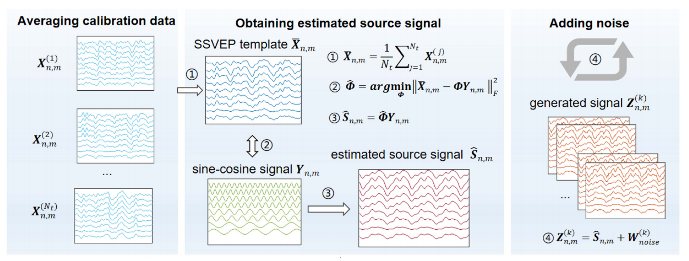
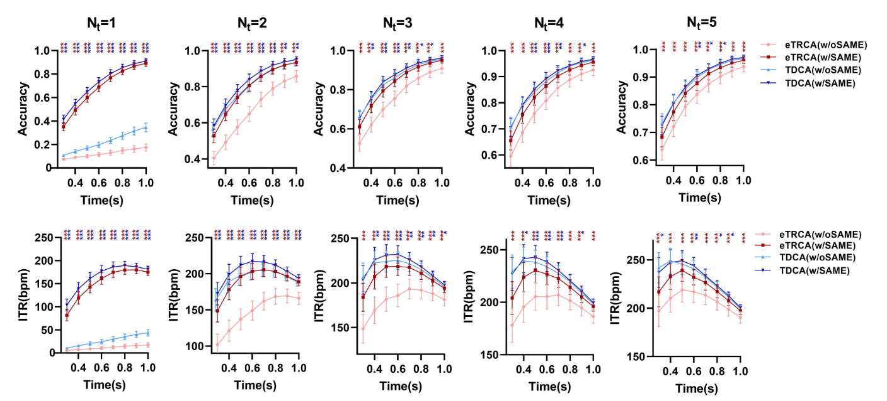

# 源混叠矩阵估计 SAME
## Source Aliasing Matrix Estimation, SAME
***

[论文链接][SAME]

本章节的第一个页面留给我的同组师妹，一位把师兄们卷得死去活来的优秀科研工作者。她设计的 SAME 数据增强方法能够高质量地生成具有受试者个体特征的 SSVEP 训练数据，从而增强后续空间滤波器模型的构建质量。SAME 的数理过程并不复杂，具有精炼简洁之美，而更重要的是，**管用**。

对于受试者的全体训练样本 $\pmb{\mathcal{X}} \in \mathbb{R}^{N_e \times N_t \times N_c \times N_p}$（其中各标量字符在其它章节已有介绍，此处不再赘述），第 $k$ 类别、第 $i$ 试次的多导联数据记为 $\pmb{X}_k^i \in \mathbb{R}^{N_c \times N_p}$，其类别样本中心记为 $\bar{\pmb{X}}_k \in \mathbb{R}^{N_c \times N_p}$：
$$
\bar{\pmb{X}}_k = \dfrac{1}{N_t} \sum_{i=1}^{N_t} \pmb{X}_k^i
$$
根据 SSVEP 的正余弦人工模板构建原理，本文进一步设计了从人工模板（$\pmb{Y}_k \in \mathbb{R}^{\left( 2N_h \right) \times N_p }$）到真实数据的映射（混叠）矩阵，并获取其最小二乘近似解 $\hat{\pmb{\Phi}}_k \in \mathbb{R}^{N_c \times \left( 2N_h \right)}$：
$$
\hat{\pmb{\Phi}}_k = \underset{\pmb{\Phi}_k} \argmin \left\| \bar{\pmb{X}}_k - \pmb{\Phi}_k \pmb{Y}_k \right\|_F^2, \ \ \hat{\pmb{\Phi}}_k = \bar{\pmb{X}}_k {\pmb{Y}_k}^T \left( \pmb{Y}_k {\pmb{Y}_k}^T \right)^{-1}
\tag{1}
$$
与标准 CCA 构建的投影向量不同，混叠矩阵 $\hat{\pmb{\Phi}}_k$ 的投影效果是多维度的，相比前者能够更好地还原 SSVEP 的空间特征信息。此外，文章对人工模板 $\pmb{Y}_k$ 进行了面向滤波器组技术的特殊优化，仅保留当前频段内的理论留存谐波成分：
$$
\pmb{Y}_k^{(m)} = 
\begin{bmatrix}
\sin \left( 2 \pi N_{h,k}^{(m)} f_k \pmb{t} + N_{h,k}^{(m)} \phi_k \right)\\
\ \\
\cos \left( 2 \pi N_{h,k}^{(m)} f_k \pmb{t} + N_{h,k}^{(m)} \phi_k \right)\\
\ \\
\vdots \\
\ \\
\sin \left( 2 \pi N_h f_k \pmb{t} + N_h \phi_k \right)\\
\ \\
\cos \left( 2 \pi N_h f_k \pmb{t} + N_h \phi_k \right)\\
\end{bmatrix}, \ \ \pmb{t} = 
\begin{bmatrix}
\dfrac{1}{f_s} & \dfrac{2}{f_s} & \cdots & \dfrac{N_p}{f_s}\\
\end{bmatrix}
\tag{2}
$$
其中上标 $(m)$ 是滤波器组子带索引，$f_s$ 是采样率，$\phi_k$ 是当前类别刺激初始相位。$N_{h,k}^{(m)}$ 与 $N_{h,k}^{max}$ 控制 $\pmb{Y}_k^{(m)}$ 内含的谐波数，谐波数目上限 $N_h$ 设为 5，$N_{h,k}^{(m)}$ 根据子带带通滤波的下边界截止频率 $f_{cut}^{(m)}$ 动态变化：
$$
N_{h,k}^{(m)} = \min \left\{N \ | \ N \times f_k \geqslant f_{cut}^{(m)} \right\}
\tag{3}
$$
对于常规低频 40 指令高速 SSVEP 范式，刺激频率范围 $[8,15.8]$ Hz，子带的低通边界频率一般设为 88 Hz，高通边界频率为 $f_{cut}^{(m)} = 8m-2$，$m \in [1,10]$。需要注意的是，$f_{cut}^{(m)}$ 仅与范式设计有关，与刺激类别 $k$ 无关，而 $N_{h,k}^{(m)}$ 则视 $f_k$ 而定。例如 $m=4$，即子带滤波范围为 $[30,88]$ Hz 时：$N_{h,16}^{(4)} = 4$（刺激频率 11 Hz）、$N_{h,26}^{(4)} = 3$（刺激频率 13 Hz），以此类推。人工构建的模拟源信号 $\hat{\pmb{S}}_k^{(m)} \in \mathbb{R}^{N_c \times N_p}$ 可表示为：
$$
\hat{\pmb{S}}_k^{(m)} = \hat{\pmb{\Phi}}_k^{(m)} \pmb{Y}_k^{(m)}
\tag{4}
$$
仅有一套模拟源信号还不足以增强空间滤波模型，本文随后对 $\hat{\pmb{S}}_k^{(m)}$ 添加零均值中心的随机噪声 $\hat{\pmb{N}}_{k,n}^{(m)} \sim N \left( 0,\pmb{\Sigma}_k^{(m)} \right)$ 并生成模拟训练数据。随机噪声满足多元高斯分布，其方差满足以下约束：
$$
\pmb{\Sigma}_k^{(m)} = 
\begin{bmatrix}
Var \left( \hat{\pmb{S}}_k^{(m)}(0,:) \right) & 0 & \cdots & 0\\
\ \\
0 & Var \left( \hat{\pmb{S}}_k^{(m)}(1,:) \right) & \cdots & 0\\
\ \\
\vdots & \vdots & \ddots & \vdots\\
\ \\
0 & 0 & \cdots & Var \left( \hat{\pmb{S}}_k^{(m)}(N_c-1,:) \right)\\
\end{bmatrix}
\tag{5}
$$
由于噪声的随机性，模拟训练数据可以批量生成，生成样本数目（$n$）上限为 $N_a$：
$$
\hat{\pmb{Z}}_{k,n}^{(m)} = \hat{\pmb{S}}_k^{(m)} + \beta \hat{\pmb{N}}_{k,n}^{(m)}, \ \ n=1,2,\cdots,N_a
\tag{6}
$$
相比真实数据，模拟训练样本存在高度集中于样本中心的特点，因此不建议生成大量样本以避免稀释真实特征。此外，噪声强度 $\beta$ 按测试经验设定为 0.05。

SAME 的优点在论文原文中已得到了充分体现，即单样本条件下降维打击各种现存有监督算法，eTRCA、ms-eTRCA、eTRCA-R 乃至 TDCA 都“难逃一死”。其根本原因在于上述常见算法无法在单样本条件下对有效信号的协方差矩阵（能量的空间分布信息）进行有效估计，从而造成了 SAME 算法的“薄纱”。

SAME 的缺陷也非常明显：当来自受试者的真实样本数目增多时，有无 SAME 加成的算法之间性能差距大幅减小，尤其是头部算法 TDCA。其原因在于数据扩增模式较为简单，模拟训练数据包含的信息有效性无法替代真实数据。考虑到一轮刺激闪烁总用时 2 s，为每个刺激获取 5 个训练样本共计用时 6 min 40 s（不考虑组间休息时长），完全在可接受范围内。当然，若刺激指令数进一步提升（如稠密频相编码的百指令集），获取 2 至 3 个训练样本或许会成为主流选择。

[SAME]: https://ieeexplore.ieee.org/document/9971465/