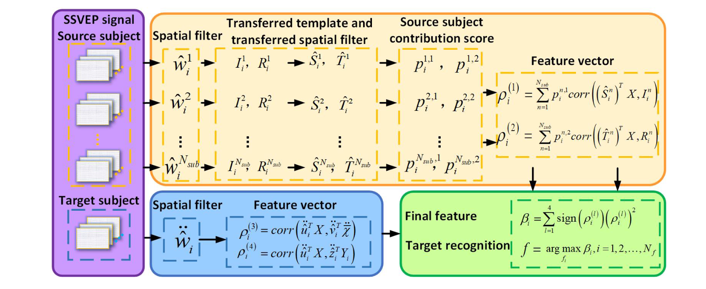

# 跨个体迁移 TRCA
## Cross-subject transfer learning TRCA, TL-TRCA
***

[论文链接][TL-TRCA]

2023 年新鲜出炉的这一篇 TRCA 改进算法并没有标准的名称（~~TL-TRCA 这个名字是我自己起的~~）。TL-TRCA 看上去好像集合了诸多文献的要义：[sc-(e)TRCA][ref1] 的正余弦模板拼接、[PT 投影][ref2]的最小二乘投影以及 [gTRCA][ref3] 的多受试者数据整合。可惜没能用上 [tlCCA][ref3] 的最小二乘受试者融合权重分配技术。为什么要说“好像”，是因为实际测试结果以及文献汇报的结果并没有想象得那么出众。当然这并不妨碍我欣赏他算法构建的思路与框架，其模块化设计复杂而不失严谨，而且存在进一步拓展优化的空间。



本文的主要思想是从多位源受试者的数据上学习迁移模板与迁移特征，融合目标受试者的个体特征进行综合评判。假设共有 $N_s$ 个源受试者，第 $n$ 个源（source）受试者的训练（全体）数据池为 $\pmb{\mathcal{X}}^{(n)} \in \mathbb{R}^{N_e \times N_t^{(n)} \times N_c^{(n)} \times N_p}$，其中第 $k$ 类、第 $i$ 试次的多导联数据记为 $\pmb{X}_k^{(n),i} \in \mathbb{R}^{N_c^{(n)} \times N_p}$。记目标（target）受试者的训练数据池为 $\pmb{\mathcal{X}}^{(\tau)} \in \mathbb{R}^{N_e \times N_t^{(\tau)} \times N_c^{(\tau)} \times Np}$，其中单试次数据记为 $\pmb{X}_k^{(\tau),i} \in \mathbb{R}^{N_c^{(\tau)} \times N_p}$。源域和目标域数据的类别（第 $k$ 类）样本中心分别记为 $\bar{\pmb{X}}_k^{(n)}$、$\bar{\pmb{X}}_k^{(\tau)}$。源域与目标域均需要使用正余弦参考模板 $\pmb{Y}_k^{(n)}$、$\pmb{Y}_k^{(\tau)}$，二者除了谐波次数以外，其余参数必须保持一致。上述部分变量的定义方法与计算公式在先前章节已有相应介绍，此处不再赘述。

接下来定义个体模型训练过程。参考 sc-(e)TRCA 对协方差矩阵的分块拼接拓展操作，本方法设计的扩增协方差矩阵 $\pmb{\widetilde{S}}_k$ 如下：
$$
    \pmb{\widetilde{S}}_k = \begin{bmatrix}
        \pmb{S}_k^{11} & \pmb{S}_k^{12} & \pmb{S}_k^{13}\\
        \ \\
        \pmb{S}_k^{21} & \pmb{S}_k^{22} & \pmb{S}_k^{23}\\
        \ \\
        \pmb{S}_k^{31} & \pmb{S}_k^{32} & \pmb{S}_k^{33}\\
    \end{bmatrix} \in \mathbb{R}^{2(N_c+N_h) \times 2(N_c+N_h)}
    \tag{2}
$$
$\pmb{\widetilde{S}}_k$ 的各分块矩阵定义详情如下（默认数据经过了零均值化预处理）：
$$
    \begin{cases}
        \pmb{S}_k^{11} = \sum_{j=1,\ i \ne j}^{N_t} \sum_{i=1}^{N_t} \pmb{X}_k^i {\pmb{X}_k^j}^T = \left( {N_t}^2 \bar{\pmb{X}}_k {\bar{\pmb{X}}_k}^T - \sum_{i=1}^{N_t} \pmb{X}_k^i {\pmb{X}_k^i}^T \right) \in \mathbb{R}^{N_c \times N_c} \ \\ \ \\
        \pmb{S}_k^{12} = {\pmb{S}_k^{21}}^T = \sum_{i=1}^{N_t} \pmb{X}_k^i {\bar{\pmb{X}}_k}^T = N_t \bar{\pmb{X}}_k {\bar{\pmb{X}}_k}^T \in \mathbb{R}^{N_c \times N_c} \ \\ \ \\
        \pmb{S}_k^{13} = {\pmb{S}_k^{31}}^T = \sum_{i=1}^{N_t} \pmb{X}_k^i {\pmb{Y}_k}^T = N_t \bar{\pmb{X}}_k {\pmb{Y}_k}^T \in \mathbb{R}^{N_c \times 2N_h} \ \\ \ \\
        \pmb{S}_k^{23} = {\pmb{S}_k^{32}}^T = \bar{\pmb{X}}_k {\pmb{Y}_k}^T \in \mathbb{R}^{N_c \times 2N_h} \ \\ \ \\
        \pmb{S}_k^{22} = \bar{\pmb{X}}_k {\bar{\pmb{X}}_k}^T \in \mathbb{R}^{N_c \times N_c} \ \\ \ \\
        \pmb{S}_k^{33} = \pmb{Y}_k {\pmb{Y}_k}^T \in \mathbb{R}^{2N_h \times 2N_h}
    \end{cases}
    \tag{3}
$$
本算法设计的扩增方差矩阵 $\pmb{\widetilde{Q}}_k$ 如下：
$$
    \pmb{\widetilde{Q}}_k = blkdiag \left( \pmb{Q}_k^1, \ \pmb{Q}_k^2, \ \pmb{Q}_k^3 \right) \in \mathbb{R}^{2N_h \times 2N_h}
    \tag{4}
$$
$\pmb{\widetilde{Q}}_k$ 的各分块矩阵定义详情如下：
$$
    \begin{cases}
        \pmb{Q}_k^1 = \sum_{i=1}^{N_t} \pmb{X}_k^i {\pmb{X}_k^i}^T \in \mathbb{R}^{N_c \times N_c} \ \\ \ \\
        \pmb{Q}_k^2 = \bar{\pmb{X}}_k {\bar{\pmb{X}}_k}^T \in \mathbb{R}^{N_c \times N_c} \ \\ \ \\
        \pmb{Q}_k^3 = \pmb{Y}_k {\pmb{Y}_k}^T \in \mathbb{R}^{2N_h \times 2N_h}
    \end{cases}
    \tag{5}
$$
上述个体模型训练在源域和目标域数据上都要进行。即对源域数据有：
$$
    \begin{align}
        \pmb{\widetilde{S}}_k^{(n)} &= \begin{bmatrix}
            {N_t^{(n)}}^2 \bar{\pmb{X}}_k^{(n)} {\bar{\pmb{X}}_k^{(n)}}^T - \sum_{i=1}^{N_t} \pmb{X}_k^{(n),i} {\pmb{X}_k^{(n),i}}^T & N_t^{(n)} \bar{\pmb{X}}_k^{(n)} {\bar{\pmb{X}}_k^{(n)}}^T & N_t^{(n)} \bar{\pmb{X}}_k^{(n)} {\pmb{Y}_k^{(n)}}^T\\
            \ \\
            N_t^{(n)} \bar{\pmb{X}}_k^{(n)} {\bar{\pmb{X}}_k^{(n)}}^T & \bar{\pmb{X}}_k^{(n)} {\bar{\pmb{X}}_k^{(n)}}^T & \bar{\pmb{X}}_k^{(n)} {\pmb{Y}_k^{(n)}}^T\\
            \ \\
            N_t^{(n)} \pmb{Y}_k^{(n)} {\bar{\pmb{X}}_k^{(n)}}^T & \pmb{Y}_k^{(n)} {\bar{\pmb{X}}_k^{(n)}}^T & \pmb{Y}_k^{(n)} {\pmb{Y}_k^{(n)}}^T\\
        \end{bmatrix} \in \mathbb{R}^{2\left[ N_h + N_c^{(n)} \right] \times 2\left[ N_h + N_c^{(n)} \right]}
        \tag{6}
        \notag \ \\
        \notag \ \\
        \pmb{\widetilde{Q}}_k^{(n)} &= \begin{bmatrix}
            \sum_{i=1}^{N_t^{(n)}} \pmb{X}_k^{(n),i} {\pmb{X}_k^{(n),i}}^T & \pmb{0} & \pmb{0}\\
            \ \\
            \pmb{0} & \bar{\pmb{X}}_k^{(n)} {\bar{\pmb{X}}_k^{(n)}}^T & \pmb{0}\\
            \ \\
            \pmb{0} & \pmb{0} & \pmb{Y}_k^{(n)} {\pmb{Y}_k^{(n)}}^T
        \end{bmatrix} \in \mathbb{R}^{2\left[ N_h + N_c^{(n)} \right] \times 2\left[ N_h + N_c^{(n)} \right]}
        \tag{7}\\
    \end{align}
$$
类似 sc-TRCA，TL-TRCA 的空间滤波器 $\hat{\pmb{f}}_k^{(n)}$（以源域数据为例）可分为三部分：
$$
    \hat{\pmb{f}}_k^{(n)} = \underset{{\pmb{f}}_k^{(n)}} \argmax \dfrac{\pmb{f}_k^{(n)} \pmb{\widetilde{S}}_k^{(n)} {\pmb{f}_k^{(n)}}^T} {\pmb{f}_k^{(n)} \pmb{\widetilde{Q}}_k^{(n)} {\pmb{f}_k^{(n)}}^T}
        = \begin{bmatrix}
            \hat{\pmb{w}}_k^{(n)} & \hat{\pmb{u}}_k^{(n)} & \hat{\pmb{v}}_k^{(n)}
        \end{bmatrix} \in \mathbb{R}^{1 \times 2 \left[ N_h + N_c^{(n)} \right]}
    \tag{8}
$$
不过令人不解的是，在源域数据训练过程中，仅有 $\hat{\pmb{u}}_k^{(n)}$ 以及 $\hat{\pmb{v}}_k^{(n)}$ 被用于后续迁移学习。而考虑 $\pmb{\widetilde{S}}_k^{(n)} (1:,1:)$ 与 $blkdiag \left( \pmb{Q}_k^2, \ \pmb{Q}_k^3 \right)$ 不难发现，这些就是 sc-TRCA 训练所需的协方差/方差矩阵，因此我认为该部分存在精简或优化的空间。

接下来谈谈迁移学习的内容：TL-TRCA 将 $\hat{\pmb{u}}_k^{(n)} \in \mathbb{R}^{1 \times N_c^{(n)}}$、$\hat{\pmb{v}}_k^{(n)} \in \mathbb{R}^{1 \times N_c^{(n)}}$ 按照类别顺序逐行拼接为 $\hat{\pmb{U}}^{(n)} \in \mathbb{R}^{N_e \times N_c^{(n)}}$、$\hat{\pmb{V}}^{(n)} \in \mathbb{R}^{N_e \times 2N_h}$（类似 eTRCA 的集成方法），在此基础上获得源域个体模板 $\pmb{\mathcal{I}}_k^{(n)}$ 与源域正余弦参考模板 $\pmb{R}_k^{(n)}$：
$$
    \begin{cases}
        \pmb{\mathcal{I}}_k^{(n)} = \hat{\pmb{U}}^{(n)} \bar{\pmb{X}}_k^{(n)} \in \mathbb{R}^{N_e \times N_p}\\
        \ \\
        \pmb{\mathcal{R}}_k^{(n)} = \hat{\pmb{V}}^{(n)} \pmb{Y}_k^{(n)} \in \mathbb{R}^{N_e \times N_p}\\
    \end{cases}
    \tag{9}
$$
在这一步骤中，源域数据的样本、导联维度信息均被压缩。需要注意的是，源域数据与目标域数据的样本容量、导联数目可以不相等，即该算法有潜力将分类模型从前期理想实验室环境下采集的较多导联数据迁移至较少导联、较少样本的测试环境数据。

至此，源域数据模型的训练基本告一段落，我们来分析目标域数据的处理过程。首先是目标域个体模型训练与模板匹配：
$$
    \begin{align}
    \pmb{\widetilde{S}}_k^{(\tau)} &= \begin{bmatrix}
        {N_t^{(\tau)}}^2 \bar{\pmb{X}}_k^{(\tau)} {\bar{\pmb{X}}_k^{(\tau)}}^T - \sum_{i=1}^{N_t} \pmb{X}_k^{(\tau),i} {\pmb{X}_k^{(\tau),i}}^T & N_t^{(\tau)} \bar{\pmb{X}}_k^{(\tau)} {\bar{\pmb{X}}_k^{(\tau)}}^T & N_t^{(\tau)} \bar{\pmb{X}}_k^{(\tau)} {\pmb{Y}_k^{(\tau)}}^T\\
        \ \\
        N_t^{(\tau)} \bar{\pmb{X}}_k^{(\tau)} {\bar{\pmb{X}}_k^{(\tau)}}^T & \bar{\pmb{X}}_k^{(\tau)} {\bar{\pmb{X}}_k^{(\tau)}}^T & \bar{\pmb{X}}_k^{(\tau)} {\pmb{Y}_k^{(\tau)}}^T\\
        \ \\
        N_t^{(\tau)} \pmb{Y}_k^{(\tau)} {\bar{\pmb{X}}_k^{(\tau)}}^T & \pmb{Y}_k^{(\tau)} {\bar{\pmb{X}}_k^{(\tau)}}^T & \pmb{Y}_k^{(\tau)} {\pmb{Y}_k^{(\tau)}}^T\\
    \end{bmatrix} \in \mathbb{R}^{2\left[ N_h + N_c^{(\tau)} \right] \times 2\left[ N_h + N_c^{(\tau)} \right]}
    \tag{10} \ \\
    \notag \ \\
    \pmb{\widetilde{Q}}_k^{(\tau)} &= \begin{bmatrix}
        \sum_{i=1}^{N_t^{(\tau)}} \pmb{X}_k^{(\tau),i} {\pmb{X}_k^{(\tau),i}}^T & \pmb{0} & \pmb{0}\\
        \ \\
        \pmb{0} & \bar{\pmb{X}}_k^{(\tau)} {\bar{\pmb{X}}_k^{(\tau)}}^T & \pmb{0}\\
        \ \\
        \pmb{0} & \pmb{0} & \pmb{Y}_k^{(\tau)} {\pmb{Y}_k^{(\tau)}}^T
    \end{bmatrix} \in \mathbb{R}^{2\left[ N_h + N_c^{(\tau)} \right] \times 2\left[ N_h + N_c^{(\tau)} \right]}
    \tag{11} \\
    \notag \ \\
    \hat{\pmb{f}}_k^{(\tau)} &= \underset{{\pmb{f}}_k^{(\tau)}} \argmax \dfrac{\pmb{f}_k^{(\tau)} \pmb{\widetilde{S}}_k^{(\tau)} {\pmb{f}_k^{(\tau)}}^T} {\pmb{f}_k^{(\tau)} \pmb{\widetilde{Q}}_k^{(\tau)} {\pmb{f}_k^{(\tau)}}^T}
        = \begin{bmatrix}
            \hat{\pmb{w}}_k^{(\tau)} & \hat{\pmb{u}}_k^{(\tau)} & \hat{\pmb{v}}_k^{(\tau)}
        \end{bmatrix} \in \mathbb{R}^{1 \times 2 \left[ N_h + N_c^{(\tau)} \right]}
    \tag{12}
    \end{align}
$$
经过以上步骤后获得 $\hat{\pmb{w}}_k^{(\tau)}$、$\hat{\pmb{u}}_k^{(\tau)}$、$\hat{\pmb{v}}_k^{(\tau)}$ 三个目标域空间滤波器。接下来将单试次目标域原始数据 $\pmb{X}_k^{(\tau),i}$ 向源域数据的两种模板 $\pmb{\mathcal{I}}_k^{(n)}$、$\pmb{\mathcal{R}}_k^{(n)}$ 分别进行投影对齐，该方法与 TP 投影非常相似，都是基于方阵 2-范数构建、利用最小二乘法求解：
$$
    \begin{cases}
        \hat{\pmb{\psi}}_k^{(n),i} = \underset{\pmb{\psi}_k^{(n),i}} \argmin \left\| \pmb{\mathcal{I}}_k^{(n)} - \pmb{\psi}_k^{(n),i} \pmb{X}_k^{(\tau),i} \right\|_2^2 \\
        \ \\
        \hat{\pmb{\upsilon}}_k^{(n),i} = \underset{\pmb{\upsilon}_k^{(n),i}} \argmin \left\| \pmb{\mathcal{R}}_k^{(n)} - \pmb{\upsilon}_k^{(n),i} \pmb{X}_k^{(\tau),i} \right\|_2^2 \\
    \end{cases} \ \Longrightarrow \ 
    \begin{cases}
        \hat{\pmb{\psi}}_k^{(n),i} = \pmb{\mathcal{I}}_k^{(n)} {\pmb{X}_k^{(\tau),i}}^T \left[ \pmb{X}_k^{(\tau),i} {\pmb{X}_k^{(\tau),i}}^T \right]^{-1} \in \mathbb{R}^{N_e \times N_c^{(\tau)}}\\
        \ \\
        \hat{\pmb{\upsilon}}_k^{(n),i} = \pmb{\mathcal{R}}_k^{(n)} {\pmb{X}_k^{(\tau),i}}^T \left[ \pmb{X}_k^{(\tau),i} {\pmb{X}_k^{(\tau),i}}^T \right]^{-1} \in \mathbb{R}^{N_e \times N_c^{(\tau)}}\\
    \end{cases}
    \tag{13}
$$
将上述投影矩阵按目标域训练样本平均，获得目标域数据至源域数据的最终迁移空间投影矩阵 $\hat{\pmb{\Psi}}_k^{(n)}$、$\hat{\pmb{\Upsilon}}_k^{(n)}$：
$$
    \begin{cases}
        \hat{\pmb{\Psi}}_k^{(n)} = \dfrac{1}{N_t^{(\tau)}} \sum_{i=1}^{N_t^{(\tau)}} \hat{\pmb{\psi}}_k^{(n),i} \in \mathbb{R}^{N_e \times N_c^{(\tau)}}\\
        \ \\
        \hat{\pmb{\Upsilon}}_k^{(n)} = \dfrac{1}{N_t^{(\tau)}} \sum_{i=1}^{N_t^{(\tau)}} \hat{\pmb{\upsilon}}_k^{(n),i} \in \mathbb{R}^{N_e \times N_c^{(\tau)}}\\
    \end{cases}
    \tag{14}
$$
写到此处，不禁想起以前吐槽 Wong 等人天花乱坠的数学公式，现在看来属实是过于严苛了。当面临想要严谨（避免使用具有通用含义的字符）但是字符数目不够用的时候，我自然而然走上了他们的老路——开始使用奇怪的希腊字母，变量上标下标满天乱飞。以防万一在此自我科普一下：

（1）$\tau$ 不是英文字符 $t$，而是希腊字符“tau”；
（2）$\psi$ 英文写作“psi”，其大写形式为 $\Psi$；
（3）$\upsilon$ 不是英文字符 $v$，而是希腊字符“upsilon”，其大写形式为 $\Upsilon$。

对于不同受试者（目标域）而言，其与各源域的相似度（或距离）是存在差异的。距离度量是否合适成为了衡量迁移学习质量的关键要素之一。本文使用目标域各试次投影数据与源域模板的相关系数之和作为目标域与源域在当前类别下的空间距离度量 $d_{k,\pmb{\mathcal{I}}}^{(n)}$、$d_{k,\pmb{\mathcal{R}}}^{(n)} $：
$$
    \begin{cases}
        d_{k,\pmb{\mathcal{I}}}^{(n)} = \sum_{i=1}^{N_t^{(\tau)}} corr \left( \hat{\pmb{\Psi}}_k^{(n)} \pmb{X}_k^{(\tau),i}, \ \pmb{\mathcal{I}}_k^{(n)} \right)\\
        \ \\
        d_{k,\pmb{\mathcal{R}}}^{(n)} = \sum_{i=1}^{N_t^{(\tau)}} corr \left( \hat{\pmb{\Upsilon}}_k^{(n)} \pmb{X}_k^{(\tau),i}, \ \pmb{\mathcal{R}}_k^{(n)} \right)\\
    \end{cases}
    \tag{15}
$$
有了距离度量之后，本文使用了一个简单的分式定义各源域对目标域的贡献指数 $\eta_{k,\pmb{\mathcal{I}}}^{(n)}$、$\eta_{k,\pmb{\mathcal{R}}}^{(n)}$：
$$
    \begin{cases}
        \eta_{k,\pmb{\mathcal{I}}}^{(n)} = \dfrac{d_{k,\pmb{\mathcal{I}}}^{(n)}} {\sum_{n=1}^{N_s} d_{k,\pmb{\mathcal{I}}}^{(n)}}
        = \dfrac{\sum_{i=1}^{N_t^{(\tau)}} \hat{\pmb{\Psi}}_k^{(n)} \pmb{X}_k^{(\tau),i} {\pmb{\mathcal{I}}_k^{(n)}}^T} {\sum_{n=1}^{N_s} \sum_{i=1}^{N_t^{(\tau)}} \hat{\pmb{\Psi}}_k^{(n)} \pmb{X}_k^{(\tau),i} {\pmb{\mathcal{I}}_k^{(n)}}^T}\\
        \ \\
        \eta_{k,\pmb{\mathcal{R}}}^{(n)} = \dfrac{d_{k,\pmb{\mathcal{R}}}^{(n)}} {\sum_{n=1}^{N_s} d_{k,\pmb{\mathcal{R}}}^{(n)}}
        = \dfrac{\sum_{i=1}^{N_t^{(\tau)}} \hat{\pmb{\Upsilon}}_k^{(n)} \pmb{X}_k^{(\tau),i} {\pmb{\mathcal{R}}_k^{(n)}}^T} {\sum_{n=1}^{N_s} \sum_{i=1}^{N_t^{(\tau)}} \hat{\pmb{\Upsilon}}_k^{(n)} \pmb{X}_k^{(\tau),i} {\pmb{\mathcal{R}}_k^{(n)}}^T}\\
    \end{cases}
    \tag{16}
$$
这些贡献指数将直接作为权重系数参与判别系数的融合构建。对于目标域的测试样本 $\pmb{\mathcal{X}} \in \mathbb{R}^{N_c^{(\tau)} \times N_p}$（经过零均值化预处理），文中设计了四种判别系数以及它们的融合版本。后续输出结果等步骤与其它算法并无二样：
$$
    \begin{bmatrix}
        \rho_{k,1}\\ \ \\
        \rho_{k,2}\\ \ \\
        \rho_{k,3}\\ \ \\
        \rho_{k,4}\\
    \end{bmatrix} =
    \begin{bmatrix}
        \sum_{n=1}^{N_s} \eta_{k,\pmb{\mathcal{I}}}^{(n)} corr \left( \hat{\pmb{\Psi}}_k^{(n)} \pmb{\mathcal{X}}, \ \pmb{\mathcal{I}}_k^{(n)} \right)\\
        \ \\
        \sum_{n=1}^{N_s} \eta_{k,\pmb{\mathcal{R}}}^{(n)} corr \left( \hat{\pmb{\Upsilon}}_k^{(n)} \pmb{\mathcal{X}}, \ \pmb{\mathcal{R}}_k^{(n)} \right)\\
        \ \\
        corr \left( \hat{\pmb{w}}_k^{(\tau)} \pmb{\mathcal{X}}, \ \hat{\pmb{u}}_k^{(\tau)} \bar{\pmb{X}}_k^{(\tau)} \right)\\
        \ \\
        corr \left( \hat{\pmb{w}}_k^{(\tau)} \pmb{\mathcal{X}}, \ \hat{\pmb{v}}_k^{(\tau)} \pmb{Y}_k^{(\tau)} \right)\\
    \end{bmatrix}, \ \ \rho_k = \sum_{j=1}^4 sign \left( \rho_{k,j} \right) \left( \rho_{k,j} \right)^2
    \tag{17}
$$
接下来我们对该算法在程序、理论以及实践三个方面进行深入分析。

### 关于个体模型训练的运算优化
简单起见，此处公式推导不再区分源域与目标域：
$$
    \hat{\pmb{f}}_k = \underset{{\pmb{f}}_k} \argmax \dfrac{\pmb{f}_k \pmb{\widetilde{S}}_k {\pmb{f}_k}^T} {\pmb{f}_k \pmb{\widetilde{Q}}_k {\pmb{f}_k}^T}
        = \underset{{\pmb{f}}_k} \argmax \dfrac{\pmb{f}_k \pmb{\widetilde{S}}_k {\pmb{f}_k}^T} {\pmb{f}_k \pmb{\widetilde{Q}}_k {\pmb{f}_k}^T} + 1
        = \underset{{\pmb{f}}_k} \argmax \dfrac{\pmb{f}_k \left( \pmb{\widetilde{Q}}_k + \pmb{\widetilde{S}}_k \right) {\pmb{f}_k}^T} {\pmb{f}_k \pmb{\widetilde{Q}}_k {\pmb{f}_k}^T}
    \tag{18}
$$
即有：
$$
    \pmb{\widetilde{S}}_k^{'} =
        \begin{bmatrix}
            {N_t}^2 \bar{\pmb{X}}_k {\bar{\pmb{X}}_k}^T & N_t \bar{\pmb{X}}_k {\bar{\pmb{X}}_k}^T & N_t \bar{\pmb{X}}_k {\pmb{Y}_k}^T\\
            \ \\
            N_t \bar{\pmb{X}}_k {\bar{\pmb{X}}_k}^T & 2\bar{\pmb{X}}_k {\bar{\pmb{X}}_k}^T & \bar{\pmb{X}}_k {\pmb{Y}_k}^T\\
            \ \\
            N_t \pmb{Y}_k {\bar{\pmb{X}}_k}^T & \pmb{Y}_k {\bar{\pmb{X}}_k}^T & 2\pmb{Y}_k {\pmb{Y}_k}^T\\
        \end{bmatrix} = 
        \begin{bmatrix}
            \pmb{X}_k^{sum} {\pmb{X}_k^{sum}}^T & \pmb{X}_k^{sum} {\bar{\pmb{X}}_k}^T & \pmb{X}_k^{sum} {\pmb{Y}_k}^T\\
            \ \\
            \bar{\pmb{X}}_k {\pmb{X}_k^{sum}}^T & 2\bar{\pmb{X}}_k {\bar{\pmb{X}}_k}^T & \bar{\pmb{X}}_k {\pmb{Y}_k}^T\\
            \ \\
            \pmb{Y}_k {\pmb{X}_k^{sum}}^T & \pmb{Y}_k {\bar{\pmb{X}}_k}^T & 2\pmb{Y}_k {\pmb{Y}_k}^T\\
        \end{bmatrix}
    \tag{19}
$$
从程序代码逻辑来看，叠加平均模板 $\bar{\pmb{X}}_k = \dfrac{1}{N_t} \sum_{i=1}^{N_t} X_k^i$ 可由叠加模板 $\pmb{X}_k^{sum} = \sum_{i=1}^{N_t} X_k^i$ 经过少量数乘（$N_c \times N_p$）快速转化，无需按照原文分块矩阵的设计进行反复计算:

```python
# assumed X_train: (n_trials*n_events, n_chans, n_points). Training dataset.
# assumed y_train: (n_trials*n_events). Labels for X_train
# assumed n_events=2, n_trials=50, n_chans=30, n_points = 1000
event_type = np.unique(y_train)
n_train = np.array([np.sum(y_train==et) for et in event_type])  # [Nt1,Nt2,...]

S = np.zeros((n_events, 2*n_chans+n_2harmonics, 2*n_chans+n_2harmonics))
Q = np.zeros_like(S)

# Original
# block covariance matrices: S & Q, (Ne,2Nc+2Nh,2Nc+2Nh)
class_center = np.zeros((n_events, n_chans, n_points))  # (Ne,Nc,Np)
for ne,et in enumerate(event_type):
    X_temp = X_train[y_train==et]  # (Nt,Nc,Np)
    class_center[ne] = X_temp.mean(axis=0)  # (Nc,Np)
    train_trials = n_train[ne]  # Nt

    # S11: inter-trial covariance, (Nc,Nc)
    S11 = np.zeros((n_chans, n_chans))
    for ttr in range(train_trials):
        for tti in range(train_trials):
            if ttr != tti:
                S11 += X_temp[ttr] @ X_temp[tti].T

    # S12 & S21.T: covariance between the SSVEP trials & the individual template, (Nc,Nc)
    S12 = np.zeros_like(S11)
    for tt in range(train_trials):
        S12 += X_temp[tt] @ class_center[ne].T

    # S13 & S31.T: similarity between the SSVEP trials & sinusoidal template, (Nc,2Nh)
    S13 = np.zeros((n_chans, n_2harmonics))
    for tt in range(train_trials):
        S13 += X_temp[tt] @ sine_template[ne].T

    # S23 & S32.T: covariance between the individual template & sinusoidal template, (Nc,2Nh)
    S23 = class_center[ne] @ sine_template[ne].T

    # S22 & S33: variance of average template & sinusoidal template, (Nc,Nc) & (2Nh,2Nh)
    S22 = class_center[ne] @ class_center[ne].T
    S33 = sine_template[ne] @ sine_template[ne].T

    # S: [[S11,S12,S13],[S21,S22,S23],[S31,S32,S33]]
    S[ne, :n_chans, :n_chans] = S11
    S[ne, :n_chans, n_chans:2*n_chans] = S12
    S[ne, n_chans:2*n_chans, :n_chans] = S12.T
    S[ne, :n_chans, 2*n_chans:] = S13
    S[ne, 2*n_chans:, :n_chans] = S13.T
    S[ne, n_chans:2*n_chans, n_chans:2*n_chans] = S22
    S[ne, n_chans:2*n_chans, 2*n_chans:] = S23
    S[ne, 2*n_chans:, n_chans:2*n_chans] = S23.T
    S[ne, 2*n_chans:, 2*n_chans:] = S33

    # Q1 = np.einsum('tcp,thp->ch', X_sub[ne], X_sub[ne])  # (Nc,Nc) | clear but slow
    Q2 = class_center[ne] @ class_center[ne].T  # (Nc,Nc)
    Q3 = sine_template[ne] @ sine_template[ne].T  # (2Nh,2Nh)
    Q1 = np.zeros_like(Q2)  # (Nc,Nc)
    for tt in range(train_trials):
        Q1 += X_temp[tt] @ X_temp[tt].T  # faster way

    # Q: blkdiag(Q1,Q2,Q3)
    Q[ne, :n_chans, :n_chans] = Q1
    Q[ne, n_chans:2*n_chans, n_chans:2*n_chans] = Q2
    Q[ne, 2*n_chans:, 2*n_chans:] = Q3
```
在保留 $\pmb{X}_k^{sum}$、$\bar{\pmb{X}_k}$ 两个变量的基础上进行训练能极大程度地减少冗余运算次数（见 Optimized 部分代码）:
```python
# block covariance matrices: S & Q, (Ne,2Nc+2Nh,2Nc+2Nh)
class_sum = np.zeros((n_events, n_chans, n_points))  # Xs: (Ne,Nc,Np)
class_center = np.zeros_like(class_sum)  # Xm: (Ne,Nc,Np)
for ne,et in enumerate(event_type):
    X_temp = X_train[y_train==et]  # (Nt,Nc,Np)
    train_trials = n_train[ne]  # Nt
    class_sum[ne], class_center[ne] = X_temp.sum(axis=0), X_temp.mean(axis=0)

    XX = np.zeros((n_chans, n_chans))  # (Nc,Nc)
    for tt in range(train_trials):
        XX += X_temp[tt] @ X_temp[tt].T  # faster way
    XsXs = class_sum[ne] @ class_sum[ne].T  # S11
    XsXm = class_sum[ne] @ class_center[ne].T  # S12, S21.T
    XmXm = class_center[ne] @ class_center[ne].T  # S22, Q2
    XsY = class_sum[ne] @ sine_template[ne].T  # S13, S31.T
    XmY = class_center[ne] @ sine_template[ne].T  # S23, S32.T
    YY = sine_template[ne] @ sine_template[ne].T  # S33, Q3

    # S: [[S11,S12,S13],[S21,S22,S23],[S31,S32,S33]]
    S[ne, :n_chans, :n_chans] = XsXs
    S[ne, :n_chans, n_chans:2*n_chans] = XsXm
    S[ne, n_chans:2*n_chans, :n_chans] = XsXm.T
    S[ne, :n_chans, 2*n_chans:] = XsY
    S[ne, 2*n_chans:, :n_chans] = XsY.T
    S[ne, n_chans:2*n_chans, n_chans:2*n_chans] = XmXm
    S[ne, n_chans:2*n_chans, 2*n_chans:] = XmY
    S[ne, 2*n_chans:, n_chans:2*n_chans] = XmY.T
    S[ne, 2*n_chans:, 2*n_chans:] = YY

    # Q: blkdiag(Q1,Q2,Q3)
    Q[ne, :n_chans, :n_chans] = XX
    Q[ne, n_chans:2*n_chans, n_chans:2*n_chans] = XmXm
    Q[ne, 2*n_chans:, 2*n_chans:] = YY
```

实机测试条件如下：测试平台为 Intel(R) Core(TM) i7-10700K CPU @ 2.90GHz & 64 GB DDR4 RAM，测试数据维度为 $\pmb{X}_k \in \mathbb{R}^{100 \times 30 \times 1000}$，测试结果目标为 $\pmb{\widetilde{S}}_k^{'}$ 与 $\pmb{\widetilde{Q}}_k^{'}$ 的单次运算时间之和。按原文方法完成上述步骤用时 $903 \pm 40$ ms；而优化后单次运算时长仅为 $33 \pm 2.32$ ms，提速比例高达 26 倍。

### 关于个体训练模型的数理分析
考虑 $\hat{\pmb{f}} = \begin{bmatrix} \hat{\pmb{w}} & \hat{\pmb{u}} & \hat{\pmb{v}} \end{bmatrix}$，则目标函数的分子、分母可转化为二次型叠加形式：
$$
    \begin{align}
        \notag
        \hat{\pmb{f}} \pmb{\widetilde{S}}^{'} {\hat{\pmb{f}}}^T &=
            \hat{\pmb{w}} \pmb{C}_{\pmb{XX}} {\hat{\pmb{w}}}^T + 2 \hat{\pmb{w}} \pmb{C}_{\pmb{X} \bar{\pmb{X}}} {\hat{\pmb{u}}}^T + 2 \hat{\pmb{w}} \pmb{C}_{\pmb{XY}} {\hat{\pmb{v}}}^T + 2 \hat{\pmb{u}} \pmb{C}_{\bar{\pmb{X}} \bar{\pmb{X}}} {\hat{\pmb{u}}}^T + 2 \hat{\pmb{u}} \pmb{C}_{\bar{\pmb{X}} \pmb{Y}} {\hat{\pmb{v}}}^T + 2 \hat{\pmb{v}} \pmb{C}_{\pmb{Y} \pmb{Y}} {\hat{\pmb{v}}}^T \\
        \notag \ \\
        \notag
        &= \left( {N_t}^2 \hat{\pmb{w}} \pmb{C}_{\bar{\pmb{X}} \bar{\pmb{X}}} {\hat{\pmb{w}}}^T + 2 N_t \hat{\pmb{w}} \pmb{C}_{\bar{\pmb{X}} \bar{\pmb{X}}} {\hat{\pmb{u}}}^T + 2 \hat{\pmb{u}} \pmb{C}_{\bar{\pmb{X}} \bar{\pmb{X}}} {\hat{\pmb{u}}}^T \right) + \left( 2N_t \hat{\pmb{w}} \pmb{C}_{\bar{\pmb{X}} \pmb{Y}} {\hat{\pmb{v}}}^T + 2 \hat{\pmb{u}} \pmb{C}_{\bar{\pmb{X}} \pmb{Y}} {\hat{\pmb{v}}}^T \right) + 2 \hat{\pmb{v}} \pmb{C}_{\pmb{Y} \pmb{Y}} {\hat{\pmb{v}}}^T\\
        \notag \ \\
        \notag
        &= N_t \hat{\pmb{w}} \pmb{C}_{\bar{\pmb{X}} \bar{\pmb{X}}} \left( N_t {\hat{\pmb{w}}}^T + 2 {\hat{\pmb{u}}}^T \right) + 2 \hat{\pmb{u}} \pmb{C}_{\bar{\pmb{X}} \bar{\pmb{X}}} {\hat{\pmb{u}}}^T + 2 \left( N_t \hat{\pmb{w}} + \hat{\pmb{u}} \right) \pmb{C}_{\bar{\pmb{X}} \pmb{Y}} {\hat{\pmb{v}}}^T + 2 \hat{\pmb{v}} \pmb{C}_{\pmb{Y} \pmb{Y}} {\hat{\pmb{v}}}^T\\
        \notag \ \\
        \notag
        \hat{\pmb{f}} \pmb{\widetilde{Q}} {\hat{\pmb{f}}}^T &=
            \hat{\pmb{w}} \pmb{C}_{\pmb{\sum_{XX}}} {\hat{\pmb{w}}}^T + \hat{\pmb{u}} \pmb{C}_{\bar{\pmb{X}} \bar{\pmb{X}}} {\hat{\pmb{u}}}^T + \hat{\pmb{v}} \pmb{C}_{\pmb{Y} \pmb{Y}} {\hat{\pmb{u}}}^T
    \end{align}
    \tag{20}
$$
不难发现，如果在分子分母中同时剔除与 $\hat{\pmb{u}}$ 相关的成分，则该目标函数与 sc-TRCA 高度相似。三个滤波器的作用及意义有待进一步实践探究。

### 关于源域个体训练流程的优化


### 关于目标域数据迁移对齐的优化
式 (14) 中呈现的空间投影矩阵获取方法略显朴素：

（1）当目标域训练样本数目 $N_t^{(\tau)}$ 不足时，对齐矩阵的最小二乘估计 $\hat{\pmb{\psi}}_k^{(n),i}$、$\hat{\pmb{\upsilon}}_k^{(n),i}$ 并不准确，进而影响 $\hat{\pmb{\Psi}}_k^{(n)}$、$\hat{\pmb{\Upsilon}}_k^{(n)}$ 的投影效果；
（2）投影矩阵对目标域训练样本的需求限制了该算法向无监督领域的拓展。

***

[TL-TRCA]: https://ieeexplore.ieee.org/document/10057002/
[ref1]: https://iopscience.iop.org/article/10.1088/1741-2552/abfdfa
[ref2]: https://iopscience.iop.org/article/10.1088/1741-2552/abcb6e
[ref3]: http://www.nature.com/articles/s41598-019-56962-2