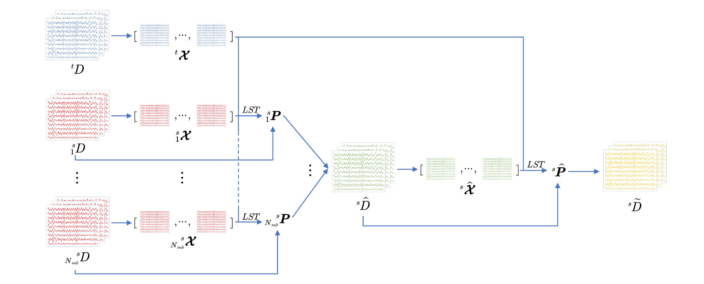

# 小样本最小二乘迁移
## Small Data Least-Squares Transformation, sd-LST
***
### [论文链接][sd-LST]

以往我对伍东睿老师团队的印象是：主攻脑纹识别、脑-机接口信息安全这一类偏高级应用向的研究，比如 [White-Box Target Attack][ref1]、[Backdoor Attack][ref2]、[Square Wave Attack][ref3]之类的（由于我对生物信息安全这一领域不熟悉，就不乱翻译了），其中有不少研究自 2019 年至今仍然挂在 arXIV 网站上，凭借我有限的知识难以客观评价其研究价值。但是这一次他们发在 TNSRE 上的算法文章着实令人耳目一新。浏览过 TL-TRCA 那一期专栏的朋友们应该知道，我对现有 SSVEP 迁移学习算法的一个判断是：仅有判别系数集成而没有目标域数据扩增的算法，其性能通常是很不稳定的。这篇 sd-LST 算法在设计原理上实现了目标域训练样本的高效补充，且方案本身具有一定的可扩展性，值得一看。

sd-LST 面临的应用场景是：SSVEP-BCI 系统拥有 $N_e$ 个控制指令；源域多导联数据 $\pmb{X}_k^{(s)} \in \mathbb{R}^{N_c \times N_p}$ 共计 $N_s$ 名受试者，数据类别 $k$ 完整，各类别样本数目（$N_t^{(s)}$）相对充分；目标域数据 $\pmb{X}_{c_k}^{(\tau)} \in \mathbb{R}^{N_c \times N_p}$ 类别 $c_k$ 可能有缺失（$N_e^{(\tau)} \leqslant N_e$），各类别样本数目（$N_t^{(\tau)}$）不充分。简单来说 sd-LST 与 stCCA 的应用场景是基本一致的，不过二者的原理有很大区别：stCCA 着力于为小范围刺激频率内的全体目标训练共通的空间滤波器，并通过源域数据与目标域数据对齐进行特征信息的迁移学习与应用，具体表现为匹配模板的生成与替代。stCCA 的空间滤波器是仅限于源域数据的，这一点其实跟 TL-TRCA 又比较类似了，即源域自体模型的训练没有包括迁移信息或者数据扩增步骤。sd-LST 则比较类似 SAME，主打一个样本扩增。后端空间滤波器的构建、信号模板的匹配流程与常规模型基本一致。

由图可知，sd-LST 的最小二乘对齐分为两步。首先，sd-LST 为源域受试者 $s$ 和目标域受试者 $\tau$ 的全体类别数据（此处“全体”以 $N_e^{(\tau)}$ 为准）训练一个跨类别通用迁移矩阵 $\hat{\pmb{P}}_1^{(s)} \in \mathbb{R}^{N_c \times N_c}$ ：
$$
\bar{\pmb{X}}_{c_k}^{(s)} = \dfrac{1}{N_t^{(s)}} \sum_{i=1}^{N_t^{(s)}} \pmb{X}_{c_k}^{(s)}, \ \ \bar{\pmb{X}}_{c_k}^{(\tau)} = \dfrac{1}{N_t^{(\tau)}} \sum_{i=1}^{N_t^{(\tau)}} \pmb{X}_{c_k}^{(\tau)}, \ \ \ \bar{\pmb{X}}_{c_k}^{(s)}, \bar{\pmb{X}}_{c_k}^{(\tau)} \in \mathbb{R}^{N_c \times N_p}, \ k \in [1,N_e^{(\tau)}]
\tag{1}
$$
$$
\pmb{\mathcal{Z}}^{(s)} = 
\begin{bmatrix}
\bar{\pmb{X}}_{c_1}^{(s)} & \bar{\pmb{X}}_{c_2}^{(s)} & \cdots & \bar{\pmb{X}}_{c_{N_e^{(\tau)}}}^{(s)}
\end{bmatrix}, \ \
\pmb{\mathcal{Z}}^{(\tau)} = 
\begin{bmatrix}
\bar{\pmb{X}}_{c_1}^{(\tau)} & \bar{\pmb{X}}_{c_2}^{(\tau)} & \cdots & \bar{\pmb{X}}_{c_{N_e^{(\tau)}}}^{(\tau)}
\end{bmatrix}, \ \ \ \pmb{\mathcal{Z}}^{(s)},{\mathcal{Z}}^{(\tau)} \in \mathbb{R}^{N_c \times \left( N_e^{(\tau)} N_p \right)}
\tag{2}
$$
$$
\hat{\pmb{P}}_1^{(s)} = \underset{\pmb{P}_1^{(s)}} \argmin \left\| \pmb{P}_1^{(s)} \pmb{\mathcal{Z}}^{(s)} - \pmb{\mathcal{Z}}^{(\tau)} \right\|_F^2 =
\pmb{\mathcal{Z}}^{(\tau)} {\pmb{\mathcal{Z}}^{(s)}}^T \left( \pmb{\mathcal{Z}}^{(s)} {\pmb{\mathcal{Z}}^{(s)}}^T \right)^{-1}
= \left( \sum_{k=1}^{N_e^{(\tau)}} \bar{\pmb{X}}_{c_k}^{(\tau)} {\bar{\pmb{X}}_{c_k}^{(s)}}^T \right) \left(\sum_{k=1}^{N_e^{(\tau)}} \bar{\pmb{X}}_{c_k}^{(s)} {\bar{\pmb{X}}_{c_k}^{(s)}}^T \right)^{-1}
\tag{3}
$$
在获取源域受试者基于部分类别数据计算的通用迁移矩阵之后，将其与源域的每一类、每一试次进行投影对齐。在此过程中，目标域缺失的类别数据由源域数据间接补充。在第一步 LST 的最后，集合全体源域受试者的迁移后数据，构成目标域的全类别大型迁移训练数据集 $\pmb{\mathcal{D}}$：
$$
\pmb{\mathcal{D}} = \left\{ \hat{\pmb{P}}_1^{(s)} \pmb{X}_k^{i,(s)} \right\}_{k \in [1,N_e], \ i \in [1,N_t], \ s \in [1,N_s]}
\tag{4}
$$
为了进一步减小迁移训练数据集 $\pmb{\mathcal{D}}$ 与目标域数据 $\pmb{X}_k^{(\tau)}$ 的域间距离，接下来 sd-LST 执行第二次最小二乘对齐：
$$
\bar{\bar{\pmb{X}}}_{c_k,\pmb{P}_1} = \dfrac{1}{\sum_{s=1}^{N_s} N_t^{(s)}} \sum_{s=1}^{N_s} \sum_{i=1}^{N_t^{(s)}} \hat{\pmb{P}}_1^{(s)} \pmb{X}_{c_k}^{i,(s)} \in \mathbb{R}^{N_c \times N_p}, \ \
\pmb{\mathcal{Z}}_{\pmb{P}_1} =
\begin{bmatrix}
\bar{\bar{\pmb{X}}}_{c_1,\pmb{P}_1} & \bar{\bar{\pmb{X}}}_{c_2,\pmb{P}_1} & \cdots & \bar{\bar{\pmb{X}}}_{c_{N_e^{(\tau)}},\pmb{P}_1}
\end{bmatrix} \in \mathbb{R}^{N_c \times \left( N_e^{(\tau)} N_p \right)}
\tag{5}
$$
$$
\hat{\pmb{P}}_2 = \underset{\pmb{P}_2} \argmin \left\| \pmb{P}_2 \pmb{\mathcal{Z}}_{\pmb{P}_1} - \pmb{\mathcal{Z}}^{(\tau)} \right\|_F^2 = \pmb{\mathcal{Z}}^{(\tau)} {\pmb{\mathcal{Z}}_{\pmb{P}_1}}^T \left( \pmb{\mathcal{Z}}_{\pmb{P}_1} {\pmb{\mathcal{Z}}_{\pmb{P}_1}}^T \right)^{-1} = \left( \sum_{k=1}^{N_e^{(\tau)}} \bar{\pmb{X}}_{c_k}^{(\tau)} {\bar{\bar{\pmb{X}}}_{c_k,\pmb{P}_1}}^T \right) \left( \sum_{k=1}^{N_e^{(\tau)}} \bar{\bar{\pmb{X}}}_{c_k,\pmb{P}_1} {\bar{\bar{\pmb{X}}}_{c_k,\pmb{P}_1}}^T \right)^{-1}
\tag{6}
$$
与式 (3) 类似地，第二次对齐矩阵 $\hat{\pmb{P}}_2$ 将再次作用于源域数据的每一个试次。最终形成的全类别迁移数据集 $\hat{\pmb{\mathcal{D}}}$ 为：
$$
\hat{\pmb{D}} = \left\{ \hat{\pmb{P}}_2 \hat{\pmb{P}}_1^{(s)} \pmb{X}_k^{i,(s)} \right\}_{k \in [1,N_e], \ i \in [1,N_t^{(s)}], \ s \in [1,N_s]}
\tag{7}
$$
在模板匹配阶段，对于测试样本 $\pmb{\mathcal{X}} \in \mathbb{R}^{N_c \times N_p}$，sd-LST 设计了 TRCA- 和 CCA- 两类、共计 4 个判别系数。仅使用 eTRCA 分类模型的算法记为 LST-TRCA：
$$
\widetilde{\pmb{X}}_k = \dfrac{1}{\sum_{s=1}^{N_s} N_t^{(s)}} \sum_{s=1}^{N_s} \sum_{i=1}^{N_t^{(s)}} \hat{\pmb{P}}_2 \hat{\pmb{P}}_1^{(s)} \pmb{X}_k^{i,(s)} \in \mathbb{R}^{N_c \times N_p}
\tag{8}
$$
$$
\hat{\pmb{w}}_k = \underset{\pmb{w}_k} \argmax \dfrac{\pmb{w}_k \widetilde{\pmb{X}}_k {\widetilde{\pmb{X}}_k}^T {\pmb{w}_k}^T} {\pmb{w}_k \left( \sum_{i=1}^{N_t} \hat{\pmb{P}}_2 \hat{\pmb{P}}_1^{(s)} \pmb{X}_k^{i,(s)} {\pmb{X}_k^{i,(s)}}^T {\hat{\pmb{P}}_1^{(s)}}^T {\hat{\pmb{P}}_2}^T \right) {\pmb{w}_k}^T}, \ \ \hat{\pmb{W}} = 
\begin{bmatrix}
\hat{\pmb{w}}_1^T & \hat{\pmb{w}}_2^T & \cdots & \hat{\pmb{w}}_{N_e}^T
\end{bmatrix}^T
\tag{9}
$$
$$
\rho_{k,{\rm eTRCA}} = {\rm corr} \left( \hat{\pmb{W}} \pmb{\mathcal{X}}, \ \hat{\pmb{W}} \widetilde{\pmb{X}}_k \right)
\tag{10}
$$
仅使用 eCCA 分类模型的算法记为 LST-CCA。CCA 空间滤波器组的详细计算过程请参考 CCA 章节，此处以 ${\rm CCA} (\pmb{X}, \pmb{Y})$ 替代：
$$
\hat{\pmb{u}}_{\pmb{\mathcal{X}} \pmb{Y}_k}, \hat{\pmb{v}}_{\pmb{\mathcal{X}} \pmb{Y}_k} = {\rm CCA} \left( \pmb{\mathcal{X}}, \ \pmb{Y}_k \right), \ \ \hat{\pmb{u}}_{\widetilde{\pmb{X}}_k \pmb{Y}_k}, \hat{\pmb{v}}_{\widetilde{\pmb{X}}_k \pmb{Y}_k} = {\rm CCA} \left( \widetilde{\pmb{X}}_k, \ \pmb{Y}_k \right)
\tag{11}
$$
$$
\begin{cases}
\rho_{k,{\rm eCCA},1} = {\rm corr} \left( \hat{\pmb{u}}_{\pmb{\mathcal{X}} \pmb{Y}_k} \pmb{\mathcal{X}}, \ \hat{\pmb{v}}_{\pmb{\mathcal{X}} \pmb{Y}_k} \pmb{Y}_k \right)\\
\ \\
\rho_{k,{\rm eCCA},2} = {\rm corr} \left( \hat{\pmb{u}}_{\pmb{\mathcal{X}} \pmb{Y}_k} \pmb{\mathcal{X}}, \ \hat{\pmb{u}}_{\pmb{\mathcal{X}} \pmb{Y}_k} \widetilde{\pmb{X}}_k \right)\\
\ \\
\rho_{k,{\rm eCCA},3} = {\rm corr} \left( \hat{\pmb{u}}_{\widetilde{\pmb{X}}_k \pmb{Y}_k} \pmb{\mathcal{X}}, \ \hat{\pmb{u}}_{\widetilde{\pmb{X}}_k \pmb{Y}_k} \widetilde{\pmb{X}}_k \right)\\
\end{cases}, \ \ \rho_{k,eCCA} = \sum_{n=1}^3 {\rm sign} \left( \rho_{k,{\rm eCCA},n} \right) \rho_{k,{\rm eCCA},n}^2
\tag{12}
$$
完整的 sd-LST 集成了两种分类模型的判别系数：
$$
\rho_k = {\rm sign} \left( \rho_{k,{\rm eTRCA}} \right) \rho_{k,{\rm eTRCA}}^2 + \dfrac{1}{3} \sum_{n=1}^3 {\rm sign} \left( \rho_{k,{\rm eCCA},n} \right) \rho_{k,{\rm eCCA},n}^2
\tag{13}
$$
感兴趣的朋友可以移步论文了解该算法的具体效果，这里我总结了个人觉得最具价值的几条结论供各位参考：

（1）对于低频 SSVEP-BCI 系统而言，sd-LST 能够在目标域仅有 1 个训练样本的条件下取得非常显目的优秀分类性能。由于 sd-LST 实现了目标域样本的扩增，因此当目标域训练样本数目增加时，sd-LST 的效果在理论上依然存在，只是可能无法与其它算法拉开较大差距；

（2）当系统指令数（刺激频率/相位组合）较少时，sd-LST 与 LST-TRCA 在小样本条件下的性能差距不大，换句话说 LST-CCA 可能难以作为具备额外有效信息的弱分类器并加强集成分类器的性能。但是从 ITR 角度看，sd-LST 的平均 ITR 高于 LST-TRCA，这可能是因为 LST-TRCA 的分类准确率个体间方差偏大，平均值略高于 sd-LST。而 ITR 与准确率是非线性映射关系，因此从 ITR 平均值的角度来看，sd-LST 的模型性能更加稳定。

[sd-LST]: https://ieeexplore.ieee.org/document/9967845/
[ref1]: http://arxiv.org/abs/1911.04606
[ref2]: http://arxiv.org/abs/2011.00101
[ref3]: https://link.springer.com/10.1007/s11432-022-3440-5