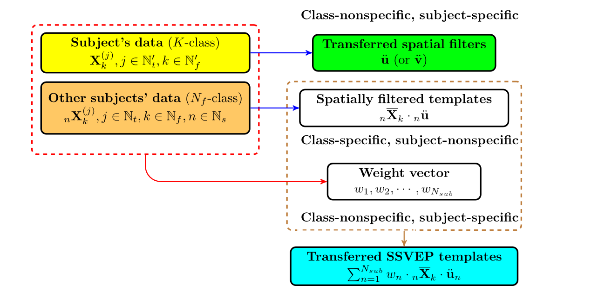
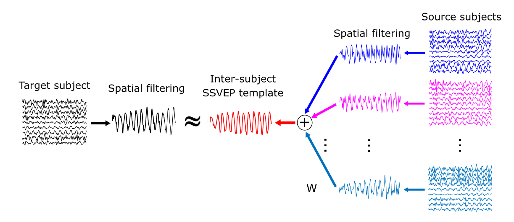

# 个体迁移学习 CCA
## Subject Transfer based CCA, stCCA
***
### [论文链接][stCCA]

Wong 于 2020 年发表的 stCCA 算法，开启了他在 SSVEP 迁移算法领域研究的“传奇生涯”。至本文落笔之日，他先后提出了 Subject Transfer based CCA（stCCA）、Transfer Learning CCA （tlCCA）、Different Phase Multi-channel Adaptive Fourier Decomposition（DP-MAFD）三篇面向 SSVEP 迁移学习主题的算法，将迁移训练的可行域范围逐步扩大。不出意外的话我能在今年暑假结束之前把这三部曲都完成（~~主要是最后一个难，真的难~~）。

本期专栏我们来看 stCCA。stCCA 面向的应用场景需求是：已有源域受试者 $n$ 的完整数据 $\pmb{X}_k^{(n)} \in \mathbb{R}^{N_c^{(n)} \times N_p}$（全类别 $N_e$，训练样本 $N_t^{(n)}$ 相对充分，导联、采样点数分别为 $N_c^{(n)}$、$N_p$），已有目标域受试者 $\tau$ 的训练数据 $\pmb{X}_{c_k}^{(\tau)} \in \mathbb{R}^{N_c^{(\tau)} \times N_p}$（类别不全 $N_e^{(\tau)} \leqslant N_e$，样本 $N_t^{(\tau)}$ 不充分）。stCCA 的主要目标是：通过将源域数据迁移至目标域，补充缺失类别的建模信息。

关于目标域不完整样本类别集合 $\left\{ c_1, c_2, \cdots, c_{N_e^{(\tau)}} \right\} $ 的筛选方式，文中给出了三种方案：
$$
    \begin{align}
        \notag
        {\rm stCCA_1} &: c_k = 1 +\left\lfloor \dfrac{\left( N_e - 1 \right) \times \left( k - 1 \right)} {N_e^{(\tau)} - 1} \right\rfloor\\
        \notag \ \\
        \notag
        {\rm stCCA_2} &: c_k = \left\lfloor \dfrac{N_e \times \left( 2k - 1 \right)} {2 N_e^{(\tau)}} \right\rfloor\\
        \notag \ \\
        \notag
        {\rm stCCA_3} &: c_k = \left\lfloor \dfrac{N_e \times 2k} {2 N_e^{(\tau)}} \right\rfloor\\
    \end{align}
    \tag{1}
$$
$\lfloor a \rfloor$ 表示小于或等于 $a$ 的最大整数。以常规 40-Target SSVEP-BCI 的类别索引为例（$N_e^{(\tau)}=15$），基于三种筛选方式构建的类别集 $C_1$、$C_2$、$C_3$ 如下所示：
$$
    \begin{align}
        \notag
        C_1 &= \left\{ 1,3,6,9,12,14,17,20,23,26,28,31,34,37,40 \right\}\\
        \notag \ \\
        \notag
        C_2 &= \left\{ 1,4,6,9,12,14,17,20,22,25,28,30,33,36,38 \right\}\\
        \notag \ \\
        \notag
        C_3 &= \left\{ 2,5,8,10,13,16,18,21,24,26,29,32,34,37,40 \right\}\\
    \end{align}
    \tag{2}
$$

具体来说，stCCA 的模型分为两个主要部分：个体空间滤波器（Intra-Subject Spatial Filter）与 跨个体 SSVEP 模板（Inter-Subject SSVEP Template），二者分别对应于两个前提假设。首先是个体内空间滤波器，Wong 提出的前提假设为：对于一个固定的受试者而言，面向不同频率刺激数据构建的空间滤波器是具有较高相似度，即可以共享的。因此 Wong 利用 msCCA 方法计算受试者的类别非特异、个体特异（class-nonspecific, subject-specific）空间滤波器（transferred spatial filters），以实现基于参数的迁移学习。上述过程在源域和目标域都会进行，此处以目标域受试者 $\tau$ 为例展示目标函数及训练结果 $\hat{\pmb{u}}^{(\tau)} \in \mathbb{R}^{1 \times N_c^{(\tau)}}$、$\hat{\pmb{v}}^{(\tau)} \in \mathbb{R}^{1 \times 2N_h}$：
$$
    \hat{\pmb{u}}^{(\tau)}, \hat{\pmb{v}}^{(\tau)} = \underset{\pmb{u}^{(\tau)},\pmb{v}^{(\tau)}} \argmax \dfrac{\pmb{u}^{(\tau)} \left( \sum_{k=1}^{N_e^{(\tau)}} \bar{\pmb{X}}_{c_k}^{(\tau)} {\pmb{Y}_{c_k}}^T \right) {\pmb{v}^{(\tau)}}^T} {\sqrt{\pmb{u}^{(\tau)} \left( \sum_{k=1}^{N_e^{(\tau)}} \bar{\pmb{X}}_{c_k}^{(\tau)} {\bar{\pmb{X}}_{c_k}^{(\tau)}}^T \right) {\pmb{u}^{(\tau)}}^T} \sqrt{\pmb{v}^{(\tau)} \left( \sum_{k=1}^{N_e^{(\tau)}} \pmb{Y}_{c_k} {\pmb{Y}_{c_k}}^T \right) {\pmb{v}^{(\tau)}}^T}}
    \tag{3}
$$
其次是跨个体 SSVEP 模板，其前提假设是：不同受试者的空间滤波 SSVEP 模板之间具有一定的共通性，即源域受试者模板的某种线性加权和可能与目标域新受试者的模板高度相似，且加权系数在受试者内（不同试次）、样本类别间（不同类别）具有可迁移性。

假设基于 $N_s$ 位源域受试者数据 $\bar{\pmb{X}}_k^{(n)} \in \mathbb{R}^{N_c \times N_p}$ 构建的跨个体模板为 $\bar{\pmb{X}}_k^{s} \in \mathbb{R}^{1 \times N_p}$：
$$
    \bar{\pmb{X}}_k^{s} = \dfrac{1} {N_s} \sum_{n=1}^{N_s} w_n \hat{\pmb{u}}^{(n)} \bar{\pmb{X}}_k^{(n)}, \ \ w_n \in \mathbb{R}
    \tag{4}
$$
其中 $w_n$ 为第 $n$ 位受试者的迁移权重，向量形式为 $\pmb{w} \in \mathbb{R}^{1 \times N_s}$。特别地，Wong 设计了一个多元线性回归问题来描述并求解最优 $\pmb{w}$。该回归问题的本质是寻找最优 $\pmb{w}$ 使得目标域训练数据的每一类个体内模板 $\hat{\pmb{u}}^{(\tau)} \bar{\pmb{X}}_{c_k}^{(\tau)}$ 与全体源域受试者个体内模板 $\hat{\pmb{u}}^{(n)} \bar{\pmb{X}}_{c_k}^{(n)}$ 的误差平方和最小：
$$
    \begin{align}
        \notag
        \hat{\pmb{w}} &= \sum_{n=1}^{N_s} \sum_{k=1}^{N_e^{(\tau)}} \sum_{t=1}^{N_p} \left[ \hat{\pmb{u}}^{(\tau)} \bar{X}_{c_k}^{(\tau)} (t) - \hat{\pmb{u}}^{(n)} \bar{X}_{c_k}^{(n)} (t) \right]^2 = \underset{\pmb{w}} \argmin \left\| \pmb{wA} - \pmb{b} \right\|_F^2\\
        \notag \\
        \notag
        \pmb{b} &=
            \begin{bmatrix}
                \hat{\pmb{u}}^{(\tau)} \bar{\pmb{X}}_{c_1}^{(\tau)} & \hat{\pmb{u}}^{(\tau)} \bar{\pmb{X}}_{c_2}^{(\tau)} & \cdots & \hat{\pmb{u}}^{(\tau)} \bar{\pmb{X}}_{c_{N_e^{(\tau)}}}^{(\tau)}
            \end{bmatrix} \in \mathbb{R}^{1 \times \left( N_e^{(\tau)} N_p \right)}\\
        \notag \\
        \notag
        \pmb{A} &= 
            \begin{bmatrix}
                \hat{\pmb{u}}^{(1)} \bar{\pmb{X}}_{c_1}^{(1)} & \hat{\pmb{u}}^{(1)} \bar{\pmb{X}}_{c_2}^{(1)} & \cdots & \hat{\pmb{u}}^{(1)} \bar{\pmb{X}}_{c_{N_e^{(\tau)}}}^{(1)}\\
                \ \\
                \hat{\pmb{u}}^{(2)} \bar{\pmb{X}}_{c_1}^{(2)} & \hat{\pmb{u}}^{(2)} \bar{\pmb{X}}_{c_2}^{(2)} & \cdots & \hat{\pmb{u}}^{(2)} \bar{\pmb{X}}_{c_{N_e^{(\tau)}}}^{(2)}\\
                \ \\
                \vdots & \vdots & \ddots & \vdots\\
                \ \\
                \hat{\pmb{u}}^{(N_s)} \bar{\pmb{X}}_{c_1}^{(N_s)} & \hat{\pmb{u}}^{(N_s)} \bar{\pmb{X}}_{c_2}^{(N_s)} & \cdots & \hat{\pmb{u}}^{(N_s)} \bar{\pmb{X}}_{c_{N_e^{(\tau)}}}^{(N_s)}\\
            \end{bmatrix} \in \mathbb{R}^{ N_s \times \left( N_e^{(\tau)} N_p \right)}
    \end{align}
    \tag{5}
$$
上式的解析解（最小二乘解）为 $\pmb{w} = \pmb{b} {\pmb{A}}^T (\pmb{A} {\pmb{A}}^T)^{-1}$。需要注意的是，这种推导过程及计算方法在理论上是精准可行的，但是在编程实践过程中未必是最优的。其原因有二：一是当源域数据集体量较大（受试者数目多）时，构建数据拼接矩阵 $\pmb{A}$ 以及矩阵运算的内存开销是巨大的，例如 BETA 数据集多达 70 人次的样本容量，在普通电脑上运行以上算法很容易导致内存溢出；二是大矩阵求逆操作在运算精度上难以保证，可能影响最终的结果输出。后续考虑使用矩阵分解方法（如 LU、QR 分解等）代替矩阵求逆。

最后，目标域的测试样本 $\pmb{\mathcal{X}} \in \mathbb{R}^{N_c \times N_p}$ 需要与两种模板分别进行匹配，获得的两种系数融合后作为 stCCA 算法的判别系数：
$$
    \begin{cases}
        \rho_{k,1} = {\rm corr} \left( \hat{\pmb{u}}^{(\tau)} \pmb{\mathcal{X}}, \ \hat{\pmb{v}}^{(\tau)} \pmb{Y}_k \right)\\
        \ \\
        \rho_{k,2} = {\rm corr} \left( \hat{\pmb{u}}^{(\tau)} \pmb{\mathcal{X}}, \ \bar{\pmb{X}}_k^{s} \right)\\
    \end{cases}, \ \ \rho_k = \sum_{i=1}^2 {\rm sign} \left( \rho_{k,i} \right) {\rho_{k,i}}^2
    \tag{6}
$$
文中还提出了一种衡量 BCI 性能的新指标：cost-performance ratio，其中文翻译似乎是“性价比”？我们最好还是使用 CPR 来简称（~~不然就太 low 了~~）。CPR 的主要作用是量化训练样本数目对于 ITR 指标的增益：
$$
    {\rm CPR} = \dfrac{\triangle {\rm ITR}} {N_t \times N_e^{(\tau)}}
    \tag{7}
$$
由于本文的论述目标是说明 stCCA 算法在极少样本条件下的显著优势，因此文中其它算法的样本容量为 $N_e$（或 $2N_e$），而 stCCA 的应用样本容量远远小于前者，从而导致了 stCCA 的 CPR 显著高于其它算法，这也算是某种意义上的“数据疏浚”吧。

最后我们来冷静客观地评价 stCCA 的实际作用。毋庸置疑的是，stCCA 是我目前浏览的文献中**首个**能够在源域与目标域样本类别不平衡的情况下、以较高质量完成模板迁移与信息传递的算法。同时在公开数据集中，即便是训练样本较为充裕的情况下，stCCA 依旧能在与 msCCA、eTRCA 的对比中以微弱优势胜出，足以说明该算法的跨个体迁移学习产生了相当程度的积极作用。但是 stCCA 与其它 TRCA 改进算法的性能差异尚不明晰，且 stCCA 并没有在目标域上扩增分类所用的样本容量，仅对最终判别系数作了补充。在信息利用程度上不够充分，存在改进的空间（这部分空间似乎被 sd-LST 填补了）。

[stCCA]: https://ieeexplore.ieee.org/document/9177172/