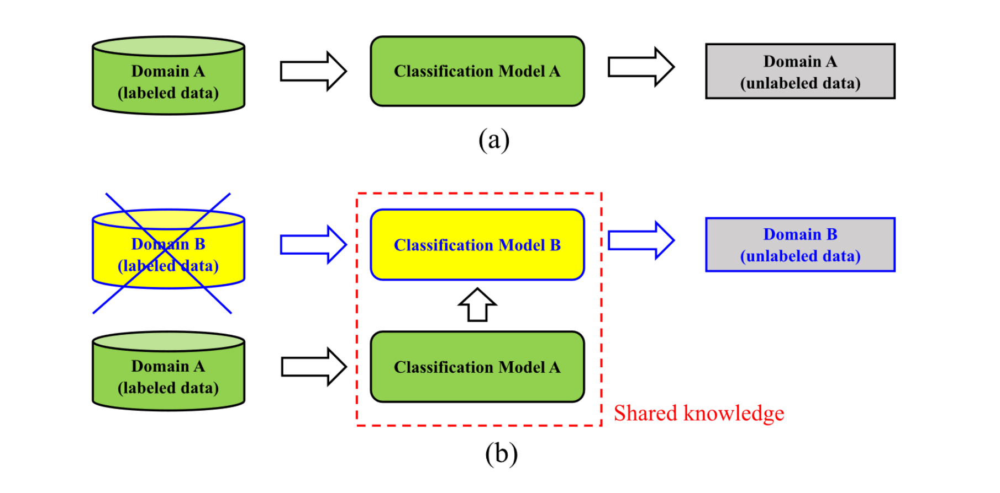
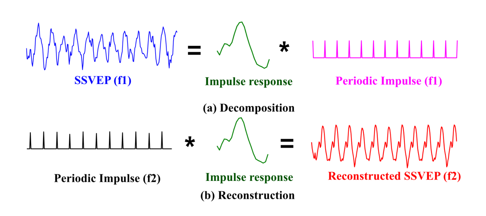
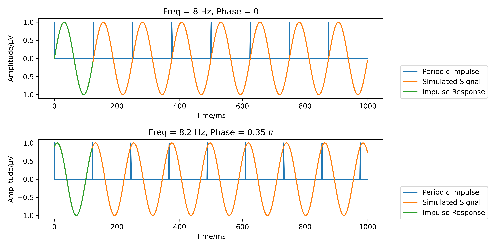
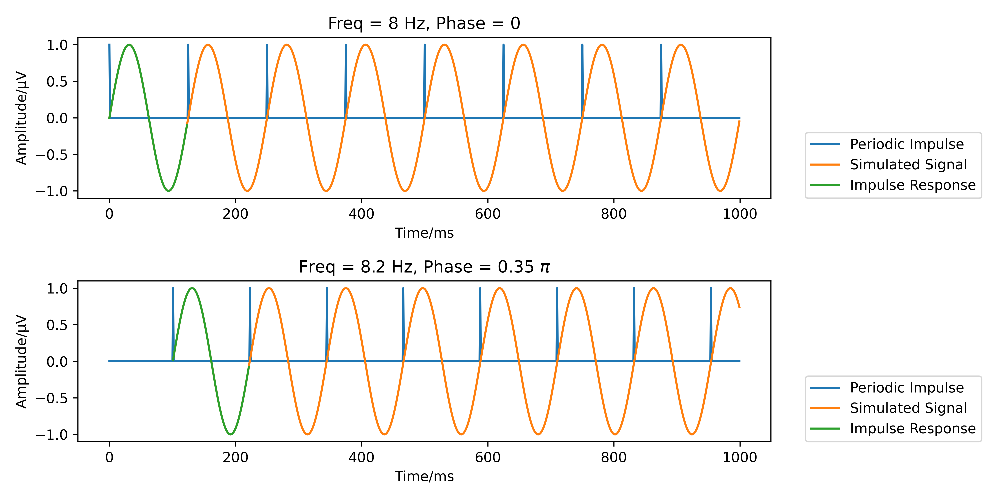
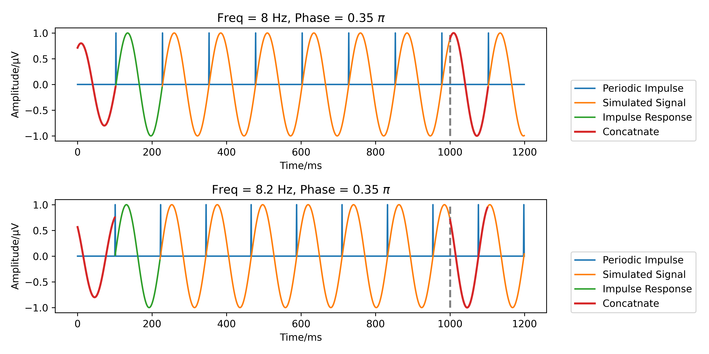

# 跨频率迁移学习 CCA
## Transfer Learning CCA, tlCCA
***
### [论文链接][tlCCA]

本期专栏介绍的算法是 Wong 的 SSVEP 迁移算法三部曲之二：tlCCA。tlCCA面向的应用场景需求是：已有受试者的类别不完整训练数据 $\pmb{X}_{c_k} \in \mathbb{R}^{N_c \times N_p}$，$c_k \in \left\{ c_1, c_2,\cdots, c_{N_e^p}\right\}$，$N_e^p \leqslant N_e$。训练样本数目 $N_t$ 相对充分，导联、采样点数分别为 $N_c$、$N_p$。光看算法名称难以区分 tlCCA 与 stCCA 的主要区别，因此我在标题中增加了“跨频率”前缀。两者的区别在于，stCCA 的应用场景是：**源域数据的类别数目、样本容量都相对完善，目标域数据样本不足，类别缺失**；而 tlCCA 的应用场景是：**无源域数据迁移条件，目标受试者的类别缺失，训练样本相对充足**。简单来说，tlCCA 完成的任务是：**数据集类别不平衡的个体内迁移学习**。

tlCCA 算法的构想与实施源于一个 SSVEP 信号形成的重要理论：叠加理论（Superposition Theory），我个人称其为“冲激（脉冲）响应-卷积模型”（Impulse Response - Convolution Model），以下简称“卷积模型”。卷积模型认为 SSVEP 信号可以表示为单周期脉冲响应（Impulse Response）以及周期性脉冲刺激（Periodic Impulse）的卷积。脉冲响应的波形不具备频率特异性（Stimulus-Specific），即不同频率诱发的 SSVEP 响应，在对应刺激频率的单个周期内，其波形相似性较高。该波形具有受试者个体特异性（Subject-Specific），即不同受试者的 Impulse Response 差异性较大（这一点似乎表明卷积模型不适合跨个体数据迁移，未经验证）。脉冲刺激决定了 SSVEP 特征信号的主体频率，脉冲强度大小决定了当前周期的波形幅值水平。

相比基于正余弦模板的传统 SSVEP 信号模型，卷积模型有利有弊：

（i）首先从信号波形来看，卷积模型显然具备更强大的个体特异性信息描述能力，对波形幅值时变性信息、波形形状特异性信息的捕获能力大大强于 CCA、eCCA 等传统模型。

（ii）其次，脉冲响应信息有望在不同频率间进行共享，反过来说，不同类别的训练数据有望为同一训练目标提供信息，等价于变相地增加了训练样本。

（iii）最后，（ii）中描述的愿景存在一定的限制，主要因素在于脉冲响应时长差异以及 SSVEP 的倍频信息。刺激频率不同，单周期脉冲响应时长自然也不一样。当刺激频率相差过大时，数据截取、超采样、降采样等方法都可能难以实现不同频率间脉冲刺激波形的迁移互通；此外，SSVEP 的倍频响应变化规律尚不明确，8 Hz 脉冲响应中可能包含的倍频成分在 15 Hz 脉冲响应中未必存在（或强度很低）。

综合（ii）、（iii）可知，论文标题所述的 “Transfer Subject-Specific Knowledge Across Stimulus Frequencies” 对刺激频率（参数）的要求是比较严格的。根据原文 Discussion 相关内容，跨频率迁移的适用范围仅限于 $f \pm 0.2$（Hz）（BETA数据集）。其中的具体细节还有很多值得展开的部分，相关内容将在本节末尾论述。

接下来重点介绍卷积模型的训练过程。对于某类 SSVEP 的单通道响应 $\pmb{x} \in \mathbb{R}^{1 \times N_p}$（简要起见，此处略去类别信息），$\pmb{x}$ 可分解为脉冲响应 $\pmb{r} \in \mathbb{R}^{1 \times N}$ 与脉冲卷积矩阵 $\pmb{H} \in \mathbb{R}^{N \times N_p}$ 的乘积：
$$
    \pmb{x} = \sum_{\tau = - \infty}^{+ \infty} r(\tau) \cdot h(t-\tau) = \pmb{r} \pmb{H} = 
    \begin{bmatrix}
        r(1) & r(2) & \cdots & r(N)
    \end{bmatrix}
    \begin{bmatrix}
        h(1) & \cdots & h(L) & 0 & 0 & \cdots & 0\\
        \ \\
        0 & h(1) & \cdots & h(L) & 0 & \cdots & 0\\
        \ \\
        \vdots & \ddots & \ddots & \ddots & \ddots & \ddots & \vdots\\
        \ \\
        0 & 0 & \cdots & 0 & h(1) & \cdots & h(L)\\
    \end{bmatrix}
    \tag{1}
$$
在 tlCCA 的实践过程中，$\pmb{H}$ 根据刺激参数可以先验性地设定，而 $\pmb{r}$ 是不可知、需要迭代优化的。对于刺激类别索引 $k$（刺激频率 $f_k$、初始相位 $\phi_k$）：
$$
    \hat{\pmb{r}}_k = \underset{\pmb{r}_k} \argmin \left\| \pmb{x}_k - \pmb{r}_k \pmb{H}_k \right\|_2^2
    \tag{2}
$$
不难发现，其中单通道响应 $\pmb{x}_k$ 似乎也不可知。当然我们可以直接使用 Oz 导联的信号作为 $\pmb{x}_k$，只不过这样效果肯定不会太好。为了尽量抑制任务无关成分，我们可以设计空间滤波器 $\pmb{w}_k$ 对多通道信号的试次叠加平均 $\bar{\pmb{X}}_k$ 进行处理：
$$
    \pmb{x}_k \approx \pmb{w}_k \bar{\pmb{X}}_k \approx \pmb{r}_k \pmb{H}_k
    \tag{3}
$$
因此，原最小二乘优化问题将转变为交替优化问题：
$$
    \left\{ \hat{\pmb{r}}_k, \hat{\pmb{w}}_k \right\} = \underset{\pmb{r}_k, \pmb{w}_k} \argmin \left\| \pmb{w}_k \bar{\pmb{X}}_k - \pmb{r}_k \pmb{H}_k \right\|_2^2
    \tag{4}
$$
对于式 (4)，首先在边界条件 $\pmb{w}_k {\pmb{w}_k}^T = 1$ 的约束下（基于 Rayleigh Quotient 或特征值分解求得的空间滤波器默认满足该条件），设定空间滤波器 $\pmb{w}_k$ 的初始值并求解 $\pmb{r}_k$（约束为 $\pmb{r}_k {\pmb{r}_k}^T = 1$），随后固定 $\pmb{r}_k$ 以求解更新 $\pmb{w}_k$。按上述步骤迭代优化直至目标函数值 $\left\| \pmb{w}_k \bar{\pmb{X}}_k - \pmb{r}_k \pmb{H}_k \right\|_2^2$ 收敛：
$$
    \begin{align}
        \notag
        \pmb{r}_k &= \pmb{w}_k \bar{\pmb{X}}_k {\pmb{H}_k}^T \left( \pmb{H}_k {\pmb{H}_k}^T \right)^{-1}\\
        \notag \ \\
        \notag
        \pmb{w}_k &= \pmb{r}_k \pmb{H}_k {\bar{\pmb{X}}_k}^T \left( \bar{\pmb{X}}_k {\bar{\pmb{X}}_k}^T \right)^{-1}
    \end{align}
    \tag{5}
$$
根据原文描述，跨频率迁移的范围限定为 $f \pm 0.2$（Hz）。以 $k$ 表示存在训练数据的刺激索引，$k^{'}$ 表示由 $k$ 迁移得来的无训练数据刺激参数，相位、滤波器、卷积矩阵等其它参数标记法以此类推。即对于类别 $k^{'}$ 而言，其训练模型存在如下关系：
$$
    \hat{\pmb{w}}_{k^{'}}, \ \hat{\pmb{r}}_{k^{'}} = \hat{\pmb{w}}_k, \ \hat{\pmb{r}}_k, \ \ \pmb{H}_{k^{'}} \ne \pmb{H}_k, \ \ \pmb{Y}_{k^{'}} \ne \pmb{Y}_k
    \tag{6}
$$
共通滤波器 $\pmb{u}$、$\pmb{v}$ 由全类别整合的 ms-eCCA（$d=N_e^p$）计算得来。技术细节可参考 stCCA、msCCA 或 ms-eCCA 章节：
$$
    \hat{\pmb{u}}, \hat{\pmb{v}} = \underset{\pmb{u},\pmb{v}} \argmax \dfrac{\pmb{u} \left( \sum_{k=1}^{N_e^p} \bar{\pmb{X}}_{c_k} {\pmb{Y}_{c_k}}^T \right) {\pmb{v}}^T} {\sqrt{\pmb{u} \left( \sum_{k=1}^{N_e^p} \bar{\pmb{X}}_{c_k} {\bar{\pmb{X}}_{c_k}}^T \right) {\pmb{u}}^T} \sqrt{\pmb{v} \left( \sum_{k=1}^{N_e^p} \pmb{Y}_{c_k} {\pmb{Y}_{c_k}}^T \right) {\pmb{v}}^T}}
    \tag{7}
$$
对于测试样本 $\pmb{\mathcal{X}} \in \mathbb{R}^{N_c \times N_p}$，设计判别系数如下：
$$
    \begin{align}
        \notag
        \rho_k &= \sum_{m=1}^{3} {\rm sign} \left( r_{k,m} \right) {r_{k,m}}^2, \ \ \ \ r_{k,m} = 
        \begin{cases}
            r_{k,1} = {\rm corr} \left( \hat{\pmb{u}} \pmb{\mathcal{X}}, \ \hat{\pmb{v}} \pmb{Y}_k \right)\\
            \ \\
            r_{k,2} = {\rm corr} \left( \hat{\pmb{w}}_k \pmb{\mathcal{X}}, \ \hat{\pmb{r}}_k \pmb{H}_k \right)\\
            \ \\
            r_{k,3} = {\rm CCA} \left( \hat{\pmb{w}}_k \pmb{\mathcal{X}}, \ \pmb{Y}_k \right)\\
        \end{cases}\\
        \notag \ \\
        \notag
        \rho_{k^{'}} &= \sum_{m=1}^{3} {\rm sign} \left( r_{k^{'},m} \right) {r_{k^{'},m}}^2, \ \ \ \ r_{k^{'},m} = 
        \begin{cases}
            r_{k^{'},1} = {\rm corr} \left( \hat{\pmb{u}} \pmb{\mathcal{X}}, \ \hat{\pmb{v}} \pmb{Y}_{k^{'}} \right)\\
            \ \\
            r_{k^{'},2} = {\rm corr} \left( \hat{\pmb{w}}_k \pmb{\mathcal{X}}, \ \hat{\pmb{r}}_k \pmb{H}_{k^{'}} \right)\\
            \ \\
            r_{k^{'},3} = {\rm CCA} \left( \hat{\pmb{w}}_k \pmb{\mathcal{X}}, \ \pmb{Y}_{k^{'}} \right)\\
        \end{cases}\\
    \end{align}
    \tag{8}
$$
到这里 tlCCA 的算法公式部分基本结束了，但是我并不想就这样结束这一期专栏。因为在代码复现的实践过程中，还有很多值得一提的技术细节想与各位读者分享。

## 脉冲刺激时刻如何确定？
想要理解该问题，抑或是在该问题上犯错误，都需要有一定的信号与线性系统的知识（当然前者需要的更多一些）。首先我们需要理解什么叫脉冲响应。这里我不想重复教材上的定义，仅以最直观（可能不严谨）的方式描述：当外部施加一次脉冲刺激（尖峰）后，系统产生一段时域响应。对于因果系统而言，整体时域响应仅决定于刺激时刻与系统本身的某些性质。

举个例子，当我们在极短时间内对一端固定的弹簧施加一个压力并撤销（事实上物理可实现的脉冲刺激不可能真正符合理论上的 $\delta(t)$ 函数，这里只是一种近似），弹簧非固定端将会产生具有阻尼性质的往复运动。非固定端点的运动轨迹即可视为弹簧系统在受到脉冲压力刺激后产生的脉冲响应。在脉冲刺激到来之前，哪怕初始条件不为零（弹簧已被压缩或者拉长），该系统也不会产生响应输出（弹簧不会运动），否则就不是因果系统。这一性质决定了我们设计 tlCCA 算法的实现与应用方式。

如果我们在构建脉冲刺激时，将大脑视为因果系统，则 0 时刻点必然存在一次脉冲，之后按刺激周期依次给予脉冲。换句话说，脉冲刺激的时刻点与真实 SSVEP 刺激的初始相位是无关的，它们既不是刺激波形的峰/谷值点，也不是零点。只要刺激频率确定了，这些时刻点也应随之确定。与之相应地，脉冲响应决定了最终卷积模型输出特征信号的相位。

这种设计会直接导致**脉冲响应跨频率迁移的失效**。例如 8 Hz、0 相位与 8.2 Hz、0.35 $\pi$ 相位的 SSVEP 脉冲响应（下图中绿色片段），二者在波形上存在巨大差异，因为二者的频率虽然相似，但是初相不同。如果抛开迁移部分不提，仅使用该方法对当前训练数据进行扩增，则因果模型在程序构建、代码运行、理论分析等方面都将带来极大的便利。

如果我们将大脑视为非因果系统，或者我们把信号相位信息交由脉冲刺激体现，则脉冲刺激时刻会产生一定的时序延迟（偏差），具体延迟数值由信号理论初相决定，此时相近频率的脉冲响应（下图中绿色波段）彼此相似共通。从物理意义角度看，脉冲刺激时刻其实是刺激显示装置（如显示器）的亮度（对比度、灰度等）刚好经过 0 点（ 归一化 RGB 值 $[0.5,0.5,0.5]$）、且即将变亮（归一化 RGB 值向 $[1,1,1]$ 变化）的那一瞬间。这一概念是由 SSVEP 的相位概念转变而来的：0 相位 SSVEP（的定义）从零电势差点开始向正波波峰变化。我们当然也可以将刺激区域从最暗向最亮转变的那一瞬间设为刺激时刻（可能这样能更好地与数字电路中的高低电平概念相对应），此时 0 相位 SSVEP（的定义）就变成了信号从负波波峰向正波波峰变换（这种定义不常见）。

这种非因果设计同样存在问题：**生成信号的前端不可避免地存在全零片段**。这是由于式 (1) 中矩阵 $\pmb{H}$ 的前端一些元素 $h(1)$、$h(2)$、$\cdots$ 为 0，导致矩阵乘法结果 $\pmb{x}$ 的相应元素为 0，事实上这一片段是由零时刻之前的脉冲刺激诱发产生的（正所谓非因果系统）。这种误差是系统性的，会直接影响目标函数 (4) 的求解结果。关于这个问题，我在后面会讲解相应的处理措施。

## 脉冲刺激强度如何模拟？
这个问题/需求主要来源于相对落后的显示设备（刷新率 120 Hz、75 Hz 甚至更低的 LCD 设备）或者相对较高的刺激频率。当显示器刷新率相对不足时，刺激波形的单周期正弦近似采样偏少，显示器的刷新帧无法保证每次准确地落在理论正弦刺激波形的波峰上。大家可以自行想象一下：单个正弦周期内（0 相位）只有 6 个采样点，则第 2、3、4、5 个采样点都将“完美”避开最亮/最暗的峰值。再将该刺激的频率调整得特殊一些，并设置一定的初始相位，则不同周期的最大峰值亮度将会发生变化，直观表现为采样波形幅值存在包络。当显示器刷新率相对充足时，即便单周期内不满足整数采样帧数，其正弦波形幅值抖动差异已经可以忽略不记了。

话虽如此，我们还是需要仔细研究一下怎样提取变化的波形幅值，以及怎样输出上一节图中的蓝色脉冲刺激波形。这里首先需要解决的问题是，如何输出非因果系统设计下的脉冲刺激时刻（因果系统只要按刺激周期依次从 0 时刻点向后标记时刻并输出就行了）。在上一个问题的讨论过程中，我们明确了一点：**脉冲刺激时刻是刺激显示装置的亮度刚好经过 0 点且即将变亮的那一瞬间**，即零相位正弦波形的零点。但是有数字信号处理经验的朋友应该了解，由于采样率的限制，信号序列的零点往往很难、甚至找不到。序列最值是相对容易找到的，因此第一个 Trick 出现了：**我们需要获取一个与刺激源同相位的余弦信号序列，通过寻找该序列的正向峰值从而确定脉冲刺激的时刻**。

Trick 1 帮助我们解决了脉冲刺激定位问题，接下来需要解决幅值（强度）问题。在已知显示设备刷新率的情况下，我们可以认为地对平滑余弦信号“降采样”。注意这里降采样并非真的减少序列采样点，而是“采样-保持”，从而获得一条看上去有“边边角角”的近似余弦采样序列。所以有第二个 Trick：**通过“采样-保持”技术获取余弦信号序列的低采样率近似序列，对该序列寻找正向峰值进一步确定脉冲刺激的真实时刻与幅值**。

结合上述两个 Trick 我们能够顺利输出幅值调制后的 Periodic Impulse 信号序列。

## 信号全零片段如何填补？
至此可知，原文中图 3（b）并不严谨。如果 0 时刻点没有脉冲刺激，不可能产生图 3（b）中所示的相位延迟效果。如何解决全零片段呢？Wong 的源代码（是的，这个家伙在论文里压根就没提这事）给出了一种近似替代的方法。即把生成信号 1s 之后的相应长度部分乘上压缩系数（0.8）后转接到此处（见下图红色区段）。这种方法只能相对降低误差，其原因在于它仅适用于“整数周期频率”，即 1 s 采样时长内具有整数个信号周期，此时全零段刚好能对应上 1 s 后的相应片段。至于诸如 8.2 Hz 这样的特殊频率，信号突变在所难免。

这种复制填补的方法是能够方便地转换为矩阵运算的。考虑卷积过程为矩阵乘法 $\pmb{x} = \pmb{rH}$，则将 $\pmb{x}$ 的末尾 $N_l$ 个点的数据复制至起始端，只需再右乘矩阵 $\pmb{H}_s$：
$$
    \pmb{H}_s = \pmb{I}_{N_p} + 
    \begin{bmatrix}
        \pmb{0}^{(N_p-N_l) \times N_l} & \pmb{0}^{(N_p - N_l) \times (N_p-N_l)}\\
        \ \\
        \pmb{I}_{N_l} & \pmb{0}^{N_l \times (N_p-N_l)}
    \end{bmatrix} \in \mathbb{R}^{N_p \times N_p}
    \tag{9}
$$
Trick 3：合理设计方阵 $\pmb{H}_s$ 并融入到式 (5) 所示的迭代优化过程中，能够解决重构信号前端出现全零片段的问题。若根据刺激周期动态地设计截取起始时刻，在理论上能够避免信号特变的问题。

[tlCCA]: https://ieeexplore.ieee.org/document/9354064/

