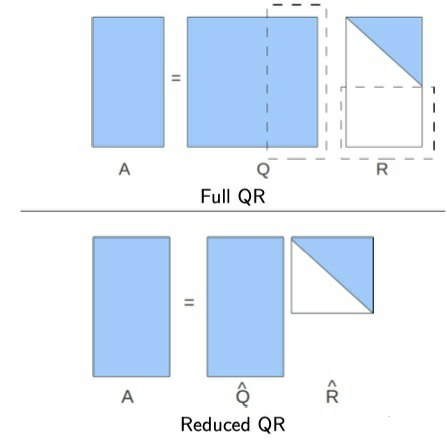

---
html:
    toc: true
print_background: true
---

# 1. 典型相关性分析
**Canonical correlation analysis, CCA**

## 1.1 标准 CCA：CCA
**[论文链接][CCA] | 代码：[cca][cca(code)].cca()**

对于具有 $N_e$ 个不同频率刺激的 SSVEP-BCI 系统，频率索引 $k$ 的人工构建正余弦模板 $\pmb{Y}_k$ 可表示为：
$$
    \pmb{Y}_k = \begin{bmatrix} 
        \sin \left(2 \pi f_k n \right)\\
        \cos \left(2 \pi f_k n \right)\\
        \sin \left(4 \pi f_k n \right)\\
        \cos \left(4 \pi f_k n \right)\\
        \vdots\\
        \sin \left(2 N_h \pi f_k n \right)\\
        \cos \left(2 N_h \pi f_k n \right)\\
    \end{bmatrix} \in \mathbb{R}^{\left(2N_h \right) \times N_p}, \ n=\left[\dfrac{1}{f_s}, \dfrac{2}{f_s}, ..., \dfrac{N_p}{f_s} \right]
    \tag{1-1-1}
$$
对于单试次多导联 EEG 数据 $\pmb{X} \in \mathbb{R}^{N_c \times N_p}$ 以及假定的所属类别 $k$ ，CCA 的优化目标为一组投影向量 $\hat{\pmb{U}}_k$ 和 $\hat{\pmb{V}}_k$，使得一维信号 $\hat{\pmb{U}}_k \pmb{X}$ 与 $\hat{\pmb{V}}_k \pmb{Y}_k$ 之间相关性最大化，其目标函数为：
$$
    \hat{\pmb{U}}_k, \hat{\pmb{V}}_k = \underset{\pmb{U}_k, \pmb{V}_k} \argmax {\dfrac{Cov \left(\pmb{U}_k \pmb{X}, \pmb{V}_k \pmb{Y}_k \right)} {\sqrt{Var \left(\pmb{U}_k \pmb{X} \right)} \sqrt{Var \left(\pmb{V}_k \pmb{Y}_k \right)}}} = \underset{\pmb{U}_k, \pmb{V}_k} \argmax {\dfrac{\pmb{U}_k \pmb{C}_{\pmb{X} \pmb{Y}_k} {\pmb{{V}}_k}^T} {\sqrt{\pmb{U}_k \pmb{C}_{\pmb{X} \pmb{X}} {\pmb{{U}}_k}^T} \sqrt{\pmb{V}_k \pmb{C}_{\pmb{Y}_k \pmb{Y}_k} {\pmb{{V}}_k}^T}}} \tag{1-1-2}
$$
$$
    \begin{cases}
        \pmb{C}_{\pmb{X} \pmb{X}} = \dfrac{1}{N_p-1} \pmb{X} {\pmb{X}}^T \in \mathbb{R}^{N_c \times N_c}\\
        \\
        \pmb{C}_{\pmb{Y}_k \pmb{Y}_k} = \dfrac{1}{N_p-1} \pmb{Y}_k {\pmb{Y}_k}^T \in \mathbb{R}^{\left(2N_h \right) \times \left(2N_h \right)}\\
        \\
        \pmb{C}_{\pmb{X} \pmb{Y}_k} = \dfrac{1}{N_p-1} \pmb{X} {\pmb{Y}_k}^T \in \mathbb{R}^{N_c \times \left(2N_h \right)}\\
        \\
        \pmb{C}_{\pmb{Y}_k \pmb{X}} = \dfrac{1}{N_p-1} \pmb{Y}_k {\pmb{X}}^T \in \mathbb{R}^{\left(2N_h \right) \times N_c}\\
    \end{cases}
    \tag{1-1-3}
$$
根据最优化理论，函数 (1-2) 的等效形式为：
$$
    \begin{cases}
        \underset{\pmb{U}_k, \pmb{V}_k} \max \ \pmb{U}_k \pmb{C}_{\pmb{X} \pmb{Y}_k} {\pmb{{V}}_k}^T\\
        \\
        s.t.\ \pmb{U}_k \pmb{C}_{\pmb{X} \pmb{X}} {\pmb{{U}}_k}^T =
        \pmb{V}_k \pmb{C}_{\pmb{Y}_k \pmb{Y}_k} {\pmb{{V}}_k}^T = 1
    \end{cases}
    \tag{1-1-4}
$$
利用 *Lagrandian* 乘子法构建多元函数 $J(\pmb{U}_k, \pmb{V}_k, \lambda, \theta)$：
$$
    J = \pmb{U}_k \pmb{C}_{\pmb{X} \pmb{Y}_k} {\pmb{{V}}_k}^T - \dfrac{1}{2} \lambda \left(\pmb{U}_k \pmb{C}_{\pmb{X} \pmb{X}} {\pmb{{U}}_k}^T - 1 \right) - \dfrac{1}{2} \theta \left(\pmb{V}_k \pmb{C}_{\pmb{Y}_k \pmb{Y}_k} {\pmb{{V}}_k}^T - 1 \right)
    \tag{1-1-5}
$$
对函数 $J$ 求偏导数并置零：
$$
    \begin{cases}
        \dfrac{\partial J} {\partial \pmb{{U}}_k} = 
        \pmb{C}_{\pmb{X} \pmb{Y}_k} {\pmb{{V}}_k}^T - \lambda \pmb{C}_{\pmb{X} \pmb{X}} {\pmb{{U}}_k}^T = 0 \ \ (I)\\
        \\
        \dfrac{\partial J} {\partial \pmb{{V}}_k} = 
        \pmb{C}_{\pmb{Y}_k \pmb{X}} {\pmb{{U}}_k}^T - \theta \pmb{C}_{\pmb{Y}_k \pmb{Y}_k} {\pmb{{V}}_k}^T = 0 \ \ (II)
    \end{cases}
    \tag{1-1-6}
$$
消元化简后可知 $\lambda = \theta$。送佛送到西，咱们来看看到底怎么消元：
$$
    \begin{cases}
        \pmb{U}_k * (I) \to 
        \pmb{U}_k \pmb{C}_{\pmb{X} \pmb{Y}_k} {\pmb{{V}}_k}^T - \lambda \pmb{U}_k \pmb{C}_{\pmb{X} \pmb{X}} {\pmb{{U}}_k}^T = 0\\
        \\
        \pmb{V}_k * (II) \to 
        \pmb{V}_k \pmb{C}_{\pmb{Y}_k \pmb{X}} {\pmb{{U}}_k}^T - \theta \pmb{V}_k \pmb{C}_{\pmb{Y}_k \pmb{Y}_k} {\pmb{{V}}_k}^T = 0\\
    \end{cases}
    \tag{1-1-7}
$$
根据约束条件 (1-1-4) 可知：
$$
    \lambda = \pmb{U}_k \pmb{C}_{\pmb{X} \pmb{Y}_k} {\pmb{{V}}_k}^T, \ 
    \theta = \pmb{V}_k \pmb{C}_{\pmb{Y}_k \pmb{X}} {\pmb{{U}}_k}^T
    \tag{1-1-8}
$$
大家注意 $\lambda = {\theta}^T$，而当我们明确要求优化目标是**一维向量**的时候，这两位大哥其实都是实数，所以它们相等。之后就是大家在解二元一次方程组时常用的代换消元过程（ $\pmb{U}_k$ 与 $\pmb{V}_k$ 互相替换），我就不再演示了。最终应得到两个特征值方程：
$$
    \begin{cases}
        {\pmb{C}_{\pmb{X} \pmb{X}}}^{-1} \pmb{C}_{\pmb{X} \pmb{Y}_k} {\pmb{C}_{\pmb{Y}_k \pmb{Y}_k}}^{-1} \pmb{C}_{\pmb{Y}_k \pmb{X}} {\pmb{U}_k}^T = {\lambda}^2 {\pmb{U}_k}^T\\
        \\
        {\pmb{C}_{\pmb{Y}_k \pmb{Y}_k}}^{-1} \pmb{C}_{\pmb{Y}_k \pmb{X}} {\pmb{C}_{\pmb{X} \pmb{X}}}^{-1} \pmb{C}_{\pmb{X} \pmb{Y}_k} {\pmb{V}_k}^T = {\theta}^2 {\pmb{V}_k}^T
    \end{cases}
    \tag{1-1-9}
$$
对式 (1-1-9) 中的两个 *Hermitte* 矩阵分别进行特征值分解，取最大特征值对应的特征向量作为投影向量，即为所求。对所有的假定类别遍历上述过程，基于一维 *Pearson* 相关系数分别计算判别系数并比较大小，确定最终的结果输出 $\hat{k}$：
$$
    \rho_k = corr \left(\hat{\pmb{U}}_k \pmb{X}, \hat{\pmb{V}}_k \pmb{Y}_k \right), \ \hat{k} = \underset{k} \argmax{\{\rho_k}\}
    \tag{1-1-10}
$$
式 (1-1-2) 与 (1-1-9) 请各位务必熟悉，之后部分算法的推导过程中我可能直接从类似前者的形式眺至后者，不再进行中间步骤的详细解说。

## 1.2 扩展 CCA：eCCA
**(Extended CCA)**

**[论文链接][eCCA] | 代码：[cca][cca(code)].ecca()**

## 1.3 多重刺激 CCA：msCCA
**(Multi-stimulus CCA)**

**[论文链接][msCCA] | 代码：[cca][cca(code)].mscca()**

**（大量数学前置知识警告）**

朋友们我们今天来膜拜 (~~gank~~) 澳门大学的内卷发动机 *Chi Man Wong* 和 *Feng Wan* 老师团队。之所以对他们“赞誉有加”，主要有三方面原因：

（1）**算法有用，但只有一点用**：他们提出的一系列 SSVEP 算法在公开数据集与竞赛数据集中具有极大优势（即样本量不足的情况）。不过在数据样本量充足的情况下，与传统的 (e)TRCA 算法难以拉开差距；

（2）**强悍如斯，地都快耕坏了**：他们的每篇论文都充分（~~往死里~~）挖掘了公开数据集的可用潜力，从 [Benchmark][Benchmark]、[UCSD][UCSD] 再到 [BETA][BETA] 都能看到他的身影，从 CCA 到 ms-(e)TRCA 各种花里胡哨的算法都测了个遍（~~根本不给人活路~~），低频 SSVEP-BCI 系统的解码被他卷得翻江倒海，再无探索空间。

（3）**故弄玄虚，堆砌数学壁垒**：该团队 2020 年发表的一篇关于[空间滤波器构建框架][TRCA-R]的综述性论文就是万恶之源。在其文章中，经常使用怪僻的希腊字母、花体英文字母作为变量名称，为了形式简约而把简单的实际操作过程复杂化。例如明明是人畜无害的试次叠加平均：
$$
    \bar{\pmb{X}} = \dfrac{1} {N_t} \sum_{n=1}^{N_t} \pmb{X}_i, \ \pmb{X}_i \in \mathbb{R}^{Nc \times Np}
    \tag{1-3-1}
$$
为了凑上自己提出的框架，硬要给你表演一套天书：
$$
    \oplus_{i=1}^{N_t} \pmb{X}_i = 
        \begin{bmatrix}
            \pmb{X}_1 & \pmb{0} & \cdots & \pmb{0}\\
            \pmb{0} & \pmb{X}_2 & \cdots & \pmb{0}\\
            \vdots & \vdots & \ddots & \vdots\\
            \pmb{0} & \cdots & \cdots & \pmb{X}_{N_t}
        \end{bmatrix}, \ 
    \bar{\pmb{X}} = \dfrac{1} {N_t} \pmb{\mathcal{I}}_{N_t, N_c} \cdot \left[\oplus_{i=1}^{N_t} \pmb{X}_i \right] \cdot \pmb{\mathcal{I}}_{N_t, N_p}^T
    \tag{1-3-2}
$$
组里有些萌新，一板一眼地照着论文公式复现算法，结果训练样本一多，程序不仅运行慢，还动不动就内存溢出。从原始数据结构中创建 $\oplus_{i=1}^{N_t} \pmb{X}_i$、$\pmb{\mathcal{I}}_{N_t, N_p}$ 这样的大矩阵送去后端运算，相当于先做一把电锯去再杀鸡炖汤，能不慢吗？家庭厨房里接上工业用电，能不溢出吗？

不可否认的是，*Chi Man Wong* 及其团队对于 SSVEP 信号解码的研究是成体系的、步骤严谨的，他们提出的空间滤波器框架适配了自 CCA 以来的各种算法，为后续研究工作打开了思路。更重要的是，他们团队以及清华大学 *Yijun Wang*、*Xiaogang Chen* 等老师带领的团队，都不搞弯道超车，不搞非对称竞争，每一个研究思路都是建立在已有研究基础上，每一步新的收获都会切实体现为文章成果。这样的团队对于学生培养是利好的，学生不用担心梭哈一个老板异想天开的课题而愁于毕业困境。因此再让我跑题一次：**但凡遇到老板鼓吹自己手握多少项目、每年经费多少万、带领多少优秀青年教师团队、手下多少研究生之类的话术，一定要慎之又慎**。你要知道，牛逼吹得不够大是不能吸引上边的人投资的，牛逼吹起来了就是在梭哈你自己的学术生涯与宝贵光阴。老板项目结不了题顶多延期，少赚一点经费，少评一些名声，日子一分都不会难受。你延期延掉的是什么还请自己掂量清楚。

言归正传，我们首先有必要介绍一下 *Wong* 提出的统一框架。*Wong* 以及部分研究者喜欢按列展示向量，而本文中向量统一按行排布（~~我偏不，老子就喜欢按行~~），因此部分公式可能在形式上与原文有所出入，但本质是一样的：
$$
    \pmb{\mathcal{Z}} \pmb{\mathcal{D}} \pmb{\mathcal{P}} \pmb{\mathcal{P}}^T {\pmb{\mathcal{D}}}^T \pmb{\mathcal{Z}}^T \pmb{W} = 
    \begin{cases}
        \pmb{\mathcal{Z}} \pmb{\mathcal{D}} \pmb{\mathcal{D}}^T \pmb{\mathcal{Z}}^T \pmb{W} \pmb{\Lambda}, \ Type I\\
        \\
        \pmb{W} \pmb{\Lambda}, \ Type II
    \end{cases}
    \tag{1-3-3}
$$
这里 $\pmb{W}$ 与 $\pmb{\Lambda}$ 之所以写成矩阵而不是“向量+标量”形式，是因为空间滤波器并不总是将多通道信号压缩至一维，对于需要进行压缩的一般情况，只需取方阵 $\pmb{\mathcal{Z}} \pmb{\mathcal{D}} \pmb{\mathcal{P}} \pmb{\mathcal{P}}^T {\pmb{\mathcal{D}}}^T \pmb{\mathcal{Z}}^T$ 的最大（小）特征值对应的特征向量即可；而当需要保留多个维度（投影子空间）时， $\pmb{W}$ 的最优解为多个特征向量的拼接，拼接顺序以对应特征向量的大小顺序为准。

接下来我不想再去复述他们文章中对各种算法的具体匹配方式，仅在此对式 (1-3-3) 中的主要成分进行简单介绍：

$\pmb{\mathcal{Z}}$ 是数据（默认按列排布）的集合矩阵，可能是（1）单个数据矩阵；（2）形如 $\bigoplus_{i=1}^{N_t} \pmb{X}_i$ 的多种数据块对角拼接组成的联合矩阵。一般来说（2）中的对角联合矩阵，在整体公式中需要经过 $\pmb{\mathcal{I}}$ 矩阵的变形处理,将其转换为由多个数据块**横向**或**纵向**拼接而成的大矩阵，如式 (1-3-11) ；

$\pmb{\mathcal{D}}$ 是时域滤波矩阵，除了滤波器组技术以外，通常预处理（带通滤波）结束后的数据无需再进行时域滤波，即 $\pmb{\mathcal{D}} = \pmb{I}$；

$\pmb{\mathcal{P}}$ 为正交投影矩阵，通常满足 $\pmb{\mathcal{P}} = {\pmb{\mathcal{P}}}^T = \pmb{\mathcal{P}} {\pmb{\mathcal{P}}}^T = {\pmb{\mathcal{P}}}^T \pmb{\mathcal{P}}$。根据给定的投影方向（$\pmb{T}$），可表示为:
$$
    \begin{cases}
        \pmb{\mathcal{P}} = \pmb{T}^T \left(\pmb{T} \pmb{T}^T \right)^{-1} \pmb{T}
            = \pmb{Q}_{\pmb{T}} {\pmb{Q}_{\pmb{T}}}^T\\
        \\
        \pmb{T} = \pmb{Q}_{\pmb{T}} \pmb{R}_{\pmb{T}}, \ Reduced \ QR \ decomposition
    \end{cases}
    \tag{1-3-4}
$$
不难发现，该框架的数学本质是一系列**广义特征值** ( *Generalized eigenvalue problems, GEPs* ) 方程，而空间滤波器构建过程中常见的**广义瑞利商** ( *Generalized Rayleigh quotient* ) 问题通常又可以转化为 *GEP* 方程加以求解，因此该框架几乎能够契合现有各种 SSVEP-BCI 系统中常见的空间滤波器算法。尽管如此，除了 *Wong* 设计的算法，我基本上不会使用这个框架来展示公式。原因除了之前吐槽过的“数学墙”以外，还有很重要的一点，即**凭空创造**、**设计**更好的时域滤波矩阵 $\pmb{\mathcal{D}}$ 或正交投影矩阵 $\pmb{\mathcal{P}}$ 都是不现实的，想要从数学上证明某个投影空间具有某些数学特性或优势都极具挑战性。我个人更倾向于通过**直观物理含义**的途径来阐释算法原理，希望通过我的讲解，能够让大家实现数学原理、编程实践与性能优化的三者合一，从而更好地掌握算法的精髓、洞察未来发展方向。

在本节前置数学知识的最后，给大家简单介绍一下广义瑞利商及其与 *GEP* 问题的关系。形如式 (1-3-5) 所示的函数称为瑞利商 ( *Rayleigh quotient* )，其中 $\pmb{A}$ 为 *Hermitte* 矩阵：
$$
    f(\pmb{\omega}) = \dfrac{\pmb{\omega} \pmb{A} {\pmb{\omega}}^T} {\pmb{\omega} {\pmb{\omega}}^T}, \ 
    \pmb{A} \in \mathbb{R}^{N \times N}, \ 
    \pmb{\omega} \in \mathbb{R}^{1 \times N}
    \tag{1-3-5}
$$
一般最优化问题需要求解的是瑞利商的最值，参考式 (1-1-4) 的方式，将式 (1-3-5) 转化为最优化问题的标准描述形式，之后利用 *Lagrandian* 乘子法构建函数 $J$：
$$
    \begin{cases}
        \underset{\pmb{\omega}} \max \ \pmb{\omega} \pmb{A} {\pmb{\omega}}^T\\
        s.t.\ \pmb{\omega} {\pmb{\omega}}^T = 1
    \end{cases} \ \Longrightarrow \ 
    J(\pmb{\omega}) = \pmb{\omega} \pmb{A} {\pmb{\omega}}^T - \lambda \left(\pmb{\omega} {\pmb{\omega}}^T - 1 \right)
    \tag{1-3-6}
$$
对 $J$ 求导并置零，最终可得特征值方程：
$$
    \dfrac{dJ(\pmb{\omega})}{d \pmb{\omega}} = 2 \pmb{A} {\pmb{\omega}}^T - 2 \lambda {\pmb{\omega}}^T = 0
    \to 
    \pmb{A} {\pmb{\omega}}^T = \lambda {\pmb{\omega}}^T
    \tag{1-3-7}
$$
至此可以看出，瑞利商的最值即为方阵 $\pmb{A}$ 最大（小）特征值，取最值时的解即为该特征值对应的特征向量。至于广义瑞利商，其形如式 (1-3-8) 所示的函数，$\pmb{B}$ 同样也是 *Hermitte* 矩阵：
$$
    f(\pmb{\omega}) = \dfrac{\pmb{\omega} \pmb{A} {\pmb{\omega}}^T} {\pmb{\omega} \pmb{B} {\pmb{\omega}}^T}, \ 
    \pmb{A},\pmb{B} \in \mathbb{R}^{N \times N}, \ 
    \pmb{\omega} \in \mathbb{R}^{1 \times N}
    \tag{1-3-8}
$$
同上进行类似操作，可以得到式 (1-3-9) 所示的 *GEP* 方程。由此可知广义瑞利商的最值即为方阵 $\pmb{B}^{-1} \pmb{A}$ 最大（小）特征值对应的特征向量：
$$
    \pmb{A} {\pmb{\omega}}^T = \lambda \pmb{B} {\pmb{\omega}}^T \ 
    \Longrightarrow \ 
    \left(\pmb{B}^{-1} \pmb{A} \right) {\pmb{\omega}}^T  = \lambda {\pmb{\omega}}^T
    \tag{1-3-9}
$$
接下来我们来看 msCCA 算法。首先给出统一框架 （**Type I**） 下的各部分组成：
$$
    \begin{cases}
        \pmb{\mathcal{Z}} = \pmb{\mathcal{I}}_{N_e,N_c} \left( \oplus_{k=1}^{N_e}{\bar{\pmb{X}}_k} \right) \in \mathbb{R}^{N_c \times (N_e N_p)}\\
        \\
        \pmb{\mathcal{D}} = \pmb{I}_{N_e N_p} \in \mathbb{R}^{\left(N_e N_p \right) \times \left(N_e N_p \right)}\\
        \\
        \pmb{\mathcal{P}} = \pmb{Q}_{\pmb{\mathcal{Y}}} {\pmb{Q}_{\pmb{\mathcal{Y}}}}^T =  \in \mathbb{R}^{\left(N_e N_p \right) \times \left(N_e N_p \right)}
    \end{cases}
    \tag{1-3-10}
$$
其中：
$$
    \pmb{\mathcal{Y}} = 
    \begin{bmatrix}
        \pmb{Y}_1 & \pmb{Y}_2 & \cdots & \pmb{Y}_{N_e}
    \end{bmatrix} \in \mathbb{R}^{\left(2N_h \right) \times \left(N_e N_p \right)}
    \tag{1-3-11}
$$
$$
    \pmb{Q}_{\pmb{\mathcal{Y}}} {\pmb{Q}_{\pmb{\mathcal{Y}}}}^T = 
    \begin{bmatrix}
            \pmb{Q}_{\pmb{Y}_1} {\pmb{Q}_{\pmb{Y}_1}}^T & \pmb{Q}_{\pmb{Y}_1} {\pmb{Q}_{\pmb{Y}_2}}^T & \cdots & \pmb{Q}_{\pmb{Y}_1} {\pmb{Q}_{\pmb{Y}_{N_e}}}^T\\
            \pmb{Q}_{\pmb{Y}_2} {\pmb{Q}_{\pmb{Y}_1}}^T & \pmb{Q}_{\pmb{Y}_2} {\pmb{Q}_{\pmb{Y}_2}}^T & \cdots & \pmb{Q}_{\pmb{Y}_2} {\pmb{Q}_{\pmb{Y}_{N_e}}}^T\\
            \vdots & \vdots & \ddots & \vdots\\
            \pmb{Q}_{\pmb{Y}_{N_e}} {\pmb{Q}_{\pmb{Y}_1}}^T & \pmb{Q}_{\pmb{Y}_{N_e}} {\pmb{Q}_{\pmb{Y}_2}}^T & \cdots & \pmb{Q}_{\pmb{Y}_{N_e}} {\pmb{Q}_{\pmb{Y}_{N_e}}}^T\\
        \end{bmatrix}
    \tag{1-3-12}
$$
不要被这些花里胡哨的公式迷乱了双眼，我们来看看每一步都发生了什么：
$$
    \pmb{\mathcal{Z}} = 
    \underbrace{
        \begin{bmatrix}
            \pmb{I}_{N_c} & \pmb{I}_{N_c} & \cdots & \pmb{I}_{N_c}
        \end{bmatrix}}_{\mathbb{R}^{N_c \times \left(N_e N_c \right)}}
    \underbrace{
        \begin{bmatrix}
            \bar{\pmb{X}}_1 & \pmb{0} & \cdots & \pmb{0}\\
            \pmb{0} & \bar{\pmb{X}}_2 & \cdots & \pmb{0}\\
            \vdots & \vdots & \ddots & \vdots\\
            \pmb{0} & \pmb{0} & \cdots & \bar{\pmb{X}}_{N_e}\\
        \end{bmatrix}}_{\mathbb{R}^{\left(N_e N_c \right) \times \left(N_e N_p \right)}} = 
    \underbrace{
        \begin{bmatrix}
            \bar{\pmb{X}}_1 & \bar{\pmb{X}}_2 & \cdots & \bar{\pmb{X}}_{N_e}
        \end{bmatrix}}_{\mathbb{R}^{N_c \times \left(N_e N_p \right)}}
    \tag{1-3-13}
$$
$$
    \pmb{\mathcal{Z}} \pmb{\mathcal{D}} = 
    \underbrace{
        \begin{bmatrix}
            \bar{\pmb{X}}_1 & \bar{\pmb{X}}_2 & \cdots & \bar{\pmb{X}}_{N_e}
        \end{bmatrix}}_{\mathbb{R}^{N_c \times \left(N_e N_p \right)}}
    \underbrace{
        \begin{bmatrix}
            \pmb{I}_{N_p} & \pmb{0} & \cdots & \pmb{0}\\
            \pmb{0} & \pmb{I}_{N_p} & \cdots & \pmb{0}\\
            \vdots & \vdots & \ddots & \vdots\\
            \pmb{0} & \pmb{0} & \cdots & \pmb{I}_{N_p}\\
        \end{bmatrix}}_{\mathbb{R}^{\left(N_e N_p \right) \times \left(N_e N_p \right)}} = \pmb{\mathcal{Z}}
    \tag{1-3-14}
$$
$$
    \pmb{\mathcal{Z}} \pmb{\mathcal{D}} \pmb{\mathcal{P}} = 
    \underbrace{
        \begin{bmatrix}
            \sum_{k=1}^{N_e}{\bar{\pmb{X}}_k \pmb{Q}_{\pmb{Y}_k} {\pmb{Q}_{\pmb{Y}_1}}^T} & \cdots & \sum_{k=1}^{N_e}{\bar{\pmb{X}}_k \pmb{Q}_{\pmb{Y}_k} {\pmb{Q}_{\pmb{Y}_{N_e}}}^T}\\
        \end{bmatrix}}_{\mathbb{R}^{N_c \times \left(N_e N_p \right)}}
    \tag{1-3-15}
$$
$$
    \pmb{\mathcal{Z}} \pmb{\mathcal{D}} \pmb{\mathcal{P}} {\pmb{\mathcal{P}}}^T {\pmb{\mathcal{D}}}^T {\pmb{\mathcal{Z}}}^T =
    \sum_{c=1}^{N_e} \left[\sum_{a=1}^{N_e} \bar{\pmb{X}}_a \pmb{Q}_{\pmb{Y}_a} {\pmb{Q}_{\pmb{Y}_c}}^T \left(\sum_{b=1}^{N_e} \bar{\pmb{X}}_b \pmb{Q}_{\pmb{Y}_b} {\pmb{Q}_{\pmb{Y}_c}}^T \right)^T \right]\\
    \ \\
    \xrightarrow{{\pmb{Q}_{\pmb{Y}_c}}^T \pmb{Q}_{\pmb{Y}_c} = \pmb{I}} N_e \sum_{b=1}^{N_e} \sum_{a=1}^{N_e} \bar{\pmb{X}}_a \pmb{Q}_{\pmb{Y}_a} {\pmb{Q}_{\pmb{Y}_b}}^T \bar{\pmb{X}}_b
    \tag{1-3-16}
$$
$$
    \pmb{\mathcal{Z}} \pmb{\mathcal{D}} {\pmb{\mathcal{D}}}^T {\pmb{\mathcal{Z}}}^T = \pmb{\mathcal{Z}} \pmb{\mathcal{Z}}^T = 
    \underbrace{
        \begin{bmatrix}
            \bar{\pmb{X}}_1 & \bar{\pmb{X}}_2 & \cdots & \bar{\pmb{X}}_{N_e}\\
        \end{bmatrix}}_{\mathbb{R}^{N_c \times \left(N_e N_p \right)}}
    \underbrace{
        \begin{bmatrix}
            \bar{\pmb{X}}_1\\
            \bar{\pmb{X}}_2\\
            \vdots\\
            \bar{\pmb{X}}_{N_e}\\
        \end{bmatrix}}_{\mathbb{R}^{\left(N_e N_p \right) \times N_c}} = 
    \sum_{k=1}^{N_e} \bar{\pmb{X}}_k {\bar{\pmb{X}}_k}^T
    \tag{1-3-17}
$$
可真是费了好一番力气才完成。最终 *GEP* 方程为（仅需一维投影向量）：
$$
    \left(N_e \sum_{b=1}^{N_e} \sum_{a=1}^{N_e} \bar{\pmb{X}}_a \pmb{Q}_{\pmb{Y}_a} {\pmb{Q}_{\pmb{Y}_b}}^T {\bar{\pmb{X}}_b}^T \right) \pmb{\omega}^T = 
    \lambda \left(\sum_{k=1}^{N_e} \bar{\pmb{X}}_k {\bar{\pmb{X}}_k}^T \right) \pmb{\omega}^T
    \tag{1-3-18}
$$
相信各位很快就会发现，这个公式没有为我们提供任何直白的、一般人能阅读的有效信息。坦白地说，仅靠式 (1-3-18) 设计的滤波器以及相应的模板匹配方法是不完整的，具体原因请各位移步下一节 ms-eCCA，我们将从另一个更合理的角度审视这个算法。

不得不说 *Wong* 这一手阉割刀法堪比老黄，先在 *JNE* 上发表精心推导设计的两大 ms- 算法，再在 *IEEE TBME* 上发表统一框架，顺带蜻蜓点水一般地，用框架小增小改就套出了这个丐版 msCCA，还比老旧的 itCCA 强上一截，以此彰显框架的“易用性”，其实根本没这么浅显，套模型套框架也并非研学之道。

## 1.4 多重刺激扩展 CCA：ms-eCCA
**(Multi-stimulus CCA)**

**[论文链接][ms-TRCA] | 代码：[cca][cca(code)].msecca()**

顾名思义，ms-eCCA 是 msCCA 的扩展，在模板匹配上类似 eCCA 之于 CCA，此外在扩增的刺激目标选择上有所约束。阅读本节内容之前，建议阅读 3.2 节以了解部分背景知识，因为本节将从另外一个角度解释ms-eCCA 公式的由来。ms-eCCA 与 ms-eTRCA 是 *Wong* 在同一篇论文中提出的方法，在发表时间上也先于 msCCA。与 3.2 节所述一致，ms- 技术假定一套滤波器同时适用于目标频率以及周边少数频率的信号，通过合并一定范围内的多类别信号，强行扩增可用训练样本数目。

“合并样本”的操作，既可以理解为**不同类别样本模板在时间顺序上的拼接**，见式(1-4-2)；也可以理解为**不同类别样本各自协方差矩阵的叠加**，见式 (1-4-4)。结合 3.2 节 ms-(e)TRCA 与 1.1 节 CCA 的相关内容，ms-eCCA 的目标函数可表示为：
$$
    \hat{\pmb{U}}_k, \hat{\pmb{V}}_k =
    \underset{\pmb{U}_k, \pmb{V}_k} \argmax 
    \dfrac{Cov \left(\pmb{U}_k \pmb{\mathcal{Z}}_k, \pmb{\mathcal{Y}}_k {\pmb{V}_k} \right)}
          {\sqrt{Var \left(\pmb{U}_k \pmb{\mathcal{Z}}_k \right)} \sqrt{Var \left(\pmb{V}_k \pmb{\mathcal{Y}}_k \right)}} = 
    \underset{\pmb{U}_k, \pmb{V}_k} \argmax 
    \dfrac{\pmb{U}_k \pmb{C}_{\pmb{\mathcal{Z}}_k \pmb{\mathcal{Y}}_k} {\pmb{V}_k}^T}
          {\sqrt{\left(\pmb{U}_k \pmb{C}_{\pmb{\mathcal{Z}}_k \pmb{\mathcal{Z}}_k} {\pmb{U}_k}^T \right)} \sqrt{\left(\pmb{V}_k \pmb{C}_{\pmb{\mathcal{Y}}_k \pmb{\mathcal{Y}}_k} {\pmb{V}_k}^T \right)}}\\
    \tag{1-4-1}
$$
$$
    \begin{cases}
        \pmb{\mathcal{Z}}_k = 
        \begin{bmatrix}
            \bar{\pmb{X}}_{k-m} & \bar{\pmb{X}}_{k-m+1} & \cdots & \bar{\pmb{X}}_{k+n}
        \end{bmatrix} \in \mathbb{R}^{N_c \times [(m+n+1)N_p]}\\
        \\
        \pmb{\mathcal{Y}}_k = 
        \begin{bmatrix}
            \pmb{Y}_{k-m} & \pmb{Y}_{k-m+1} & \cdots & \pmb{Y}_{k+n}
        \end{bmatrix} \in \mathbb{R}^{N_c \times [(m+n+1) N_t N_p]}\\
    \end{cases}
    \tag{1-4-2}
$$
$$
    \pmb{Y}_k = 
    \begin{bmatrix}
        \sin(2 \pi f_k \pmb{t} + \phi_k)\\
        \cos(2 \pi f_k \pmb{t} + \phi_k)\\
        \vdots\\
        \sin(2 \pi N_h f_k \pmb{t} + N_h \phi_k)\\
        \cos(2 \pi N_h f_k \pmb{t} + N_h \phi_k)\\
    \end{bmatrix} \in \mathbb{R}^{(2N_h) \times N_p}, \ 
    \pmb{t} = 
        \begin{bmatrix}
            \dfrac{1}{f_s} & \dfrac{2}{f_s} & \cdots & \dfrac{N_p}{f_s}
        \end{bmatrix}
    \tag{1-4-3}
$$
$$
    \begin{cases}
        \pmb{C}_{\pmb{\mathcal{Z}}_k \pmb{\mathcal{Z}}_k}
            = \dfrac{1} {N_p-1} \sum_{i=-n}^{m}
              \bar{\pmb{X}}_{k+i} {\bar{\pmb{X}}_{k+i}}^T \in \mathbb{R}^{N_c \times N_c}\\
        \\
        \pmb{C}_{\pmb{\mathcal{Y}}_k \pmb{\mathcal{Y}}_k}
            = \dfrac{1} {N_p-1}
              \sum_{i=-n}^{m} \pmb{Y}_{k+i} {\pmb{Y}_{k+i}}^T \in \mathbb{R}^{(2N_h) \times (2N_h)}\\
        \\
        \pmb{C}_{\pmb{\mathcal{Z}}_k \pmb{\mathcal{Y}}_k}
            = \dfrac{1} {N_p-1}
              \sum_{i=-n}^{m} \bar{\pmb{X}}_{k+i} {\pmb{Y}_{k+i}}^T \in \mathbb{R}^{N_c \times (2N_h)}\\
        \\
        \pmb{C}_{\pmb{\mathcal{Y}}_k \pmb{\mathcal{Z}}_k}
            = \dfrac{1} {N_p-1}
              \sum_{i=-n}^{m} \pmb{Y}_{k+i} {\bar{\pmb{X}}_{k+i}}^T \in \mathbb{R}^{(2N_h) \times N_c}\\
    \end{cases}
    \tag{1-4-4}
$$
简而言之，在空间滤波器构建上，ms-eCCA 与 ms-(e)TRCA 的思路一致，即把不同类别信号按时间维度顺次拼接，以起到数据扩增的作用。类比 1.1 节推导过程可知，式 (1-4-1) 所对应的两个 *GEP* 方程为：
$$
    \begin{cases}
        {\pmb{C}_{\pmb{\mathcal{Z}}_k \pmb{\mathcal{Z}}_k}}^{-1}
        \pmb{C}_{\pmb{\mathcal{Z}}_k \pmb{\mathcal{Y}}_k}
        {\pmb{C}_{\pmb{\mathcal{Y}}_k \pmb{\mathcal{Y}}_k}}^{-1}
        \pmb{C}_{\pmb{\mathcal{Y}}_k \pmb{\mathcal{Z}}_k}
        \pmb{U}_k = {\lambda}^2 {\pmb{U}_k}^T \ \ (I)\\
        \\
        {\pmb{C}_{\pmb{\mathcal{Y}}_k \pmb{\mathcal{Y}}_k}}^{-1}
        \pmb{C}_{\pmb{\mathcal{Y}}_k \pmb{\mathcal{Z}}_k}
        {\pmb{C}_{\pmb{\mathcal{Z}}_k \pmb{\mathcal{Z}}_k}}^{-1}
        \pmb{C}_{\pmb{\mathcal{Z}}_k \pmb{\mathcal{Y}}_k}
        \pmb{V}_k = {\theta}^2 {\pmb{V}_k}^T \ \ (II)\\
    \end{cases}
    \tag{1-4-5}
$$
首先来看方程组中的 $(I)$：
$$
    \left(\sum_k \bar{\pmb{X}}_k {\bar{\pmb{X}}_k}^T \right)^{-1}
    \left(\sum_a \bar{\pmb{X}}_a {\pmb{Y}_a}^T \right)
    \left(\sum_c \pmb{Y}_c {\pmb{Y}_c}^T \right)^{-1}
    \left(\sum_b \pmb{Y}_b {\bar{\pmb{X}}_b}^T \right) {\pmb{U}_k}^T = 
    {\lambda}^2 {\pmb{U}_k}^T\\ \ \\
    \Longrightarrow \ 
    \left(\sum_a \bar{\pmb{X}}_a {\pmb{Y}_a}^T \right)
    \left(\sum_c \pmb{Y}_c {\pmb{Y}_c}^T \right)^{-1}
    \left(\sum_b \pmb{Y}_b {\bar{\pmb{X}}_b}^T \right) {\pmb{U}_k}^T = 
    {\lambda}^2 \left(\sum_k \bar{\pmb{X}}_k {\bar{\pmb{X}}_k}^T \right) {\pmb{U}_k}^T\\ \ \\
    \Longrightarrow \ 
    \left[\sum_b \sum_a \bar{\pmb{X}}_a {\pmb{Y}_a}^T \left(\sum_c \pmb{Y}_c {\pmb{Y}_c}^T \right)^{-1} \pmb{Y}_b {\bar{\pmb{X}}_b}^T \right] {\pmb{U}_k}^T = 
    {\lambda}^2 \left(\sum_k \bar{\pmb{X}}_k {\bar{\pmb{X}}_k}^T \right) {\pmb{U}_k}^T
    \tag{1-4-6}
$$
到这一步我们不难发现，其结果已经与上一节末尾的式 (1-3-18) 形式非常相似，仅剩的问题在于正交投影 $\pmb{Q}_k {\pmb{Q}_k}^T$ 与正余弦矩阵 $\pmb{Y}_k$ 之间的关系。

因此我们有必要讲解（~~插播~~）一下何为 QR 分解 ( *QR decomposition* )。QR 分解又称正交三角分解，通常用于求解矩阵的特征值与特征向量。QR 分解的作用是将实（复）非奇异矩阵 $\pmb{A}$ 转化为正交（酉）矩阵 $\pmb{Q}$ 与实（复）非奇异上三角矩阵 $\pmb{R}$ 的乘积。从操作结果来看，QR 矩阵分为全分解 ( *full decomposition* ) 与约化分解 ( *reduced decomposition* ) 两种，二者的差异见下图：

一般情况下，我们需要的是约化 QR 分解结果。计算方法有很多，这里给出其中一种方便理解与实操的方法—— *Gram-Schmidt* 正交化。首先我们获取矩阵 $\pmb{A} \in \mathbb{R}^{m \times n}$ 的列向量组 $\pmb{A}(:,j)$，之后单位化 $\pmb{A}(:,1)$，并将其作为第一个正交基，对后续列向量依次进行投影分解：
$$
    \begin{cases}
        \pmb{A}(:,1) = r_{1,1} \pmb{q}_1\\
        \pmb{A}(:,2) = r_{2,1} \pmb{q}_1 + r_{2,2} \pmb{q}_2\\
        \cdots \\
        \pmb{A}(:,n) = r_{n,1} \pmb{q}_1 + r_{n,2} \pmb{q}_2 + \cdots + r_{n,n} \pmb{q}_{n}\\
    \end{cases}
    \tag{1-4-7}
$$
$$
    \pmb{A} = 
    \begin{bmatrix}
        \pmb{q}_1 & \pmb{q}_2 & \cdots & \pmb{q}_{n}
    \end{bmatrix}
    \begin{bmatrix}
        r_{1,1} & r_{1,2} & \cdots & r_{1,n}\\
        0 & r_{2,2} & \cdots & r_{2,n}\\
        \vdots & \vdots & \ddots & \vdots\\
        0 & 0 & \cdots & r_{n,n}\\
    \end{bmatrix} = \pmb{Q_A R_A}
    \tag{1-4-8}
$$
我们在 -R 技术、ms- 技术乃至未来将更新的 TDCA 算法中都经常见到正交投影 $\pmb{\mathcal{P}}_k = \pmb{Q}_k {\pmb{Q}_k}^T$ 的身影，我们来仔细研究一下这个矩阵。已知 ${\pmb{Y}_k}^T = \pmb{Q}_k \pmb{R}_k$，对照式 (1-4-8) 不难看出：

（1）$\pmb{Q}_k$ 本质上就是 ${\pmb{Y}_k}^T$，二者在数值上存在一定的系数比例。因为对于正余弦模板矩阵而言，其列向量本来就是正交的，只是不满足单位化而已；

（2）$\pmb{R}_k$ 是个对角阵，主对角线上的系数绝对值均相等，且为 ${\pmb{Y}_k}^T$ 中任一列向量的**内积平方根**，$\pmb{R}_k$ 的唯一作用就是将 $\pmb{Q}_k$ 压缩至单位化水平。这一点很容易证明：
$$
    {\pmb{Y}_k}^T \pmb{Y}_k = \pmb{Q}_k \left(\pmb{R}_k {\pmb{R}_k}^T \right) {\pmb{Q}_k}^T = {r_{1,1}}^2 \pmb{Q}_k {\pmb{Q}_k}^T
    \tag{1-4-9}
$$

又因为式 (1-3-4) 指出，$\pmb{\mathcal{P}} = \pmb{T}^T \left(\pmb{T} \pmb{T}^T \right)^{-1} \pmb{T} = \pmb{Q}_{\pmb{T}} {\pmb{Q}_{\pmb{T}}}^T$，我们知道 $\pmb{Q}_k {\pmb{Q}_k}^T = {\pmb{Y}_k}^T \left(\pmb{Y}_k {\pmb{Y}_k}^T \right)^{-1} \pmb{Y}_k$，接下来我们证明这个矩阵能够起到正交投影的作用。

关于正交投影，从泛函的角度而言可以给出如下定义：令 $\pmb{H}$ 为向量空间，$\pmb{M}$ 是 $\pmb{H}$ 内的 $n$ 维子空间。若对于 $\pmb{H}$ 中的向量 $\pmb{x}$：
$$
    \exists \ \hat{\pmb{x}} \in \pmb{M}, \  \ s.t. \ \forall \ \pmb{y} \in \pmb{M}, \ \left<\pmb{x} - \hat{\pmb{x}}, \pmb{y} \right> = 0
    \tag{1-4-10}
$$
则称 $\hat{\pmb{x}}$ 是 $\pmb{x}$ 在子空间 $\pmb{M}$ 上的投影。对于某一频率、各次谐波的正余弦信号张成的向量空间 $\pmb{Y}_k$，矩阵中每一个行向量都是该空间内的一个向量。我们来看投影过程：
$$
    \pmb{X} {\pmb{Y}_k}^T \left(\pmb{Y}_k {\pmb{Y}_k}^T \right)^{-1} \pmb{Y}_k = \hat{\pmb{X}} \ \Longrightarrow \ 
    \pmb{X} {\pmb{Y}_k}^T = \hat{\pmb{X}} {\pmb{Y}_k}^T\\
     \ \\
    \therefore \ \left(\pmb{X} - \hat{\pmb{X}} \right) {\pmb{Y}_k}^T = 0 \ \Longrightarrow \ \left<\pmb{X} - \hat{\pmb{X}}, \pmb{Y}_k \right>=0
    \tag{1-4-11}
$$
由上可知，经过投影后的信号 $\hat{\pmb{X}}$ 位于向量空间 $\pmb{Y}_k$ 内，即纯化了 EEG 信号中与正余弦刺激相关的成分，尽管这个成分也许并不能完全覆盖刺激诱发信号的共性或个性特征。结合此前关于 QR 分解的描述，我们知道 $\pmb{Q}_k {\pmb{Q}_k}^T$ 与 ${\pmb{Y}_k}^T \pmb{Y}_k$ 的差别仅在于一个数值平衡，起到该效果的部分显然就是 $\left(\pmb{Y}_k {\pmb{Y}_k}^T \right)^{-1}$ 了：
$$
    \left<\pmb{Y}_k(i,:), \pmb{Y}_k(i,:) \right> = \left\|\pmb{Y}_k(i,:) \right\|_2^2\\
    \ \\
    \left\|\pmb{Y}_k(i,:) \right\|_2^2 = \left\|\pmb{Y}_k(j,:) \right\|_2^2, \ \forall i,j \in \left[1,2N_h \right]\\
    \ \\
    \left(\pmb{Y}_k {\pmb{Y}_k}^T \right)^{-1} = 
    \begin{bmatrix}
        \dfrac{1}{\left\|\pmb{Y}_k(1,:) \right\|_2^2} & \cdots & 0\\
        \vdots & \ddots & \vdots\\
        0 & \cdots & \dfrac{1}{\left\|\pmb{Y}_k(2N_h,:) \right\|_2^2}\\
    \end{bmatrix} = \dfrac{\pmb{I}_{2N_h}} {\left\|\pmb{Y}_k(i,:) \right\|_2^2} 
    \tag{1-4-12}
$$
这里需要额外指出，$\left\|\pmb{Y}_k(i,:) \right\|_2^2$ 的数值与**正余弦信号的频率或相位**是无关的（这一点可以自行编程测试，不再证明），且人工构建正余弦信号的峰峰值均为 2（即幅值相等），因此该范数只与**数据长度**有关。换句话说在同一批次数据中，对任意 $k$ 该范数均相等：
$$
    \left(\sum_c \pmb{Y}_c {\pmb{Y}_c}^T \right)^{-1} = 
    \dfrac{\pmb{I}_{2N_h}}{N_e \left\|\pmb{Y}_k(i,:) \right\|_2^2}
    \tag{1-4-13}
$$
因此，式 (1-4-6) 可简化为：
$$
    \dfrac{1}{N_e} \left[\sum_b \sum_a \bar{\pmb{X}}_a \dfrac{{\pmb{Y}_a}^T} {\left\|\pmb{Y}_k(i,:) \right\|_2} \dfrac{\pmb{Y}_b} {\left\|\pmb{Y}_k(i,:) \right\|_2} {\bar{\pmb{X}}_b}^T \right] {\pmb{U}_k}^T = 
    {\lambda}^2 \left(\sum_k \bar{\pmb{X}}_k {\bar{\pmb{X}}_k}^T \right) {\pmb{U}_k}^T\\
    \ \\
    \Longrightarrow \  \left(\dfrac{1}{N_e} \sum_b \sum_a \bar{\pmb{X}}_a \pmb{Q}_{\pmb{Y}_a} { \pmb{Q}_{\pmb{Y}_b}}^T {\bar{\pmb{X}}_b}^T \right) {\pmb{U}_k}^T = 
    {\lambda}^2 \left(\sum_k \bar{\pmb{X}}_k {\bar{\pmb{X}}_k}^T \right) {\pmb{U}_k}^T
    \tag{1-4-14}
$$
这样我们就来到了式 (1-3-18)。条条大路通罗马，不是吗？但比起式 (1-4-14) 这种惊险刺激的过山车，我个人还是更喜欢式 (1-4-5) 这种平静祥和的旅途。

对比可知，上一节中提到的 msCCA 只是式 (1-4-5) 中的 $(I)$。尽管它可以进行模板匹配，但是其背后的设计思维显然不止于此，这也是我们通过统一框架无法了解到的信息。式 (1-4-1) 指出，msCCA 的训练目标应当是为训练数据与正余弦信号（二者均为合并样本）各自寻找一组投影向量以满足后续需求，而不是单方面优化 EEG 数据。

结合上述关于投影矩阵相关的说明，我们可以剔除 ${\pmb{C}_{\pmb{\mathcal{Y}}_k \pmb{\mathcal{Y}}_k}}^{-1}$ 以进一步简化 $(I)$：
$$
    {\pmb{C}_{\pmb{\mathcal{Z}}_k \pmb{\mathcal{Z}}_k}}^{-1} \pmb{C}_{\pmb{\mathcal{Z}}_k \pmb{\mathcal{Y}}_k}
    \pmb{C}_{\pmb{\mathcal{Y}}_k \pmb{\mathcal{Z}}_k} \pmb{U}_k = 
    {\lambda}^2 {\pmb{U}_k}^T
    \tag{1-4-15}
$$
我们来看看这个 *GEP* 方程对应的广义瑞利商形式：
$$
    \hat{\pmb{U}}_k = \underset{\pmb{U}_k} \argmax
    \dfrac{\pmb{U}_k \pmb{C}_{\pmb{\mathcal{Z}}_k \pmb{\mathcal{Y}}_k} \pmb{C}_{\pmb{\mathcal{Y}}_k \pmb{\mathcal{Z}}_k} {\pmb{U}_k}^T} {\pmb{U}_k \left(\sum_k \bar{\pmb{X}}_k {\bar{\pmb{X}}_k}^T \right) {\pmb{U}_k}^T} 
    \tag{1-4-16}
$$
这个方程的分母是**滤波后合并样本的能量**，但是分子就很有意思了，显然 $\pmb{U}_k \pmb{C}_{\pmb{\mathcal{Z}}_k \pmb{\mathcal{Y}}_k}$ 并不能表示某种信号，因为它的长度已经与采样信号不一样了，这一点在所有 CCA 系列算法中其实都存在。目前我还无法给它一个合理的物理解释，如果各位观众姥爷有高见，希望邮件联系我指点迷津。$(I)$ 的问题到此为止了，可 $(II)$ 真不是一位善茬，不论如何都无法缩减运算量，只得就此作罢。最后总结一下 ms-eCCA 的空间滤波器构建函数（*GEP* 方程）以及模板匹配所需的步骤：
$$
    \begin{cases}
        {\pmb{C}_{\pmb{\mathcal{Z}}_k \pmb{\mathcal{Z}}_k}}^{-1}
        \pmb{C}_{\pmb{\mathcal{Z}}_k \pmb{\mathcal{Y}}_k}
        \pmb{C}_{\pmb{\mathcal{Y}}_k \pmb{\mathcal{Z}}_k}
        \pmb{U}_k = {\lambda}^2 {\pmb{U}_k}^T \ \ (I)\\
        \\
        {\pmb{C}_{\pmb{\mathcal{Y}}_k \pmb{\mathcal{Y}}_k}}^{-1}
        \pmb{C}_{\pmb{\mathcal{Y}}_k \pmb{\mathcal{Z}}_k}
        {\pmb{C}_{\pmb{\mathcal{Z}}_k \pmb{\mathcal{Z}}_k}}^{-1}
        \pmb{C}_{\pmb{\mathcal{Z}}_k \pmb{\mathcal{Y}}_k}
        \pmb{V}_k = {\theta}^2 {\pmb{V}_k}^T \ \ (II)\\
    \end{cases}
    \tag{1-4-17}
$$
$$
    \rho_k = \sum_{i=1}^2 sign \left(\rho_{k,i} \right) \times \rho_{k,i}^2, \ 
    \begin{cases}
        \rho_{k,1} = corr \left(\pmb{U}_k \pmb{\chi}, \pmb{V}_k \pmb{Y}_k \right)\\
        \rho_{k,2} = corr \left(\pmb{U}_k \pmb{\chi}, \pmb{U}_k \bar{\pmb{X}}_k \right)\\
    \end{cases}
    \tag{1-4-18}
$$

## 1.x 跨个体空间滤波器迁移：CSSFT
**(Cross-subject spatial filter transfer method)**

**[论文链接][CSSFT] | 代码：[cca][cca(code)].cssft()**

[cca(code)]: https://github.com/BrynhildrW/SSVEP_algorithms/blob/main/cca.py
[CCA]: http://ieeexplore.ieee.org/document/4203016/
[eCCA]: http://www.pnas.org/lookup/doi/10.1073/pnas.1508080112
[msCCA]: https://ieeexplore.ieee.org/document/9006809/
[CSSFT]: http://iopscience.iop.org/article/10.1088/1741-2552/ac6b57

***