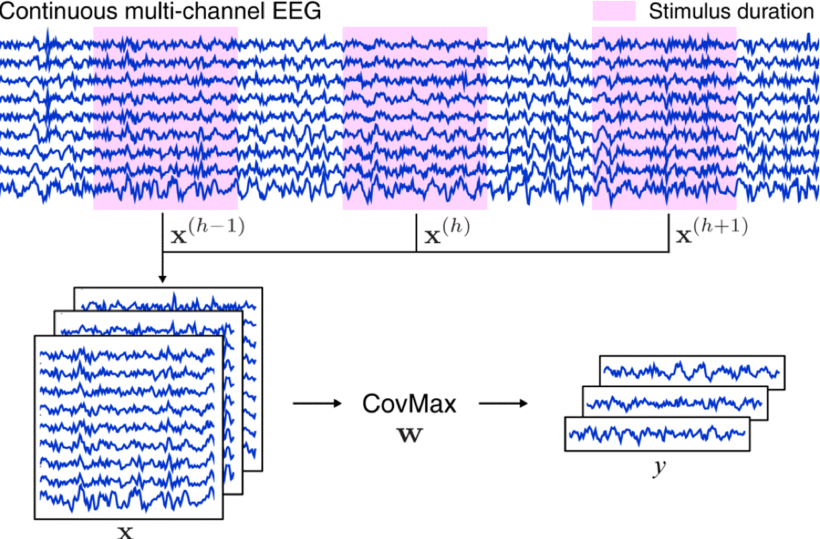

---
html:
    toc: true
print_background: true
---

<script type="text/javascript" src="http://cdn.mathjax.org/mathjax/latest/MathJax.js?config=TeX-AMS-MML_HTMLorMML"></script>
<script type="text/x-mathjax-config"> MathJax.Hub.Config({ tex2jax: {inlineMath: [['$', '$']]}, messageStyle: "none" });</script>

# 3. 任务相关成分分析
**Task-related component analysis, TRCA**

## 3.1 普通/集成 TRCA：(e)TRCA
**( (Ensemble) TRCA, (e)TRCA）**

**[论文链接][TRCA] | 代码：[trca][trca(code)].etrca()**

与此前基于 CCA 改进的 SSVEP 算法相比，TRCA 在构建思路上存在较大差别，具体表现在其关注对象（即信号模板）不再限定为具有正余弦波动性质的传统模型，而是充分包含了个体信息的 “任务相关成分” ( *Task-related components, TRCs* )。关于TRC可以简单理解为：当受试者在多次接受相同任务时，其 EEG 信号中应当包含具有相同性质的诱发成分。由此可见，TRCA 在理论上适用于任何诱发信号具有稳定波形特征的 BCI 范式特征信号解码。



*Nakanishi* 等人首次将 TRCA 应用至 SSVEP 信号解码上时，在公式推导部分使用了一个非常讨巧的办法：**跨试次信号相关性最大化**。之所以称其“讨巧”，是因为原版 TRCA 公式回避了很多关键物理意义问题，用几近感性认识一般的操作去掩盖了实际上非常重要的物理过程，这就导致理论与实践过程的脱节：例如分子中强调的**跨试次协方差计算**操作，在编程过程中会产生大量冗余计算步骤；分母的**矩阵拼接**操作也缺乏明确的物理意义对应说明。而上述“瑕疵”在后续算法改进工作中被不断研究透彻。因此本文不再按照原文思路推导算法，仅给出相对成熟的阐释：

对于第 $k$ 类别、第 $i$、$j$ 试次数据 $\pmb{X}_k^i,\pmb{X}_k^j \in \mathbb{R}^{N_c \times N_p}$ (假定 $i \ne j$)，其跨试次样本协方差以及单试次样本方差（自协方差）分别为：
$$
    Cov \left(\pmb{\omega}_k \pmb{X}_k^i, \pmb{\omega}_k \pmb{X}_k^j \right) = \dfrac{1} {N_p-1} \pmb{\omega}_k \pmb{X}_k^i {\pmb{X}_k^j}^T {\pmb{\omega}_k}^T, i \ne j
    \tag{3-1-1}
$$
$$
    Var \left(\pmb{\omega}_k \pmb{X}_k^i \right) = Cov \left(\pmb{\omega}_k \pmb{X}_k^i, \pmb{\omega}_k \pmb{X}_k^j \right) = \dfrac{1}{N_p-1} \pmb{\omega}_k \pmb{X}_k^i {\pmb{X}_k^i}^T {\pmb{\omega}_k}^T 
    \tag{3-1-2}
$$
因此，TRCA 的目标函数可写为：
$$
    \hat{\pmb{\omega}}_k = 
    \underset{\pmb{\omega}_k} \argmax
        \dfrac{\sum_{j=1, j \ne i}^{N_t} \sum_{i=1}^{N_t} Cov \left(\pmb{\omega}_k \pmb{X}_k^i, \pmb{\omega}_k \pmb{X}_k^j \right)} {\sum_{i=1}^{N_t} Var \left(\pmb{\omega}_k \pmb{X}_k^i \right)} = 
    \underset{\pmb{\omega}_k} \argmax 
        \dfrac{\pmb{\omega}_k \pmb{S}_k {\pmb{\omega}_k}^T} {\pmb{\omega}_k \pmb{Q}_k {\pmb{\omega}_k}^T}
    \tag{3-1-3}
$$
$$
    \pmb{S}_k = \sum_{j=1,j \ne i}^{N_t} \sum_{i=1}^{N_t} \pmb{X}_k^i {\pmb{X}_k^j}^T, \ \pmb{Q}_k = \sum_{i=1}^{N_t} \pmb{X}_k^i {\pmb{X}_k^i}^T
    \tag{3-1-4}
$$
根据广义瑞利商的结论，上述目标函数的单维度最优解即为方阵 ${\pmb{Q}_k}^{-1} \pmb{S}_k$ 的最大特征值对应的特征向量。接下来对TRCA的目标函数作进一步分析：
$$
    \pmb{S}_k = \sum_{j=1}^{N_t} \sum_{i=1}^{N_t} \pmb{X}_k^i {\pmb{X}_k^j}^T - \pmb{Q}_k = 
    {N_t}^2 \bar{X}_k {\bar{X}_k}^T - \pmb{Q}_k = 
    \pmb{S}_k^{'} - \pmb{Q}_k
    \tag {3-1-5}
$$
$$
    \dfrac{\pmb{\omega}_k \pmb{S}_k {\pmb{\omega}_k}^T} {\pmb{\omega}_k \pmb{Q}_k {\pmb{\omega}_k}^T} = 
    \dfrac{\pmb{\omega}_k \pmb{S}_k^{'} {\pmb{\omega}_k}^T} {\pmb{\omega}_k \pmb{Q}_k {\pmb{\omega}_k}^T} - 1
    \tag {3-1-6}
$$
相比于直接计算 $\pmb{S}_k$，经由 $\pmb{S}_k^{'}$ 替换或计算得到 $\pmb{S}_k$ 能够大幅提升运算速度。其原因如下：将单次浮点数相乘与相加设为两种单位操作，其耗时分别为 $T_{\times}$ 和 $T_+$，对应时间复杂度分别为 $O_{\times}$ 与 $O_+$。则针对 $\pmb{X}_k^i$ 执行一次矩阵乘法 $\pmb{X}_k^i {\pmb{X}_k^i}^T$ 或矩阵加法 $\pmb{X}_k^i + \pmb{X}_k^j$ 所需的理论运行时间 $T_{M \times}$、$T_{M+}$ 分别为：
$$
    T_{M \times} = \left({N_c}^2 N_p \right) T_+ + \left[{N_c}^2 (N_p-1) \right]T_{\times}
    \tag{3-1-7}
$$
$$
    T_{M+} = (N_c N_p)T_+
    \tag{3-1-8}
$$
对于具有 $\mathbb{R}^{N_t \times N_c \times N_p}$ 维度的训练数据张量 $\pmb{X}_k$，求解 $\pmb{S}_k$ 的总计理论时间 $T_1$ 与时间复杂度 $O_1$ 分别为：
$$
    T_1 = N_t \left(N_t-1 \right) T_{M \times} + \left[N_t(N_t-1)-1 \right] T_{M+}
    \tag{3-1-9}
$$
$$
    O_1 = O_{\times} \left({N_t}^2 {N_c}^2 N_p \right) + O_+ \left({N_t}^2 {N_c}^2 N_p \right) 
    \tag{3-1-10}
$$
而使用 $\pmb{S}_k^{'}$ 时，首先计算按试次平均后的个体模板 $\bar{\pmb{X}}_k$，其理论运行时间 $T_0$ 为：
$$
    T_0 = \left(N_c N_p \right)T_{\times} + \left(N_t-1 \right) T_{M+}
    \tag{3-1-11}
$$
$\pmb{S}_k^{'}$ 的总计理论计算时间 $T_2$ 与时间复杂度 $O_2$ 分别为：
$$
    T_2 = T_0 + T_{M \times}
    \tag{3-1-12}
$$
$$
    O_2 = O_{\times} \left({N_c}^2 N_p \right) + O_+ \left[\max \left(N_t N_c N_p, {N_c}^2 N_p \right) \right]
    \tag {3-1-13}
$$
对比 $O_1$ 与 $O_2$ 可见，样本数量越多，采用该种替换方法与原始情况所产生的偏差越小、速度提升越大。

综上所述，通过训练数据获取当前类别专属的空间滤波器 $\hat{\pmb{\omega}}_k$ 以及信号模板 $\hat{\pmb{\omega}}_k \bar{\pmb{X}}_k$，基于一维 *Pearson* 相关系数公式，对单试次测试数据 $\pmb{\chi}$ 应用空间滤波后与模板信号计算判别系数：
$$
    \rho_k = corr \left(\hat{\pmb{\omega}}_k \bar{\pmb{X}}_k, \hat{\pmb{\omega}}_k \pmb{\chi} \right)
    \tag {3-1-14}
$$
eTRCA 是基于 TRCA 的集成学习版本，它把各类别 $\hat{\pmb{\omega}}_k \in \mathbb{R}^{1 \times N_c}$ 按行拼接在一起组成高维滤波器 $\hat{\pmb{W}}$，通过计算二维 *Pearson* 相关系数完成信号的模式识别：
$$
    \begin{cases}
        \hat{\pmb{W}} = 
        \begin{bmatrix}
            \hat{\pmb{\omega}}_1\\
            \hat{\pmb{\omega}}_2\\
            \vdots\\
            \hat{\pmb{\omega}}_{N_e}\\
        \end{bmatrix} \in \mathbb{R}^{N_e \times N_c}\\
        \\
        \rho_k = corr2 \left(\hat{\pmb{W}} \bar{\pmb{X}}_k, \hat{\pmb{W}} \pmb{\chi} \right)
    \end{cases}
    \tag {3-1-15}
$$
其中 $corr2()$ 函数本质上就是先把一个二维矩阵按行拉平变成一维序列，之后再计算一维 *Pearson* 系数。关于这个过程，Matlab 的 **corr2()** 函数给出了一种更适合编程的高效运算方法。对于同维度二维矩阵 $\pmb{A} = [a_{ij}]_{m \times n}$，$\pmb{B} = [b_{ij}]_{m \times n}$，计算矩阵中心 $\bar{\bar{\pmb{A}}}$、$\bar{\bar{\pmb{B}}}$：
$$
    \bar{\bar{\pmb{A}}} = \sum_{j=1}^m \sum_{i=1}^n a_{ij} = \sum\sum a_{ij},  \ \bar{\bar{\pmb{B}}} = \sum\sum b_{ij}
    \tag{3-1-16}
$$
$$
    corr2(\pmb{A}, \pmb{B}) = \dfrac{\sum\sum \left(a_{ij} - \bar{\bar{\pmb{A}}}\right)\left(b_{ij} - \bar{\bar{\pmb{B}}}\right)} {\sqrt{\sum\sum \left(a_{ij} - \bar{\bar{\pmb{A}}} \right)^2} \sqrt{\sum\sum \left(b_{ij} - \bar{\bar{\pmb{B}}} \right)^2}}
    \tag{3-1-17}
$$
别被式 (3-1-17) 一层又一层的叠加操作唬住了，在 *ndarray* 的基础上很容易就能将其复现出来。由于避免了大矩阵变量的维度变换，运算速度会有显著提升：
```python
import numpy as np
def corr2_coef(X, Y):
    """2-D Pearson correlation coefficient
    Args:
        X (ndarray): (m,n)
        Y (ndarray): (m,n)
    Returns:
        coef (float)
    """
    mean_X, mean_Y = X.mean(), Y.mean()  # matrix center
    decen_X, decen_Y = X-mean_X, Y-mean_Y  # decentralized matrix
    numerator = np.einsum('ij->', decen_X*decen_Y)
    denominator_X = np.einsum('ij->', decen_X**2)
    denominator_Y = np.einsum('ij->', decen_Y**2)
    coef = numerator/np.sqrt(denominator_X*denominator_Y)
    return coef
```
论文中关于所谓的集成思想有这样一段描述：
> *Since there are $N_f$ individual calibration data corresponding to all visual stimuli, $N_f$ different spatial filters can be obtained. Ideally, they should be similar to each other because the mixing coefficients from SSVEP source signals to scalp recordings could be considered similar within the used frequency range, which indicates the possibility of further improvements by intergrating all spatial filters.*

翻译一下，*Nakanishi* 认为 8 - 15.8 Hz 刺激诱发的共计 40 类 SSVEP，彼此之间对应的空间滤波器应当是相似的，因为刺激频段比较窄，诱发脑电的头皮分布模式不至于产生过大的变化。所以根据 8 Hz SSVEP 训练得到的空间滤波器（注意这个“**适用**”应当与 TRCA 的目标函数结合理解），将其应用至其它频率信号时，理论上其目标函数，即式 (3-2) 也能达到比较高的水平，当然这样滤波后的信号质量显然不如“一个萝卜一个坑”，但多多少少能保留相当程度的特征成分。所以将其它类别专属的滤波器用在当前类别上，是变相地扩增了信号模板的空间维度信息。

依我愚见，eTRCA 虽然性能更为强劲，但该算法可能存在原理性缺陷：容易产生冗余成分。在刺激目标较多时，全类别集成似乎并无必要。这一点在 2021 年清华大学 *Liu Binchuan* 发表的 [TDCA][TDCA] 算法文章中也有所指出，当然人家是大佬，成果已经产出了。鄙人的具体研究工作仍在进行（~~构思~~）中。

至此我们有必要再回顾一下 TRCA 的目标函数：
$$
    \hat{\pmb{\omega}}_k = 
    \underset{\pmb{\omega}_k} \argmax 
        \dfrac{\pmb{\omega}_k \bar{\pmb{X}}_k {\bar{\pmb{X}}_k}^T {\pmb{\omega}_k}^T} {\pmb{\omega}_k \left(\sum_{i=1}^{N_t} \pmb{X}_k^i {\pmb{X}_k^i}^T\right) {\pmb{\omega}_k}^T}
    \tag{3-1-18}
$$
（1）分子中 $\pmb{\omega}_k \bar{\pmb{X}}_k {\bar{\pmb{X}}_k}^T {\pmb{\omega}_k}^T$ 的本质为“**滤波后特征信号的能量**”。训练样本数目越多，叠加平均操作获取的信号模板质量越高，即随机信号成分削减越充分。而且分子能够决定目标函数的最终优化上限。

（2）分母 $\pmb{\omega}_k \left(\sum_{i=1}^{N_t} \pmb{X}_k^i {\pmb{X}_k^i}^T\right) {\pmb{\omega}_k}^T$ 的本质为“**滤波后各试次信号能量之和**”。

（3）结合上述两点可见，TRCA 的性能优越是原理性的，其结构相当完善。唯一的缺陷在于训练样本数目：当 $N_t$ 较小时，由（1）可知优化目标将产生无法弥补的偏差。因此后续关于 TRCA 的改进，大多针对少样本下获取更稳健的信号模板估计入手，我们将在 (e)TRCA-R、sc-(e)TRCA 等算法中观察到这一倾向。

## 3.2 多重刺激 TRCA：ms-(e)TRCA
**(Multi-stimulus (e)TRCA)**

**[论文链接][ms-TRCA] | 代码：[trca][trca(code)].ms_etrca()**

该算法是我们提到的第一种关于TRCA的改进算法，与 msCCA、ms-eCCA 一样出自 *Wong* 的之手，行文风格也一以贯之。由 3.1 节末尾分析可知，TRCA 类型的算法需要较多的训练数据以保证协方差矩阵估计的准确性，在原文中亦有相关描述：
> *To guarantee good performance, the number of calibration trials for each visual stimulus cannot be small for the eCCA method and the eTRCA method; otherwise, their recognition accuracies would decrease dramatically $\dots$ A major reason is that the estimate of covariance matrices in the CCA-based (or the TRCA-based) methods could become unreliable in the case of small training data so that the resulting spatial filters may not be accurate. As a matter of fact, the algorithms relying on the estimator of covariance matrix also suffer from insufficient training data problem $\dots$*

然而对于具有较多指令集（32、40 或更多）的 SSVEP-BCI 系统而言，为每个指令获取足量训练试次（$N_t>10$）在时间上通常是不允许的。而且刺激时间如果过长，诱发信号的质量会由于受试者累积的视觉疲劳而急剧下降，不利于系统实际应用。因此，*Wong* 提出了一种学习方法，从目标 $A$ 的相邻刺激（$B$、$C$ 等）的诱发信号中学习 $A$ 的特征。以一个简单的 4 指令集系统为例，ms- 技术的学习流程见下图（原文 fig.1）：


原文对于这一套流程的可行性做了连篇累牍的证明，在此仅提炼其最终结论：

**去除 0.14 s 的人眼视觉通路延迟之后，SSVEP 采集信号与闪烁刺激相位基本一致、不同刺激间的相位差也与闪烁刺激相位差基本一致**。

听君一席话，如听一席话是吧？这不是 SSVEP 信号处理的常规步骤吗？此外关于 Benchmark 数据集的刺激参数设定（频率、相位等），他们也特地写了三个**方程**来说明，总之一通操作着实看得人头昏脑胀。鉴于本人有幸曾经听过 *Wong* 的线上报告，视频里他只消三言两语便把 ms-eTRCA 的原理描述得鞭辟入里，所以我相信这种反人类的数学语言其实出自 *Feng Wan* 老师的手笔。

接下来我们先看看原文中给出的公式。ms-eTRCA 与 ms-TRCA 的关系类似 eTRCA 之于 TRCA，因此前两者的目标函数是共通的：
$$
    \hat{\pmb{\omega}}_k = \underset{\pmb{\omega}_k} \argmax 
    \dfrac{\pmb{\omega}_k \pmb{A}_k {\pmb{A}_k}^T {\pmb{\omega}_k}^T} {\pmb{\omega}_k \pmb{B}_k {\pmb{B}_k}^T {\pmb{\omega}_k}^T}
    \tag{3-2-1}
$$
分子分母中的协方差矩阵与 (e)TRCA 略有差异，具体如下：
$$
    \begin{cases}
        \pmb{A}_k = 
        \begin{bmatrix}
            \bar{\pmb{X}}_{k-m} & \bar{\pmb{X}}_{k-m+1} & \cdots & \bar{\pmb{X}}_{k+n}
        \end{bmatrix} \in \mathbb{R}^{N_c \times [(m+n+1)N_p]}\\
        \\
        \pmb{B}_k = 
        \begin{bmatrix}
            \pmb{\chi}_{k-m} & \pmb{\chi}_{k-m+1} & \cdots & \pmb{\chi}_{k+n}
        \end{bmatrix} \in \mathbb{R}^{N_c \times [(m+n+1) N_t N_p]}\\
    \end{cases}
    \tag{3-2-2}
$$
$$
    \pmb{\chi}_{k} = 
    \begin{bmatrix}
            \pmb{X}_k^1 & \pmb{X}_k^2 & \cdots & \pmb{X}_k^{N_t}
    \end{bmatrix} \in \mathbb{R}^{N_c \times (N_t N_p)}
    \tag{3-2-3}
$$
可以看出，*multi-stimulus* 技术的本质就是把目标刺激前 $m$、后 $n$ 个不同频率的刺激信号**顺次拼接**起来，在时间维度上对训练数据进行扩增，其范围为 $d$（含自身），具体拼接个数（$m$、$n$）依不同情况各有一番规定。

（1）关于 $m$ 与 $n$ 的大小分配（一般情况）：若 $d$ 为奇数，则前向与后向扩增范围相等；若 $d$ 为偶数，则前向扩增比后向多一位，即有：
$$
    \begin{cases}
        m = n = \dfrac{1} {2} (d-1), \ \ d=2n+1 | n \in \mathbb{N^+}\\
        \\
        m = \dfrac{1} {2} d, \ n = \dfrac{1} {2} d - 1, \ \ d=2n | n \in \mathbb{N^+}\\
    \end{cases}
    \tag{3-2-4}
$$

（2）假设刺激目标 $k$ 处于相对**靠前**的位置，由于前向没有足够类别的信号用于拼接，因此需向后顺延扩增位数。例如 $d=5,k=2$，应向后顺延一位（$m=1,n=3$）；若 $d=6,k=2$，则向后顺延两位（$m=1,n=4$）。综上可总结出式 (3-2-7)：
$$
    \begin{cases}
        m = k - 1\\
        \\
        n = d - k\\
    \end{cases}, \ k \in \left[ 1, \ \dfrac{1} {2} d \right]
    \tag{3-2-5}
$$
（3）假设刺激目标 $k$ 处于**中部**位置，即 (1) 中所述的“一般情况”，则有式 (3-2-8)：
$$
    \begin{cases}
        m = \left[\dfrac{1}{2}d\right]\\
        \\
        n = d - \left[\dfrac{1}{2}d\right] - 1
    \end{cases}, \ k \in \left( \left[ \dfrac{1}{2}d \right], \ N_e-\left(d-\left[\dfrac{1}{2}d\right]\right)\right)
    \tag{3-2-6}
$$
（4）假设刺激目标 $k$ 位于**尾部**位置，此时与（2）相反，需向前顺延扩增位数，即有式 (3-2-9)：
$$
    \begin{cases}
        m = d - 1 - \left(N_e - k \right)\\
        \\
        n = N_e - k\\
    \end{cases},  \ k \in \left[N_e - \left(d - \left[\dfrac{1}{2} d \right] - 1 \right), N_e \right]
    \tag{3-2-7}
$$
好了，我们再回过头去看式 (3-2-3)，该式分子、分母中的协方差矩阵可以通过与式 (3-1-5) 联动，进一步改写为如下形式：
$$
    \begin{cases}
        \pmb{A}_k {\pmb{A}_k}^T = \sum_{i=-m}^{n+1} \bar{\pmb{X}}_{k+i} {\bar{\pmb{X}}_{k+i}}^T = \dfrac{1}{{N_t}^2} \sum_{i=-m}^{n+1} {\pmb{S}_{k+i}^{'}}\\
        \\
        \pmb{B}_k {\pmb{B}_k}^T = \sum_{i=-m}^{n+1} \sum_{j=1}^{N_t} \pmb{X}_i^j {\pmb{X}_i^j}^T = \sum_{i=-m}^{n+1} \pmb{Q}_{k+i}
    \end{cases}
    \tag{3-2-8}
$$
一般来说，非零常系数是不影响矩阵特征值分解结果的。所以我们看 ms-(e)TRCA 的目标函数式，它就是把不同频率信号对应的 (e)TRCA 目标函数的分子、分母各自相加组成新的分式。再直白一点，就是“**把多个频率的信号当一个频率去训练**”，强行增加了可用样本数目。
$$
    \hat{\pmb{\omega}}_k = 
    \underset{\pmb{\omega}_k} \argmax 
    \dfrac{\pmb{\omega}_k \left(\sum_{i=-m}^{n+1} \bar{\pmb{X}}_{k+i} {\bar{\pmb{X}}_{k+i}}^T \right) {\pmb{\omega}_k}^T} {\pmb{\omega}_k \left(\sum_{i=-m}^{n+1} \sum_{j=1}^{N_t} \pmb{X}_i^j {\pmb{X}_i^j}^T \right) {\pmb{\omega}_k}^T} = 
    \underset{\pmb{\omega}_k} \argmax 
    \dfrac{\sum_{i=-m}^{n+1} \pmb{\omega}_k {\pmb{S}_{k+i}^{'}} {\pmb{\omega}_k}^T} {\sum_{i=-m}^{n+1} \pmb{\omega}_k \pmb{Q}_{k+i} {\pmb{\omega}_k}^T}
    \tag{3-2-9}
$$

我们有一点需要注意，根据文章里网格筛选的结果（原文 Fig.3）， $d$ 的范围并非是越大越好，在 (e)TRCA 算法上体现得尤为明显。


说来也令人感慨，ms- 的思路不可谓不简单，但是 *Wong* 等人之所以成功，一方面是因为敢想敢做，另一方面也要归功于砌墙的数学功底，能够把简单的内核包装成高大上的复杂操作，让人一眼完全看不透其内在关联。

## 3.3 正余弦扩展 TRCA：(e)TRCA-R
**[论文链接][TRCA-R] | 代码：[trca][trca(code)].etrca_r()**

该算法依旧出自 *Wong* 的手笔。按照其提出的设计框架，-R 技术就是将原本为单位阵的空间投影矩阵替换为正余弦信号张成的投影空间 $\pmb{\mathcal{P}}$，与之类似的算法还有 MsetCCA1-R（未来更新）。在讲解 (e)TRCA-R 之前，我们先来观察 (e)TRCA 的目标函数在统一框架（ 1.3 节式 (1-3-4)，**Type I** ) 下的各部分组成：
$$
    \begin{cases}
        \pmb{\mathcal{Z}} = \pmb{\mathcal{I}}_{N_t,N_c} \left(\oplus_{i=1}^{N_t} \pmb{X}_k^i \right) \in \mathbb{R}^{N_c \times \left(N_t N_p \right)}\\
        \\
        \pmb{\mathcal{D}} = \pmb{I}_{N_t N_p} \in \mathbb{R}^{\left(N_t N_p \right) \times \left(N_t N_p \right)}\\
        \\
        \pmb{\mathcal{P}} = {\pmb{\mathcal{I}}_{N_t,N_p}}^T \pmb{\mathcal{I}}_{N_t,N_p} \in \mathbb{R}^{\left(N_t N_p \right) \times \left(N_t N_p \right)}
    \end{cases}
    \tag{3-3-1}
$$
为了更清楚地让大家明白这个框架到底干了什么事，我们来依次画一下各步骤的展开形态：
$$
    \pmb{\mathcal{Z}} = 
    \underbrace{
        \begin{bmatrix}
            \pmb{I}_{N_c} & \pmb{I}_{N_c} & \cdots & \pmb{I}_{N_c}
        \end{bmatrix}}_{\mathbb{R}^{N_c \times \left(N_t N_c \right)}}
    \underbrace{
        \begin{bmatrix}
            \pmb{X}_k^1 & \pmb{0} & \cdots & \pmb{0}\\
            \pmb{0} & \pmb{X}_k^2 & \cdots & \pmb{0}\\
            \vdots & \vdots & \ddots & \vdots\\
            \pmb{0} & \pmb{0} & \cdots & \pmb{X}_k^{N_t}\\
        \end{bmatrix}}_{\mathbb{R}^{\left(N_t N_c \right) \times \left(N_t N_p \right)}} = 
    \underbrace{
        \begin{bmatrix}
            \pmb{X}_k^1 & \pmb{X}_k^2 & \cdots & \pmb{X}_k^{N_t}
        \end{bmatrix}}_{\mathbb{R}^{N_c \times \left(N_t N_p \right)}}
    \tag{3-3-2}
$$
$$
    \pmb{\mathcal{Z}} \pmb{\mathcal{D}} = 
    \underbrace{
        \begin{bmatrix}
            \pmb{X}_k^1 & \pmb{X}_k^2 & \cdots & \pmb{X}_k^{N_t}
        \end{bmatrix}}_{\mathbb{R}^{N_c \times \left(N_t N_p \right)}}
    \underbrace{
        \begin{bmatrix}
            \pmb{I}_{N_p} & \pmb{0} & \cdots & \pmb{0}\\
            \pmb{0} & \pmb{I}_{N_p} & \cdots & \pmb{0}\\
            \vdots & \vdots & \ddots & \vdots\\
            \pmb{0} & \pmb{0} & \cdots & \pmb{I}_{N_p}\\
        \end{bmatrix}}_{\mathbb{R}^{\left(N_t N_p \right) \times \left(N_t N_p \right)}} = \pmb{\mathcal{Z}}
    \tag{3-3-3}
$$
$$
    \pmb{\mathcal{P}} = 
    \underbrace{
        \begin{bmatrix}
            \pmb{I}_{N_p}\\
            \pmb{I}_{N_p}\\
            \vdots\\
            \pmb{I}_{N_p}\\
        \end{bmatrix}}_{\mathbb{R}^{\left(N_t N_p \right) \times N_p}}
    \underbrace{
        \begin{bmatrix}
            \pmb{I}_{N_p} & \pmb{I}_{N_p} & \cdots & \pmb{I}_{N_p}\\
        \end{bmatrix}}_{\mathbb{R}^{N_p \times \left(N_t N_p \right)}} = 
    \underbrace{
        \begin{bmatrix}
            \pmb{I}_{N_p} & \pmb{I}_{N_p} & \cdots & \pmb{I}_{N_p}\\
            \pmb{I}_{N_p} & \pmb{I}_{N_p} & \cdots & \pmb{I}_{N_p}\\
            \vdots & \vdots & \ddots & \vdots\\
            \pmb{I}_{N_p} & \pmb{I}_{N_p} & \cdots & \pmb{I}_{N_p}\\
        \end{bmatrix}}_{\mathbb{R}^{\left(N_t N_p \right) \times \left(N_t N_p \right)}}
    \tag{3-3-4}
$$
$$
    \pmb{\mathcal{Z}} \pmb{\mathcal{D}} \pmb{\mathcal{P}} = 
    \underbrace{
        \begin{bmatrix}
            \pmb{X}_k^1 & \cdots & \pmb{X}_k^{N_t}\\
        \end{bmatrix}}_{\mathbb{R}^{N_c \times \left(N_t N_p \right)}}
    \underbrace{
        \begin{bmatrix}
            \pmb{I}_{N_p} & \cdots & \pmb{I}_{N_p}\\
            \vdots & \ddots & \vdots\\
            \pmb{I}_{N_p} & \cdots & \pmb{I}_{N_p}\\
        \end{bmatrix}}_{\mathbb{R}^{\left(N_t N_p \right) \times \left(N_t N_p \right)}} = 
    \underbrace{
        \begin{bmatrix}
            \sum_{i=1}^{N_t}{\pmb{X}_k^i} & \cdots & \sum_{i=1}^{N_t}{\pmb{X}_k^i}\\
        \end{bmatrix}}_{\mathbb{R}^{N_c \times \left(N_t N_p \right)}}
    \tag{3-3-5}
$$
$$
    \pmb{\mathcal{Z}} \pmb{\mathcal{D}} \pmb{\mathcal{P}} {\pmb{\mathcal{P}}}^T {\pmb{\mathcal{D}}}^T {\pmb{\mathcal{Z}}}^T = 
    \underbrace{
        \begin{bmatrix}
            \sum_{i=1}^{N_t}{\pmb{X}_k^i} & \cdots & \sum_{i=1}^{N_t}{\pmb{X}_k^i}\\
        \end{bmatrix}}_{\mathbb{R}^{N_c \times \left(N_t N_p \right)}}
    \underbrace{
        \begin{bmatrix}
            \sum_{i=1}^{N_t}{\pmb{X}_k^i}\\
            \vdots\\
            \sum_{i=1}^{N_t}{\pmb{X}_k^i}\\
        \end{bmatrix}}_{\mathbb{R}^{\left(N_t N_p \right) \times N_c}} = 
    N_t\sum_{j=1}^{N_t} \sum_{i=1}^{N_t} \pmb{X}_k^i {\pmb{X}_k^i}^T
    \tag{3-3-6}
$$
$$
    \pmb{\mathcal{Z}} \pmb{\mathcal{D}} {\pmb{\mathcal{D}}}^T {\pmb{\mathcal{Z}}}^T = \pmb{\mathcal{Z}} \pmb{\mathcal{Z}}^T = 
    \underbrace{
        \begin{bmatrix}
            \pmb{X}_k^1 & \pmb{X}_k^2 & \cdots & \pmb{X}_k^{N_t}\\
        \end{bmatrix}}_{\mathbb{R}^{N_c \times \left(N_t N_p \right)}}
    \underbrace{
        \begin{bmatrix}
            \pmb{X}_k^1\\
            \pmb{X}_k^2\\
            \vdots\\
            \pmb{X}_k^{N_t}\\
        \end{bmatrix}}_{\mathbb{R}^{\left(N_t N_p \right) \times N_c}} = 
    \sum_{i=1}^{N_t} \pmb{X}_k^i {\pmb{X}_k^i}^T
    \tag{3-3-7}
$$
综上所述，仅需一维投影向量的情况下，*GEP* 方程可表示为式 (3-3-8)，忽略常系数影响后可发现该式与 (e)TRCA 的目标函数完全吻合。
$$
    \left(N_t\sum_{j=1}^{N_t} \sum_{i=1}^{N_t} \pmb{X}_k^i {\pmb{X}_k^i}^T \right) \pmb{\omega} = 
    \lambda \left(\sum_{i=1}^{N_t} \pmb{X}_k^i {\pmb{X}_k^i}^T \right) \pmb{\omega}
    \tag{3-3-8}
$$
在常规 (e)TRCA 中，正交投影矩阵 $\pmb{\mathcal{P}}$ 的本质作用仅是叠加。而在 (e)TRCA-R 中，*Wong* 将其改为了正余弦信号张成的投影空间，其余均与 (e)TRCA 保持一致：
$$
    \pmb{\mathcal{P}} = 
    \begin{bmatrix}
        \pmb{Q}_{\pmb{Y}_k}\\
        \vdots\\
        \pmb{Q}_{\pmb{Y}_k}\\
    \end{bmatrix}
    \begin{bmatrix}
        \pmb{Q}_{\pmb{Y}_k} & \cdots & \pmb{Q}_{\pmb{Y}_k}\\
    \end{bmatrix} = 
    \begin{bmatrix}
        \pmb{Q}_{\pmb{Y}_k} {\pmb{Q}_{\pmb{Y}_k}}^T & \cdots & \pmb{Q}_{\pmb{Y}_k} {\pmb{Q}_{\pmb{Y}_k}}^T\\
        \vdots & \ddots & \vdots\\
        \pmb{Q}_{\pmb{Y}_k} {\pmb{Q}_{\pmb{Y}_k}}^T & \cdots & \pmb{Q}_{\pmb{Y}_k} {\pmb{Q}_{\pmb{Y}_k}}^T\\
    \end{bmatrix}
    \tag{3-3-9}
$$
注意有 $\pmb{\mathcal{P}} = \pmb{\mathcal{P}} {\pmb{\mathcal{P}}}^T$，所以 (e)TRCA-R 的 *GEP* 方程可表示为：
$$
    \left[N_t\sum_{j=1}^{N_t} \sum_{i=1}^{N_t} \left(\pmb{X}_k^i \pmb{Q}_{\pmb{Y}_k} {\pmb{Q}_{\pmb{Y}_k}}^T\right) \left(\pmb{X}_k^j \pmb{Q}_{\pmb{Y}_k} {\pmb{Q}_{\pmb{Y}_k}}^T\right)^T \right] \pmb{\omega}^T = 
    \lambda \left(\sum_{i=1}^{N_t} \pmb{X}_k^i {\pmb{X}_k^i}^T \right) \pmb{\omega}^T
    \tag{3-3-10}
$$
目标函数可以写为：
$$
    \hat{\pmb{\omega}}_k = 
    \underset{\pmb{\omega}_k} \argmax 
        \dfrac{\pmb{\omega}_k \left(\bar{\pmb{X}}_k \pmb{P}_k \right) \left(\bar{\pmb{X}}_k \pmb{P}_k \right)^T {\pmb{\omega}_k}^T} {\pmb{\omega}_k \left(\sum_{i=1}^{N_t} \pmb{X}_k^i {\pmb{X}_k^i}^T\right) {\pmb{\omega}_k}^T} = 
        \dfrac{\pmb{\omega}_k \bar{\pmb{X}}_k \pmb{Y}_k^T \pmb{Y}_k \bar{\pmb{X}}_k^T {\pmb{\omega}_k}^T} {\pmb{\omega}_k \left(\sum_{i=1}^{N_t} \pmb{X}_k^i {\pmb{X}_k^i}^T\right) {\pmb{\omega}_k}^T}
    \tag{3-3-11}
$$
通过（3-3-11）可以观察到，-R 技术的改进点在于通过正交投影矩阵 $\pmb{P}_k$ 进一步约束了优化函数的目标 $\bar{\pmb{X}}_k$ 。关于投影矩阵的作用，在 ms-eCCA 章节中已有介绍，此处不再赘述。

## 3.4 相似度约束 TRCA：sc-(e)TRCA
**(Similarity-constrained (e)TRCA)**

**[论文链接][sc-TRCA] | 代码：[trca][trca(code)].sc_etrca()**

2021 年发表在 JNE 上的这篇文章，似乎是横空出世一般。没有 *Yijun Wang*，没有 *Xiaogang Chen*，没有 *Nakanish Masaki*，更没有 *Chiman Wong*，作者都是清一色的新面孔，让人眼前一亮。在公式推导方面，该团队似乎受到 *Hirokazu Tanaka* 的风格影响更多一些，在描述相关性时特意标注清楚了常系数，这一点对于明确变量的物理含义大有裨益。

按照原文的思路，sc-TRCA 的主要改进点在于通过人工构造正余弦矩阵 $\pmb{Y}_k$ 对目标函数分子、分母中的协方差矩阵进行扩增。我们先来看看原文对于扩增方式的描述：
$$
    \begin{align}
        \notag
        \widetilde{\pmb{Q}}_k &= 
        \begin{bmatrix}
            \pmb{Q}_1 & \pmb{0}\\ \ \\
            \pmb{0} & \pmb{Q}_2\\
        \end{bmatrix}, \ 
        \begin{cases}
            \pmb{Q}_1 = \dfrac{1}{N_t N_p} \sum_{i=1}^{N_t} \pmb{X}_k^i {\pmb{X}_k^i}^T \in \mathbb{R}^{N_c \times N_c}\\
            \ \\
            \pmb{Q}_2 = \dfrac{1}{N_p} \pmb{Y}_k {\pmb{Y}_k}^T \in \mathbb{R}^{\left(2N_h \right) \times \left(2N_h \right)}
        \end{cases}\\
        \notag \ \\
        \notag
        \widetilde{\pmb{S}}_k &= 
        \begin{bmatrix}
            \pmb{S}_{11} & \pmb{S}_{12}\\ \ \\
            \pmb{S}_{21} & \pmb{S}_{22}\\
        \end{bmatrix}, \ 
        \begin{cases}
            \pmb{S}_{11} = \dfrac{1}{N_t (N_t-1) N_p} \sum_{j=1,j \ne i}^{N_t} \sum_{i=1}^{N_t} \pmb{X}_k^i {\pmb{X}_k^i}^T \in \mathbb{R}^{N_c \times N_c}\\
            \ \\
            \pmb{S}_{12} = {\pmb{S}_{21}}^T = \dfrac{1}{N_t N_p} \sum_{i=1}^{N_t} \pmb{X}_k^i {\pmb{Y}_k}^T \in \mathbb{R}^{N_c \times \left(2N_h \right)}\\
            \ \\
            \pmb{S}_{22} = \dfrac{1}{N_p} \pmb{Y}_k {\pmb{Y}_k}^T \in \mathbb{R}^{\left(2N_h \right) \times \left(2N_h \right)}
        \end{cases}
    \end{align}
    \tag{3-4-1}
$$
sc-TRCA 的目标函数为：
$$
    \hat{\pmb{\omega}}_k = \underset{\pmb{\omega}_k} \argmax \dfrac{\pmb{\omega}_k \widetilde{\pmb{S}}_k {\pmb{\omega}_k}^T}{\pmb{\omega}_k \widetilde{\pmb{Q}}_k {\pmb{\omega}_k}^T} = 
    \begin{bmatrix}
        \hat{\pmb{u}}_k & \hat{\pmb{v}}_k\\
    \end{bmatrix} \ 
    \in \mathbb{R}^{1 \times \left(N_c + 2N_h \right)}
    \tag{3-4-2}
$$
不难发现，$\pmb{S}_{11}$ 与 $\pmb{Q}_1$ 与 TRCA 目标函数中的 $\pmb{S}_k$、$\pmb{Q}_k$ 是相等的。维度扩增后得到的滤波器需要分割为两个部分：（1）适用于 EEG 数据的 $\hat{\pmb{u}}_k$；（2）适用于正余弦模板的 $\hat{\pmb{v}}_k$。因此判别系数也分为两部分：
$$
    \begin{cases}
        \rho_k^1 = corr \left(\hat{\pmb{u}}_k \bar{\pmb{X}}_k, \hat{\pmb{u}}_k \pmb{\mathcal{X}} \right)\\
        \ \\
        \rho_k^2 = corr \left(\hat{\pmb{v}}_k \pmb{Y}_k, \hat{\pmb{u}}_k \pmb{\mathcal{X}} \right)\\
    \end{cases}, \ \rho_k = \sum_{i=1}^2 sign \left(\rho_k^i \right) \left(\rho_k^i \right)^2
    \tag{3-4-3}
$$
原文的公式推导不可谓不直观，但是我总觉得差点意思。核心问题在于，我们不明白为什么要这样操作，也很难从中学到什么经验。此外 sc- 技术与原版 TRCA 的联系似乎并不是很紧密，因此接下来我们将从另外一个角度审视上述扩增过程。

根据 3.1 节末尾的分析，我们知道想要改善 TRCA 的模型性能，关键在于对 $\bar{\pmb{X}}_k$ 的信息优化：（1）-R 技术通过正交投影约束了其中的 SSVEP 频率特征成分；（2）ms- 技术通过合并其它频率的样本，约束随机噪声成分的占比。sc- 技术也不例外，它通过空间维度扩增强化 $\bar{\pmb{X}}_k$：
$$
    \widetilde{\pmb{X}}_k = 
    \begin{bmatrix}
        \bar{\pmb{X}}_k\\ \ \\ \pmb{Y}_k\\
    \end{bmatrix} \in \mathbb{R}^{\left(N_c + 2N_h \right) \times N_p}
    \tag{3-4-4}
$$
之后 $\pmb{S}_k$ 的扩增以及 $\hat{\pmb{u}}_k$、$\hat{\pmb{v}}_k$ 的分割就犹如母兔产崽一般顺理成章了：
$$
    \widetilde{\pmb{S}}_k = \widetilde{\pmb{X}}_k {\widetilde{\pmb{X}}_k}^T \ \Longrightarrow \ 
    \begin{bmatrix}
        \bar{\pmb{X}}_k {\bar{\pmb{X}}_k}^T & \bar{\pmb{X}}_k {\pmb{Y}_k}^T\\
        \ \\
        \pmb{Y}_k {\bar{\pmb{X}}_k}^T & \pmb{Y}_k {\pmb{Y}_k}^T
    \end{bmatrix} \ \Longrightarrow \
    \begin{bmatrix}
        \pmb{S}_{11} & \pmb{S}_{12}\\
        \ \\
        \pmb{S}_{21} & \pmb{S}_{22}\\
    \end{bmatrix}
    \tag{3-4-5}
$$
$$
    \pmb{\omega}_k \widetilde{\pmb{X}}_k = 
    \begin{bmatrix}
        \hat{\pmb{u}}_k & \hat{\pmb{v}}_k\\
    \end{bmatrix}
    \begin{bmatrix}
        \bar{\pmb{X}}_k\\ \ \\ \pmb{Y}_k\\
    \end{bmatrix} = \hat{\pmb{u}}_k \bar{\pmb{X}}_k + \hat{\pmb{v}}_k \pmb{Y}_k
    \tag{3-4-6}
$$
目标函数分子的物理意义转变为“滤波后**扩增模板**的能量”：
$$
    \begin{align}
        \notag
        \pmb{\omega}_k \widetilde{\pmb{S}}_k {\pmb{\omega}_k}^T &= \pmb{\omega}_k \widetilde{\pmb{X}}_k \left(\pmb{\omega}_k \widetilde{\pmb{X}}_k \right)^T\\
        \notag \ \\
        \notag
        &= \hat{\pmb{u}}_k \bar{\pmb{X}}_k {\bar{\pmb{X}}_k}^T {\hat{\pmb{u}}_k}^T + \hat{\pmb{u}}_k \bar{\pmb{X}}_k {\pmb{Y}_k}^T {\hat{\pmb{v}}_k}^T + \hat{\pmb{v}}_k \pmb{Y}_k {\bar{\pmb{X}}_k}^T { \hat{\pmb{u}}_k}^T + \hat{\pmb{v}}_k \pmb{Y}_k {\pmb{Y}_k}^T {\hat{\pmb{v}}_k}^T\\
        \notag \ \\
        \notag
        &= Var \left(\hat{\pmb{u}}_k \bar{\pmb{X}}_k \right) + 2 \times Cov \left(\hat{\pmb{u}}_k \bar{\pmb{X}}_k, \hat{\pmb{v}}_k \pmb{Y}_k \right) + Var \left(\hat{\pmb{v}}_k \pmb{Y}_k \right)\\
    \end{align}
    \tag{3-4-7}
$$
通过（3-4-7）我们可以很清晰地看到分子的能量组成：滤波后 EEG 信号能量、滤波后正余弦模板能量以及二者的互能量（协方差）。其中协方差的存在我个人认为是至关重要的，尽管没有经过测试证实。在从能量角度思考问题时，我们很容易陷入想当然的场景：一段含噪信号的能量（通过幅值平方求和的方式计算）就等于信号能量加上噪声能量。这一观点往往是不准确的，因为“**信号与噪声完全不相关**”这一前提太过严格，大多数生理信号其实并不满足该条件。因此，将信号与噪声的协方差考虑进优化目标是非常有必要的。

尽管如此，sc-TRCA 的分母还是狠狠地给了我一巴掌，同上分析可知：
$$
    \begin{align}
        \notag
        \pmb{\omega}_k \widetilde{\pmb{Q}}_k {\pmb{\omega}_k}^T &= \hat{\pmb{u}}_k \left(\sum_{i=1}^{N_t} \pmb{X}_k^i {\pmb{X}_k^i}^T \right) {\hat{\pmb{u}}_k}^T + N_t \hat{\pmb{v}}_k \pmb{Y}_k {\pmb{Y}_k}^T {\hat{\pmb{v}}_k}^T\\
        \notag \ \\
        \notag
        &= \sum_{i=1}^{N_t} Var \left(\hat{\pmb{u}}_k \pmb{X}_k^i \right) + \sum_{i=1}^{N_t} Var \left(\hat{\pmb{v}}_k \pmb{Y}_k \right)\\
    \end{align}
    \tag{3-4-8}
$$
可以看到，分母建立在“采集信号中的非 SSVEP 噪声与正余弦信号毫不相关”这一强假设基础上，而且在“各个试次中均存在”，这一点目前恕我不能苟同（~~没准等我测试完以后再次被打脸~~）。

争议暂且搁置，我们来总结一下 sc- 技术的本质，即引入正余弦模板，在空间维度扩增训练数据的信息容量，从而强化模型稳定性。重要的话我再重复一遍：只要对 $\bar{\pmb{X}}$ 进行有效改进（扩增、纯化等），就有希望提高 TRCA 空间滤波器的分类性能，未来各位将在其它 TRCA 改进算法中看到类似的趋势（~~求求各位大佬多发文章没准我还能水一篇综述~~）。


## 3.5 组 TRCA：gTRCA
**(Group TRCA)**

**[论文链接][gTRCA] | 代码：[trca][trca(code)].gtrca()**


## 3.6 交叉相关性 TRCA：xTRCA
**(Cross-correlation TRCA)**

**[论文链接][xTRCA] | 代码：[trca][trca(code)].xtrca()**


[trca(code)]:  https://github.com/BrynhildrW/SSVEP_algorithms/blob/main/trca.py
[TRCA]: https://ieeexplore.ieee.org/document/7904641/
[ms-TRCA]: https://iopscience.iop.org/article/10.1088/1741-2552/ab2373
[Benchmark]:https://ieeexplore.ieee.org/document/7740878/
[UCSD]:https://dx.plos.org/10.1371/journal.pone.0140703
[BETA]:https://www.frontiersin.org/article/10.3389/fnins.2020.00627/full
[TRCA-R]: https://ieeexplore.ieee.org/document/9006809/
[sc-TRCA]: https://iopscience.iop.org/article/10.1088/1741-2552/abfdfa
[gTRCA]: temp
[xTRCA]: temp
[TDCA]: https://ieeexplore.ieee.org/document/9541393/

***