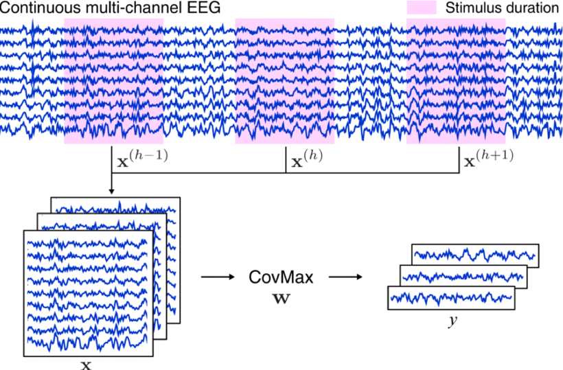
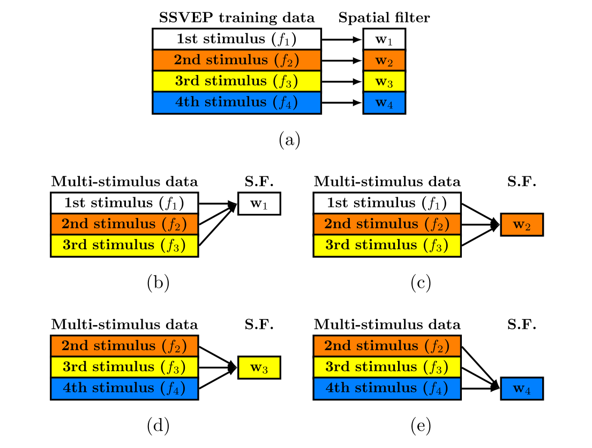

---
html:
    toc: true
print_background: true
---

<script type="text/javascript" src="http://cdn.mathjax.org/mathjax/latest/MathJax.js?config=TeX-AMS-MML_HTMLorMML"></script>
<script type="text/x-mathjax-config"> MathJax.Hub.Config({ tex2jax: {inlineMath: [['$', '$']]}, messageStyle: "none" });</script>

# 常见 SSVEP 信号处理算法（空间滤波器）

更新进展：今天写了 msTRCA 的部分说明、吐槽（2022/7/23）
近期计划：看心情更新。

教资这科目二比科目一难多了呀，还得是科目三生物好学。

**<font color="#dd0000"> 建议各位同僚读完硕士赶紧去就业吧，千万不要盲目读博、投身火海。 </font>**

***
## 公式变量符号及说明
| 符号名称 | 物理含义 |
| --- | --- |
| $N_e$ | 刺激类别数 |
| $N_t$ | 训练样本数 |
| $N_c$ | 导联数 |
| $N_p$ | 单试次采样点数 |
| $N_h$ | 正余弦信号谐波个数 |
| $N_k$ | 保留子空间个数 |
| $f_s$ | EEG 信号采样率 |
| $Cov(\pmb{x},\pmb{y}),Cov(\pmb{X},\pmb{Y})$ | 向量（矩阵） $\pmb{x}$（$\pmb{X}$）和 $\pmb{y}$（$\pmb{Y}$）的协方差（阵） |
| $Var(\pmb{x}),Var(\pmb{X})$ | 向量（矩阵）$\pmb{x}$（$\pmb{X}$）的方差（自协方差）（阵） |
| $corr(\pmb{x},\pmb{y}),corr2(\pmb{X},\pmb{Y})$ | 向量（矩阵） $\pmb{x}$（$\pmb{X}$）和 $\pmb{y}$（$\pmb{Y}$）的 *Pearson* 相关系数 |
| $\pmb{I}_N$ | $N$ 阶单位阵 |
| $\pmb{\mathcal{I}}_{M,N} \in \mathbb{R}^{N \times \left(MN \right)}$ | $M$ 个 $\pmb{I}_N$ 的横向拼接，$\left[\pmb{I}_N,\cdots,\pmb{I}_N \right]$ |
| $\pmb{\chi}$ | EEG 测试数据矩阵 |
| $\pmb{X}$ | EEG 训练数据矩阵 |
| $\pmb{x}$ | EEG 训练数据序列 |
| $\pmb{Y}$ | 人工构建正余弦模板 |
| $\pmb{X}^i, \pmb{x}^i$ | 第 $i$ 试次或第 $i$ 导联数据，详见各部分具体说明|
| $\pmb{X}_k, \pmb{x}_k$ | 第 $k$ 类别数据 |
| $\bar{\pmb{X}}_k$, $\bar{\pmb{x}}_k$ | 类别样本中心，由 $\pmb{X}_k$ 或 $\pmb{x}_k$ 按试次叠加平均获得 |
| $\bar{\bar{\pmb{X}}}, \bar{\bar{\pmb{x}}}$ | 总体样本中心，由 $\bar{\pmb{X}}_k$ 或 $\bar{\pmb{x}}_k$ 按类别叠加平均获得 |
| $\pmb{\omega}, \pmb{U}, \pmb{V}$ ... | 低维空间滤波器 |
| $\pmb{W}$ | 高维空间滤波器，由数个低维空间滤波器集成获得 |
（在无特殊说明的情况下，所有训练数据默认经过了零均值化处理）

***
## 1. 典型相关性分析
**Canonical correlation analysis, CCA**

### 1.1 标准 CCA：CCA
**[论文链接][CCA] | 代码：[cca][cca(code)].cca()** | **2022/7/10**

对于第 $k$ 类别、第 $i$ 试次数据 $\pmb{X}_k^i \in \mathbb{R}^{N_c \times N_p}$，其对应频率的人工构建正余弦模板 $\pmb{Y}_k \in \mathbb{R}^{\left(2N_h \right) \times N_p}$ 可表示为：
$$
    \pmb{Y}_k = 
    \begin{bmatrix}
        \sin \left(2 \pi fn \right)\\
        \cos \left(2 \pi fn \right)\\
        \sin \left(4 \pi fn \right)\\
        \cos \left(4 \pi fn \right)\\
        ...\\
        \sin \left(2 N_h \pi fn \right)\\
        \cos \left(2 N_h \pi fn \right)\\
    \end{bmatrix}, n=\left[\dfrac{1}{f_s}, \dfrac{2}{f_s}, ..., \dfrac{N_p}{f_s} \right]
    \tag{1-1-1}
$$
CCA 的优化目标为 $\hat{\pmb{U}}_k^i$ 和 $\hat{\pmb{V}}_k^i$，使得一维信号 $\hat{\pmb{U}}_k^i \pmb{X}_k^i$ 与 $\hat{\pmb{V}}_k^i \pmb{Y}_k$ 之间相关性最大化，其目标函数为：
$$
    \hat{\pmb{U}}_k^i, \hat{\pmb{V}}_k^i =
    \underset{\pmb{U}_k^i, \pmb{V}_k^i} \argmax 
        \dfrac{Cov \left(\pmb{U}_k^i \pmb{X}_k^i, \pmb{V}_k^i \pmb{Y}_k \right)} {\sqrt{Var \left(\pmb{U}_k^i \pmb{X}_k^i \right)} \sqrt{Var \left(\pmb{V}_k^i \pmb{Y}_k \right)}} = 
    \underset{\pmb{U}_k^i, \pmb{V}_k^i} \argmax
        \dfrac{\pmb{U}_k^i \pmb{C}_{\pmb{X}_k \pmb{Y}_k}^i {\pmb{{V}}_k^i}^T} {\sqrt{\pmb{U}_k^i \pmb{C}_{\pmb{X}_k \pmb{X}_k}^i {\pmb{{U}}_k^i}^T} \sqrt{\pmb{V}_k^i \pmb{C}_{\pmb{Y}_k \pmb{Y}_k} {\pmb{{V}}_k^i}^T}}
    \\
    \tag{1-1-2}
$$
$$
    \begin{cases}
        \pmb{C}_{\pmb{X}_k \pmb{X}_k}^i = \dfrac{1}{N_p-1} \pmb{X}_k^i {\pmb{X}_k^i}^T \in \mathbb{R}^{N_c \times N_c}\\
        \\
        \pmb{C}_{\pmb{Y}_k \pmb{Y}_k} = \dfrac{1}{N_p-1} \pmb{Y}_k {\pmb{Y}_k}^T \in \mathbb{R}^{\left(2N_h \right) \times \left(2N_h \right)}\\
        \\
        \pmb{C}_{\pmb{X}_k \pmb{Y}_k}^i = \dfrac{1}{N_p-1} \pmb{X}_k^i {\pmb{Y}_k}^T \in \mathbb{R}^{N_c \times \left(2N_h \right)}\\
        \\
        \pmb{C}_{\pmb{Y}_k \pmb{X}_k}^i = \dfrac{1}{N_p-1} \pmb{Y}_k {\pmb{X}_k^i}^T \in \mathbb{R}^{\left(2N_h \right) \times N_c}\\
    \end{cases}
    \tag{1-1-3}
$$
根据最优化理论，函数 (1-2) 的等效形式为：
$$
    \begin{cases}
        \underset{\pmb{U}_k^i, \pmb{V}_k^i} \max \ \pmb{U}_k^i \pmb{C}_{\pmb{X}_k \pmb{Y}_k}^i {\pmb{{V}}_k^i}^T\\
        \\
        s.t.\ \pmb{U}_k^i \pmb{C}_{\pmb{X}_k \pmb{X}_k}^i {\pmb{{U}}_k^i}^T =
        \pmb{V}_k^i \pmb{C}_{\pmb{Y}_k \pmb{Y}_k} {\pmb{{V}}_k^i}^T = 1
    \end{cases}
    \tag{1-1-4}
$$
利用 *Lagrandian* 乘子法构建多元函数 $J(\pmb{U}_k^i, \pmb{V}_k^i, \lambda, \theta)$：
$$
    J = \pmb{U}_k^i \pmb{C}_{\pmb{X}_k \pmb{Y}_k}^i {\pmb{{V}}_k^i}^T - \dfrac{1}{2} \lambda \left(\pmb{U}_k^i \pmb{C}_{\pmb{X}_k \pmb{X}_k}^i {\pmb{{U}}_k^i}^T - 1 \right) - \dfrac{1}{2} \theta \left(\pmb{V}_k^i \pmb{C}_{\pmb{Y}_k \pmb{Y}_k} {\pmb{{V}}_k^i}^T - 1 \right)
    \tag{1-1-5}
$$
对函数 $J$ 求偏导数并置零：
$$
    \begin{cases}
        \dfrac{\partial J}{\partial \pmb{{U}}_k^i} = 
        \pmb{C}_{\pmb{X}_k \pmb{Y}_k}^i {\pmb{{V}}_k^i}^T - \lambda \pmb{C}_{\pmb{X}_k \pmb{X}_k}^i {\pmb{{U}}_k^i}^T = 0 \ \ (I)\\
        \\
        \dfrac{\partial J}{\partial \pmb{{V}}_k^i} = 
        \pmb{C}_{\pmb{Y}_k \pmb{X}_k}^i {\pmb{{U}}_k^i}^T - \theta \pmb{C}_{\pmb{Y}_k \pmb{Y}_k} {\pmb{{V}}_k^i}^T = 0 \ \ (II)
    \end{cases}
    \tag{1-1-6}
$$
消元化简后可知 $\lambda = \theta$。送佛送到西，咱们来看看到底怎么消元：
$$
    \begin{cases}
        \pmb{U}_k^i * (I) \to 
        \pmb{U}_k^i \pmb{C}_{\pmb{X}_k \pmb{Y}_k}^i {\pmb{{V}}_k^i}^T - \lambda \pmb{U}_k^i \pmb{C}_{\pmb{X}_k \pmb{X}_k}^i {\pmb{{U}}_k^i}^T = 0\\
        \\
        \pmb{V}_k^i * (II) \to 
        \pmb{V}_k^i \pmb{C}_{\pmb{Y}_k \pmb{X}_k}^i {\pmb{{U}}_k^i}^T - \theta \pmb{V}_k^i \pmb{C}_{\pmb{Y}_k \pmb{Y}_k} {\pmb{{V}}_k^i}^T = 0\\
    \end{cases}
    \tag{1-1-7}
$$
根据约束条件 (1-1-4) 可知：
$$
    \lambda = \pmb{U}_k^i \pmb{C}_{\pmb{X}_k \pmb{Y}_k}^i {\pmb{{V}}_k^i}^T, \ 
    \theta = \pmb{V}_k^i \pmb{C}_{\pmb{Y}_k \pmb{X}_k}^i {\pmb{{U}}_k^i}^T
    \tag{1-1-8}
$$
大家注意 $\lambda = {\theta}^T$，而当我们明确要求优化目标是**一维向量**的时候，这两位大哥其实都是实数，所以它们相等。之后就是大家在解二元一次方程组时常用的代换消元过程（ $\pmb{U}_k^i$ 与 $\pmb{V}_k^i$ 互相替换），我就不再演示了。最终应得到两个特征值方程：
$$
    \begin{cases}
        {\pmb{C}_{\pmb{X}_k \pmb{X}_k}^i}^{-1} \pmb{C}_{\pmb{X}_k \pmb{Y}_k}^i {\pmb{C}_{\pmb{Y}_k \pmb{Y}_k}}^{-1} \pmb{C}_{\pmb{Y}_k \pmb{X}_k}^i {\pmb{U}_k^i}^T = {\lambda}^2 {\pmb{U}_k^i}^T\\
        \\
        {\pmb{C}_{\pmb{Y}_k \pmb{Y}_k}}^{-1} \pmb{C}_{\pmb{Y}_k \pmb{X}_k}^i {\pmb{C}_{\pmb{X}_k \pmb{X}_k}^i}^{-1} \pmb{C}_{\pmb{X}_k \pmb{Y}_k}^i {\pmb{V}_k^i}^T = {\theta}^2 {\pmb{V}_k^i}^T
    \end{cases}
    \tag{1-1-9}
$$
对式 (1-1-9) 中的两个 *Hermitte* 矩阵分别进行特征值分解，取最大特征值对应的特征向量作为投影向量，即为所求。基于一维 *Pearson* 相关系数，对单试次测试数据 $\pmb{\chi}$ 与不同频率的正余弦模板分别滤波后，计算判别系数并比较大小，确定最终的结果输出 $\hat{k}$：
$$
    \rho_k = corr \left(\hat{\pmb{U}}_k \pmb{\chi}, \hat{\pmb{V}}_k \pmb{Y}_k \right)
    \tag{1-1-10}
$$
$$
    \hat{k} = \underset{k} \argmax {\{\rho_k | k=1,2,...,N_e \}}
    \tag{1-1-11}
$$

### 1.2 扩展 CCA：eCCA
**(Extended CCA)**

**[论文链接][eCCA] | 代码：[cca][cca(code)].ecca()**


### 1.3 多重刺激 CCA：msCCA
**(Multi-stimulus CCA)**

**[论文链接][msCCA] | 代码：[cca][cca(code)].mscca()**

**<font color="#dd0000">（大量数学前置知识警告）</font>**

朋友们我们今天来膜拜 (~~gank~~) 澳门大学的内卷发动机 *Chi Man Wong* 和 *Feng Wan* 老师团队。之所以对他们“赞誉有加”，主要有三方面原因：

（1）**算法有用，但只有一点用**：他们提出的一系列 SSVEP 算法在公开数据集与竞赛数据集中具有极大优势（即样本量不足的情况）。不过在数据样本量充足的情况下，与传统的 (e)TRCA 算法难以拉开差距；

（2）**强悍如斯，地都快耕坏了**：他们的每篇论文都充分（~~往死里~~）挖掘了公开数据集的可用潜力，从 [Benchmark][Benchmark]、[UCSD][UCSD] 再到 [BETA][BETA] 都能看到他的身影，从 CCA 到 ms-(e)TRCA 各种花里胡哨的算法都测了个遍（~~根本不给人活路~~），低频 SSVEP-BCI 系统的解码被他卷得翻江倒海，再无探索空间。

（3）**故弄玄虚，堆砌数学壁垒**：该团队 2020 年发表的一篇关于[空间滤波器构建框架][TRCA-R]的综述性论文就是万恶之源。在其文章中，经常使用怪僻的希腊字母、花体英文字母作为变量名称，为了形式简约而把简单的实际操作过程复杂化。例如明明是人畜无害的试次叠加平均：
$$
    \bar{\pmb{X}} = \dfrac{1} {N_t} \sum_{n=1}^{N_t} \pmb{X}_i, \ \pmb{X}_i \in \mathbb{R}^{Nc \times Np}
    \tag{1-3-1}
$$
为了凑上自己提出的框架，硬要给你表演一套天书：
$$
    \begin{cases}
        \oplus_{i=1}^{N_t} \pmb{X}_i = 
        \begin{bmatrix}
            \pmb{X}_1 & \pmb{0} & \cdots & \pmb{0}\\
            \pmb{0} & \pmb{X}_2 & \cdots & \pmb{0}\\
            \vdots & \vdots & \ddots & \vdots\\
            \pmb{0} & \cdots & \cdots & \pmb{X}_{N_t}
        \end{bmatrix} \in \mathbb{R}^{\left(N_t N_c \right) \times \left(N_t N_p \right)}\\
        \\
        \bar{\pmb{X}} = \dfrac{1} {N_t} \pmb{\mathcal{I}}_{N_t, N_c} \cdot \left[\oplus_{i=1}^{N_t} \pmb{X}_i \right] \cdot \pmb{\mathcal{I}}_{N_t, N_p}^T
    \end{cases}
    \tag{1-3-2}
$$
组里有些萌新，一板一眼地照着论文公式复现算法，结果训练样本一多，程序不仅运行慢，还动不动就内存溢出。从原始数据结构中创建 $\oplus_{i=1}^{N_t} \pmb{X}_i$、$\pmb{\mathcal{I}}_{N_t, N_p}$ 这样的大矩阵送去后端运算，相当于先做一把电锯去再杀鸡炖汤，能不慢吗？家庭厨房里接上工业用电，能不溢出吗？

不可否认的是，*Chi Man Wong* 及其团队对于 SSVEP 信号解码的研究是成体系的、步骤严谨的，他们提出的空间滤波器框架适配了自 CCA 以来的各种算法，为后续研究工作打开了思路。更重要的是，他们团队以及清华大学 *Yijun Wang*、*Xiaogang Chen* 等老师带领的团队，都不搞弯道超车，不搞非对称竞争，每一个研究思路都是建立在已有研究基础上，每一步新的收获都会切实体现为文章成果。这样的团队对于学生培养是利好的，学生不用担心梭哈一个老板异想天开的课题而愁于毕业困境。因此再让我跑题一次：**<font color="#dd0000">但凡遇到老板鼓吹自己手握多少项目、每年经费多少万、带领多少优秀青年教师团队、手下多少研究生之类的话术，一定要慎之又慎</font>**。你要知道，牛逼吹得不够大是不能吸引上边的人投资的，牛逼吹起来了就是在梭哈你自己的学术生涯与宝贵光阴。老板项目结不了题顶多延期，少赚一点经费，少评一些名声，日子一分都不会难受。你延期延掉的是什么还请自己掂量清楚。

言归正传，我们首先有必要介绍一下 *Wong* 提出的统一框架。*Wong* 以及部分研究者喜欢按列展示向量，而本文中向量统一按行排布（~~我偏不，老子就喜欢按行~~），因此部分公式可能在形式上与原文有所出入，但本质是一样的：
$$
    \pmb{\mathcal{Z}} \pmb{\mathcal{D}} \pmb{\mathcal{P}} \pmb{\mathcal{P}}^T {\pmb{\mathcal{D}}}^T \pmb{\mathcal{Z}}^T \pmb{W} = 
    \begin{cases}
        \pmb{\mathcal{Z}} \pmb{\mathcal{D}} \pmb{\mathcal{D}}^T \pmb{\mathcal{Z}}^T \pmb{W} \pmb{\Lambda}, \ Type I\\
        \\
        \pmb{W} \pmb{\Lambda}, \ Type II
    \end{cases}
    \tag{1-3-3}
$$
这里 $\pmb{W}$ 与 $\pmb{\Lambda}$ 之所以写成矩阵而不是“向量+标量”形式，是因为空间滤波器并不总是将多通道信号压缩至一维，对于需要进行压缩的一般情况，只需取方阵 $\pmb{\mathcal{Z}} \pmb{\mathcal{D}} \pmb{\mathcal{P}} \pmb{\mathcal{P}}^T {\pmb{\mathcal{D}}}^T \pmb{\mathcal{Z}}^T$ 的最大（小）特征值对应的特征向量即可；而当需要保留多个维度（投影子空间）时， $\pmb{W}$ 的最优解为多个特征向量的拼接，拼接顺序以对应特征向量的大小顺序为准。

接下来我不想再去复述他们文章中对各种算法的具体匹配方式，仅在此对式 (1-3-3) 中的主要成分进行简单介绍：

$\pmb{\mathcal{Z}}$ 是数据（默认按列排布）的集合矩阵，可能是（1）单个数据矩阵；（2）形如 $\bigoplus_{i=1}^{N_t} \pmb{X}_i$ 的多种数据块对角拼接组成的联合矩阵；（3）由多个 $\pmb{\mathcal{Z}}$ 横向或纵向拼接而成的矩阵。一般来说（2）中的对角联合矩阵在整体公式中需要经过 $\pmb{\mathcal{I}}$ 矩阵的变形处理，将其转换为（3）的格式，例如 3.3 节中式 (3-3-2) 所示的 $\pmb{\mathcal{Z}}$；

$\pmb{\mathcal{D}}$ 是时域滤波矩阵，除了滤波器组技术以外，通常预处理（带通滤波）结束后的数据无需再进行时域滤波，即 $\pmb{\mathcal{D}} = \pmb{I}$；

$\pmb{\mathcal{P}}$ 为正交投影矩阵，通常满足 $\pmb{\mathcal{P}} = {\pmb{\mathcal{P}}}^T = \pmb{\mathcal{P}} {\pmb{\mathcal{P}}}^T = {\pmb{\mathcal{P}}}^T \pmb{\mathcal{P}}$。根据给定的投影方向（$\pmb{T}$），可表示为:
$$
    \begin{cases}
        \pmb{\mathcal{P}} = \pmb{T}^T \left(\pmb{T} \pmb{T}^T \right)^{-1} \pmb{T}
            = \pmb{Q}_{\pmb{T}} {\pmb{Q}_{\pmb{T}}}^T\\
        \\
        \pmb{T} = \pmb{Q}_{\pmb{T}} \pmb{R}_{\pmb{T}}, \ Reduced \ QR \ decomposition
    \end{cases}
    \tag{1-3-4}
$$
不难发现，该框架的数学本质是一系列**广义特征值** ( *Generalized eigenvalue problems, GEPs* ) 方程，而空间滤波器构建过程中常见的**广义瑞利商** ( *Generalized Rayleigh quotient* ) 问题通常又可以转化为 *GEP* 方程加以求解，因此该框架几乎能够契合现有各种 SSVEP-BCI 系统中常见的空间滤波器算法。但是在后文中，除了 *Wong* 设计的算法，我基本上不会使用这个框架来展示公式，原因我在几段前已经吐槽过。我个人更倾向于通过**直观物理含义**的途径来阐释算法原理，希望通过我的讲解，能够让大家实现原理、编程实践与性能优化三者合一，更好地掌握算法的精髓、洞察未来改进方向。最后给大家简单介绍一下广义瑞利商及其与 *GEP* 问题的关系：

形如式 (1-3-5) 所示的函数称为瑞利商 ( *Rayleigh quotient* )，其中 $\pmb{A}$ 为 *Hermitte* 矩阵：
$$
    f(\pmb{\omega}) = \dfrac{\pmb{\omega} \pmb{A} {\pmb{\omega}}^T} {\pmb{\omega} {\pmb{\omega}}^T}, \ 
    \pmb{A} \in \mathbb{R}^{N \times N}, \ 
    \pmb{\omega} \in \mathbb{R}^{1 \times N}
    \tag{1-3-5}
$$
一般最优化问题需要求解瑞利商的最值，同 (1-1-4) 将其转化为最优化问题标准描述形式，之后利用 *Lagrandian* 乘子法构建函数 $J$：
$$
    \begin{cases}
        \underset{\pmb{\omega}} \max \ \pmb{\omega} \pmb{A} {\pmb{\omega}}^T\\
        s.t.\ \pmb{\omega} {\pmb{\omega}}^T = 1
    \end{cases} \to 
    J(\pmb{\omega}) = \pmb{\omega} \pmb{A} {\pmb{\omega}}^T - \lambda \left(\pmb{\omega} {\pmb{\omega}}^T - 1 \right)
    \tag{1-3-6}
$$
对 $J$ 求导并置零，最终可得特征值方程：
$$
    \dfrac{dJ(\pmb{\omega})}{d \pmb{\omega}} = 2 \pmb{A} {\pmb{\omega}}^T - 2 \lambda {\pmb{\omega}}^T = 0
    \to 
    \pmb{A} {\pmb{\omega}}^T = \lambda {\pmb{\omega}}^T
    \tag{1-3-7}
$$
至此可以看出，瑞利商的最值即为方阵 $\pmb{A}$ 最大（小）特征值对应的特征向量。至于广义瑞利商，其形如式 (1-3-8) 所示的函数，$\pmb{B}$ 同样也是 *Hermitte* 矩阵：
$$
    f(\pmb{\omega}) = \dfrac{\pmb{\omega} \pmb{A} {\pmb{\omega}}^T} {\pmb{\omega} \pmb{B} {\pmb{\omega}}^T}, \ 
    \pmb{A},\pmb{B} \in \mathbb{R}^{N \times N}, \ 
    \pmb{\omega} \in \mathbb{R}^{1 \times N}
    \tag{1-3-8}
$$
同上进行类似操作，可以得到式 (1-3-9) 所示的 *GEP* 方程。由此可知广义瑞利商的最值即为方阵 $\pmb{B}^{-1} \pmb{A}$ 最大（小）特征值对应的特征向量：
$$
    \pmb{A} {\pmb{\omega}}^T = \lambda \pmb{B} {\pmb{\omega}}^T
    \Longrightarrow 
    \left(\pmb{B}^{-1} \pmb{A} \right) {\pmb{\omega}}^T  = \lambda {\pmb{\omega}}^T
    \tag{1-3-9}
$$

（未完成）

$$
    \pmb{\mathcal{Z}} \pmb{Q}_{\pmb{\mathcal{Y}}} {\pmb{Q}_{\pmb{\mathcal{Y}}}}^T {\pmb{\mathcal{Z}}}^T \pmb{U} = \pmb{\mathcal{Z}} {\pmb{\mathcal{Z}}}^T \pmb{U} \pmb{\Lambda}
    \tag{1-3-10}
$$
$$
    \begin{cases}
        \pmb{\mathcal{Z}}_k = 
        \begin{bmatrix}
            \bar{\pmb{X}}_1 & \bar{\pmb{X}}_2 & \cdots & \bar{\pmb{X}}_{N_e}
        \end{bmatrix} \in \mathbb{R}^{N_c \times \left(N_e N_p \right)}\\
        \\
        \pmb{\mathcal{Y}}_k = 
        \begin{bmatrix}
            \pmb{Y}_1 & \pmb{Y}_2 & \cdots & \pmb{Y}_{N_e}
        \end{bmatrix} \in \mathbb{R}^{N_c \times \left(N_e N_t N_p \right)}\\
    \end{cases}
    \tag{1-3-11}
$$
$$
    \begin{cases}
        \pmb{Q}_{\pmb{\mathcal{Y}}} {\pmb{Q}_{\pmb{\mathcal{Y}}}}^T = {\pmb{\mathcal{Y}}_k}^T \left(\pmb{\mathcal{Y}}_k {\pmb{\mathcal{Y}}_k}^T \right)^{-1} \pmb{\mathcal{Y}}_k\\
    \end{cases}
    \tag{1-3-12}
$$

### 1.4 多重刺激扩展 CCA：ms-eCCA
**(Multi-stimulus CCA)**

**[论文链接][mseCCA] | 代码：[cca][cca(code)].msecca()** | **2022/7/26**

阅读本节内容之前，建议阅读 3.2 节以了解部分背景知识，因为本节将从另外一个角度解释ms-eCCA 公式的由来。ms-eCCA 与 ms-eTRCA 是 *Wong* 在同一篇论文中提出的方法，在发表时间上也先于 msCCA。

顾名思义，ms-eCCA 是 msCCA 的扩展，在模板匹配上类似 eCCA 之于 CCA，此外在扩增的刺激目标选择上有所约束。与 3.2 节所述一致，ms- 技术假定一套滤波器同时适用于目标频率以及周边少数频率的信号，通过合并一定范围内的多类别信号，强行扩增可用训练样本数目。

结合 3.2 节与 1.1 节 CCA 的相关知识，ms-eCCA 的目标函数可表示为：
$$
    \hat{\pmb{U}}_k, \hat{\pmb{V}}_k =
    \underset{\pmb{U}_k, \pmb{V}_k} \argmax 
    \dfrac{Cov \left(\pmb{U}_k \pmb{\mathcal{Z}}_k, \pmb{\mathcal{Y}}_k {\pmb{V}_k} \right)}
          {\sqrt{Var \left(\pmb{U}_k \pmb{\mathcal{Z}}_k \right)} \sqrt{Var \left(\pmb{V}_k \pmb{\mathcal{Y}}_k \right)}} = 
    \underset{\pmb{U}_k, \pmb{V}_k} \argmax 
    \dfrac{\pmb{U}_k \pmb{C}_{\pmb{\mathcal{Z}}_k \pmb{\mathcal{Y}}_k} {\pmb{V}_k}^T}
          {\sqrt{\left(\pmb{U}_k \pmb{C}_{\pmb{\mathcal{Z}}_k \pmb{\mathcal{Z}}_k} {\pmb{U}_k}^T \right)} \sqrt{\left(\pmb{V}_k \pmb{C}_{\pmb{\mathcal{Y}}_k \pmb{\mathcal{Y}}_k} {\pmb{V}_k}^T \right)}}\\
    \tag{1-4-1}
$$
$$
    \begin{cases}
        \pmb{\mathcal{Z}}_k = 
        \begin{bmatrix}
            \bar{\pmb{X}}_{k-m} & \bar{\pmb{X}}_{k-m+1} & \cdots & \bar{\pmb{X}}_{k+n}
        \end{bmatrix} \in \mathbb{R}^{N_c \times [(m+n+1)N_p]}\\
        \\
        \pmb{\mathcal{Y}}_k = 
        \begin{bmatrix}
            \pmb{Y}_{k-m} & \pmb{Y}_{k-m+1} & \cdots & \pmb{Y}_{k+n}
        \end{bmatrix} \in \mathbb{R}^{N_c \times [(m+n+1) N_t N_p]}\\
    \end{cases}
    \tag{1-4-2}
$$
$$
    \pmb{Y}_k = 
    \begin{bmatrix}
        \sin(2 \pi f_k \pmb{t} + \phi_k)\\
        \cos(2 \pi f_k \pmb{t} + \phi_k)\\
        \vdots\\
        \sin(2 \pi N_h f_k \pmb{t} + N_h \phi_k)\\
        \cos(2 \pi N_h f_k \pmb{t} + N_h \phi_k)\\
    \end{bmatrix} \in \mathbb{R}^{(2N_h) \times N_p}, \ 
    \pmb{t} = 
        \begin{bmatrix}
            \dfrac{1}{f_s} & \dfrac{2}{f_s} & \cdots & \dfrac{N_p}{f_s}
        \end{bmatrix}
    \tag{1-4-3}
$$
$$
    \begin{cases}
        \pmb{C}_{\pmb{\mathcal{Z}}_k \pmb{\mathcal{Z}}_k}
            = \dfrac{1} {N_p-1} \sum_{i=-n}^{m}
              \bar{\pmb{X}}_{k+i} {\bar{\pmb{X}}_{k+i}}^T \in \mathbb{R}^{N_c \times N_c}\\
        \\
        \pmb{C}_{\pmb{\mathcal{Y}}_k \pmb{\mathcal{Y}}_k}
            = \dfrac{1} {N_p-1}
              \sum_{i=-n}^{m} \pmb{Y}_{k+i} {\pmb{Y}_{k+i}}^T \in \mathbb{R}^{(2N_h) \times (2N_h)}\\
        \\
        \pmb{C}_{\pmb{\mathcal{Z}}_k \pmb{\mathcal{Y}}_k}
            = \dfrac{1} {N_p-1}
              \sum_{i=-n}^{m} \bar{\pmb{X}}_{k+i} {\pmb{Y}_{k+i}}^T \in \mathbb{R}^{N_c \times (2N_h)}\\
        \\
        \pmb{C}_{\pmb{\mathcal{Y}}_k \pmb{\mathcal{Z}}_k}
            = \dfrac{1} {N_p-1}
              \sum_{i=-n}^{m} \pmb{Y}_{k+i} {\bar{\pmb{X}}_{k+i}}^T \in \mathbb{R}^{(2N_h) \times N_c}\\
    \end{cases}
    \tag{1-4-4}
$$
简而言之，在空间滤波器构建上，ms-eCCA 与 ms-(e)TRCA 的思路一致，即把不同类别信号按时间维度顺次拼接，以起到数据扩增的作用。类比 1.1 节推导过程可知，式 (1-4-1) 所对应的两个 *GEP* 方程为：
$$
    \begin{cases}
        {\pmb{C}_{\pmb{\mathcal{Z}}_k \pmb{\mathcal{Z}}_k}}^{-1}
        \pmb{C}_{\pmb{\mathcal{Z}}_k \pmb{\mathcal{Y}}_k}
        {\pmb{C}_{\pmb{\mathcal{Y}}_k \pmb{\mathcal{Y}}_k}}^{-1}
        \pmb{C}_{\pmb{\mathcal{Y}}_k \pmb{\mathcal{Z}}_k}
        \pmb{U}_k^i = {\lambda}^2 \pmb{U}_k^i\\
        \\
        {\pmb{C}_{\pmb{\mathcal{Y}}_k \pmb{\mathcal{Y}}_k}}^{-1}
        \pmb{C}_{\pmb{\mathcal{Y}}_k \pmb{\mathcal{Z}}_k}
        {\pmb{C}_{\pmb{\mathcal{Z}}_k \pmb{\mathcal{Z}}_k}}^{-1}
        \pmb{C}_{\pmb{\mathcal{Z}}_k \pmb{\mathcal{Y}}_k}
        \pmb{V}_k^i = {\theta}^2 \pmb{V}_k^i
    \end{cases}
    \tag{1-4-5}
$$
排除常系数的影响，式 (1-4-5) 可以进一步表示为：
$$

$$

### 1.x 跨个体空间滤波器迁移：CSSFT
**(Cross-subject spatial filter transfer method)**

**[论文链接][CSSFT] | 代码：[cca][cca(code)].cssft()**


[cca(code)]: https://github.com/BrynhildrW/SSVEP_algorithms/blob/main/cca.py
[CCA]: http://ieeexplore.ieee.org/document/4203016/
[eCCA]: http://www.pnas.org/lookup/doi/10.1073/pnas.1508080112
[msCCA]: https://ieeexplore.ieee.org/document/9006809/
[mseCCA]: https://iopscience.iop.org/article/10.1088/1741-2552/ab2373
[CSSFT]: http://iopscience.iop.org/article/10.1088/1741-2552/ac6b57

***
## 2. 多变量同步化系数
**Multivariate synchronization index, MSI**

### 2.1 标准 MSI：MSI
**[论文链接][MSI] | 代码：[msi][msi(code)].msi()**


### 2.2 时域局部 MSI：tMSI
**(Temporally MSI)**

**[论文链接][tMSI] | 代码：[msi][msi(code)].tmsi()**


### 2.3 扩展 MSI：eMSI
**(Extended MSI)**

**[论文链接][MSI] | 代码：[msi][msi(code)].emsi()**


[msi(code)]: temp
[MSI]: https://linkinghub.elsevier.com/retrieve/pii/S0165027013002677
[tMSI]: http://link.springer.com/10.1007/s11571-016-9398-9
[eMSI]: https://linkinghub.elsevier.com/retrieve/pii/S0925231217309980

***
## 3. 任务相关成分分析
**Task-related component analysis, TRCA**

### 3.1 普通/集成 TRCA：(e)TRCA
**( (Ensemble) TRCA, (e)TRCA）**

**[论文链接][TRCA] | 代码：[trca][trca(code)].etrca()** | **2022/7/16**

与此前基于 CCA 改进的 SSVEP 算法相比，TRCA 在构建思路上存在较大差别，具体表现在其关注对象（即信号模板）不再限定为具有正余弦波动性质的传统模型，而是充分包含了个体信息的 “任务相关成分” ( *Task-related components, TRCs* )。关于TRC可以简单理解为：当受试者在多次接受相同任务时，其 EEG 信号中应当包含具有相同性质的诱发成分。由此可见，TRCA 在理论上适用于任何诱发信号具有稳定波形特征的 BCI 范式特征信号解码。



*Nakanishi* 等人首次将 TRCA 应用至 SSVEP 信号解码上时，在公式推导部分使用了一个非常讨巧的办法：**跨试次信号相关性最大化**。之所以称其“讨巧”，是因为原版 TRCA 公式分子中强调的**跨试次协方差计算**操作，在实际编程过程中产生了大量冗余计算步骤；其分母的**矩阵拼接**操作也缺乏明确的物理意义对应说明。而上述“瑕疵”在后续算法改进工作中被不断研究透彻。因此本文不再按照原文思路推导算法，仅给出相对成熟的阐释：

对于第 $k$ 类别、第 $i$、$j$ 试次数据 $\pmb{X}_k^i,\pmb{X}_k^j \in \mathbb{R}^{N_c \times N_p}$ (假定 $i \ne j$)，其跨试次样本协方差以及单试次样本方差（自协方差）分别为：
$$
    Cov \left(\pmb{\omega}_k \pmb{X}_k^i, \pmb{\omega}_k \pmb{X}_k^j \right) = \dfrac{1} {N_p-1} \pmb{\omega}_k \pmb{X}_k^i {\pmb{X}_k^j}^T {\pmb{\omega}_k}^T, i \ne j
    \tag{3-1-1}
$$
$$
    Var \left(\pmb{\omega}_k \pmb{X}_k^i \right) = Cov \left(\pmb{\omega}_k \pmb{X}_k^i, \pmb{\omega}_k \pmb{X}_k^j \right) = \dfrac{1}{N_p-1} \pmb{\omega}_k \pmb{X}_k^i {\pmb{X}_k^i}^T {\pmb{\omega}_k}^T 
    \tag{3-1-2}
$$
因此，TRCA 的目标函数可写为：
$$
    \hat{\pmb{\omega}}_k = 
    \underset{\pmb{\omega}_k} \argmax
        \dfrac{\sum_{j=1, j \ne i}^{N_t} \sum_{i=1}^{N_t} Cov \left(\pmb{\omega}_k \pmb{X}_k^i, \pmb{\omega}_k \pmb{X}_k^j \right)} {\sum_{i=1}^{N_t} Var \left(\pmb{\omega}_k \pmb{X}_k^i \right)} = 
    \underset{\pmb{\omega}_k} \argmax 
        \dfrac{\pmb{\omega}_k \pmb{S}_k {\pmb{\omega}_k}^T} {\pmb{\omega}_k \pmb{Q}_k {\pmb{\omega}_k}^T}
    \tag{3-1-3}
$$
$$
    \pmb{S}_k = \sum_{j=1,j \ne i}^{N_t} \sum_{i=1}^{N_t} \pmb{X}_k^i {\pmb{X}_k^j}^T, \ \pmb{Q}_k = \sum_{i=1}^{N_t} \pmb{X}_k^i {\pmb{X}_k^i}^T
    \tag{3-1-4}
$$
根据广义瑞利商的结论，上述目标函数的单维度最优解即为方阵 ${\pmb{Q}_k}^{-1} \pmb{S}_k$ 的最大特征值对应的特征向量。接下来对TRCA的目标函数作进一步分析：
$$
    \pmb{S}_k = \sum_{j=1}^{N_t} \sum_{i=1}^{N_t} \pmb{X}_k^i {\pmb{X}_k^j}^T - \pmb{Q}_k = 
    {N_t}^2 \bar{X}_k {\bar{X}_k}^T - \pmb{Q}_k = 
    \pmb{S}_k^{'} - \pmb{Q}_k
    \tag {3-1-5}
$$
$$
    \dfrac{\pmb{\omega}_k \pmb{S}_k {\pmb{\omega}_k}^T} {\pmb{\omega}_k \pmb{Q}_k {\pmb{\omega}_k}^T} = 
    \dfrac{\pmb{\omega}_k \pmb{S}_k^{'} {\pmb{\omega}_k}^T} {\pmb{\omega}_k \pmb{Q}_k {\pmb{\omega}_k}^T} - 1
    \tag {3-1-6}
$$
相比于直接计算 $\pmb{S}_k$，经由 $\pmb{S}_k^{'}$ 替换或计算得到 $\pmb{S}_k$ 能够大幅提升运算速度。其原因如下：将单次浮点数相乘与相加设为两种单位操作，其耗时分别为 $T_{\times}$ 和 $T_+$，对应时间复杂度分别为 $O_{\times}$ 与 $O_+$。则针对 $\pmb{X}_k^i$ 执行一次矩阵乘法 $\pmb{X}_k^i {\pmb{X}_k^i}^T$ 或矩阵加法 $\pmb{X}_k^i + \pmb{X}_k^j$ 所需的理论运行时间 $T_{M \times}$、$T_{M+}$ 分别为：
$$
    T_{M \times} = \left({N_c}^2 N_p \right) T_+ + \left[{N_c}^2 (N_p-1) \right]T_{\times}
    \tag{3-1-7}
$$
$$
    T_{M+} = (N_c N_p)T_+
    \tag{3-1-8}
$$
对于具有 $\mathbb{R}^{N_t \times N_c \times N_p}$ 维度的训练数据张量 $\pmb{X}_k$，求解 $\pmb{S}_k$ 的总计理论时间 $T_1$ 与时间复杂度 $O_1$ 分别为：
$$
    T_1 = N_t \left(N_t-1 \right) T_{M \times} + \left[N_t(N_t-1)-1 \right] T_{M+}
    \tag{3-1-9}
$$
$$
    O_1 = O_{\times} \left({N_t}^2 {N_c}^2 N_p \right) + O_+ \left({N_t}^2 {N_c}^2 N_p \right) 
    \tag{3-1-10}
$$
而使用 $\pmb{S}_k^{'}$ 时，首先计算按试次平均后的个体模板 $\bar{\pmb{X}}_k$，其理论运行时间 $T_0$ 为：
$$
    T_0 = \left(N_c N_p \right)T_{\times} + \left(N_t-1 \right) T_{M+}
    \tag{3-1-11}
$$
$\pmb{S}_k^{'}$ 的总计理论计算时间 $T_2$ 与时间复杂度 $O_2$ 分别为：
$$
    T_2 = T_0 + T_{M \times}
    \tag{3-1-12}
$$
$$
    O_2 = O_{\times} \left({N_c}^2 N_p \right) + O_+ \left[\max \left(N_t N_c N_p, {N_c}^2 N_p \right) \right]
    \tag {3-1-13}
$$
对比 $O_1$ 与 $O_2$ 可见，样本数量越多，采用该种替换方法与原始情况所产生的偏差越小、速度提升越大。

综上所述，通过训练数据获取当前类别专属的空间滤波器 $\hat{\pmb{\omega}}_k$ 以及信号模板 $\hat{\pmb{\omega}}_k \bar{\pmb{X}}_k$，基于一维 *Pearson* 相关系数公式，对单试次测试数据 $\pmb{\chi}$ 应用空间滤波后与模板信号计算判别系数：
$$
    \rho_k = corr \left(\hat{\pmb{\omega}}_k \bar{\pmb{X}}_k, \hat{\pmb{\omega}}_k \pmb{\chi} \right)
    \tag {3-1-14}
$$
eTRCA 是基于 TRCA 的集成学习版本，它把各类别 $\hat{\pmb{\omega}}_k \in \mathbb{R}^{1 \times N_c}$ 按行拼接在一起组成高维滤波器 $\hat{\pmb{W}}$，通过计算二维 *Pearson* 相关系数完成信号的模式识别：
$$
    \begin{cases}
        \hat{\pmb{W}} = 
        \begin{bmatrix}
            \hat{\pmb{\omega}}_1\\
            \hat{\pmb{\omega}}_2\\
            \vdots\\
            \hat{\pmb{\omega}}_{N_e}\\
        \end{bmatrix} \in \mathbb{R}^{N_e \times N_c}\\
        \\
        \rho_k = corr2 \left(\hat{\pmb{W}} \bar{\pmb{X}}_k, \hat{\pmb{W}} \pmb{\chi} \right)
    \end{cases}
    \tag {3-1-15}
$$
其中 $corr2()$ 函数本质上就是先把一个二维矩阵按行拉平变成一维序列，之后再计算一维 *Pearson* 系数。关于这个过程，Matlab 的 **corr2()** 函数给出了一种更适合编程的高效运算方法。对于同维度二维矩阵 $\pmb{A} = [a_{ij}]_{m \times n}$，$\pmb{B} = [b_{ij}]_{m \times n}$，计算矩阵中心 $\bar{\bar{\pmb{A}}}$、$\bar{\bar{\pmb{B}}}$：
$$
    \bar{\bar{\pmb{A}}} = \sum_{j=1}^m \sum_{i=1}^n a_{ij} = \sum\sum a_{ij},  \ \bar{\bar{\pmb{B}}} = \sum\sum b_{ij}
    \tag{3-1-16}
$$
$$
    corr2(\pmb{A}, \pmb{B}) = \dfrac{\sum\sum \left(a_{ij} - \bar{\bar{\pmb{A}}}\right)\left(b_{ij} - \bar{\bar{\pmb{B}}}\right)} {\sqrt{\sum\sum \left(a_{ij} - \bar{\bar{\pmb{A}}} \right)^2} \sqrt{\sum\sum \left(b_{ij} - \bar{\bar{\pmb{B}}} \right)^2}}
    \tag{3-1-17}
$$
别被式 (3-1-17) 一层又一层的叠加操作唬住了，在 *ndarray* 的基础上很容易就能将其复现出来。由于避免了大矩阵变量的维度变换，运算速度会有显著提升：
```python
import numpy as np
def corr2_coef(X, Y):
    """2-D Pearson correlation coefficient
    Args:
        X (ndarray): (m,n)
        Y (ndarray): (m,n)
    Returns:
        coef (float)
    """
    mean_X, mean_Y = X.mean(), Y.mean()  # matrix center
    decen_X, decen_Y = X-mean_X, Y-mean_Y  # decentralized matrix
    numerator = np.einsum('ij->', decen_X*decen_Y)
    denominator_X = np.einsum('ij->', decen_X**2)
    denominator_Y = np.einsum('ij->', decen_Y**2)
    coef = numerator/np.sqrt(denominator_X*denominator_Y)
    return coef
```
论文中关于所谓的集成思想有这样一段描述：
> *Since there are $N_f$ individual calibration data corresponding to all visual stimuli, $N_f$ different spatial filters can be obtained. Ideally, they should be similar to each other because the mixing coefficients from SSVEP source signals to scalp recordings could be considered similar within the used frequency range, which indicates the possibility of further improvements by intergrating all spatial filters.*

翻译一下，*Nakanishi* 认为 8 - 15.8 Hz 刺激诱发的共计 40 类 SSVEP，彼此之间对应的空间滤波器应当是相似的，因为刺激频段比较窄，诱发脑电的头皮分布模式不至于产生过大的变化。所以根据 8 Hz SSVEP 训练得到的空间滤波器（注意这个“**适用**”应当与 TRCA 的目标函数结合理解），将其应用至其它频率信号时，理论上其目标函数，即式 (3-2) 也能达到比较高的水平，当然这样滤波后的信号质量显然不如“一个萝卜一个坑”，但多多少少能保留相当程度的特征成分。所以将其它类别专属的滤波器用在当前类别上，是变相地扩增了信号模板的空间维度信息。

依我愚见，eTRCA 虽然性能更为强劲，但该算法可能存在原理性缺陷：容易产生冗余成分。在刺激目标较多时，全类别集成似乎并无必要。这一点在 2021 年清华大学 *Liu Binchuan* 发表的 [TDCA][TDCA] 算法文章中也有所指出，当然人家是大佬，成果已经产出了。鄙人的具体研究工作仍在进行（~~构思~~）中。

至此我们有必要再回顾一下 TRCA 的目标函数：

（1）分子中 $\pmb{\omega}_k \bar{X}_k {\bar{X}_k}^T {\pmb{\omega}_k}^T$ 的本质为“**滤波后特征信号的能量**”。训练样本数目越多，叠加平均操作获取的信号模板质量越高，即随机信号成分削减越充分。而且分子能够决定目标函数的最终优化上限。

（2）分母 $\pmb{\omega}_k \left(\sum_{i=1}^{N_t} \pmb{X}_k^i {\pmb{X}_k^i}^T\right) {\pmb{\omega}_k}^T$ 的本质为“**滤波后各试次信号能量之和**”。

（3）结合上述两点可见，TRCA 的性能优越是原理性的，其结构相当完善。唯一的缺陷在于训练样本数目：当 $N_t$ 较小时，由（1）可知优化目标将产生无法弥补的偏差。因此后续关于 TRCA 的改进，大多针对少样本下获取更稳健的信号模板估计入手，我们将在 (e)TRCA-R、sc-(e)TRCA 等算法中观察到这一倾向。

### 3.2 多重刺激 TRCA：ms-(e)TRCA
**(Multi-stimulus (e)TRCA)**

**[论文链接][ms-TRCA] | 代码：[trca][trca(code)].ms_etrca()** | **2022/7/23 - 7/25**

该算法是我们提到的第一种关于TRCA的改进算法，与 msCCA、ms-eCCA 一样出自 *Wong* 的之手，行文风格也一以贯之。由 3.1 节末尾分析可知，TRCA 类型的算法需要较多的训练数据以保证协方差矩阵估计的准确性，在原文中亦有相关描述：
> *To guarantee good performance, the number of calibration trials for each visual stimulus cannot be small for the eCCA method and the eTRCA method; otherwise, their recognition accuracies would decrease dramatically $\dots$ A major reason is that the estimate of covariance matrices in the CCA-based (or the TRCA-based) methods could become unreliable in the case of small training data so that the resulting spatial filters may not be accurate. As a matter of fact, the algorithms relying on the estimator of covariance matrix also suffer from insufficient training data problem $\dots$*

然而对于具有较多指令集（32、40 或更多）的 SSVEP-BCI 系统而言，为每个指令获取足量训练试次（$N_t>10$）在时间上通常是不允许的。而且刺激时间如果过长，诱发信号的质量会由于受试者累积的视觉疲劳而急剧下降，不利于系统实际应用。因此，*Wong* 提出了一种学习方法，从目标 $A$ 的相邻刺激（$B$、$C$ 等）的诱发信号中学习 $A$ 的特征。以一个简单的 4 指令集系统为例，ms- 技术的学习流程见下图（原文 fig.1）：



原文对于这一套流程的可行性做了连篇累牍的证明，在此仅提炼其最终结论：

**去除 0.14 s 的人眼视觉通路延迟之后，SSVEP 采集信号与闪烁刺激相位基本一致、不同刺激间的相位差也与闪烁刺激相位差基本一致**。

听君一席话，如听一席话是吧？这不是 SSVEP 信号处理的常规步骤吗？此外关于 Benchmark 数据集的刺激参数设定（频率、相位等），他们也特地写了三个**方程**来说明，总之一通操作着实看得人头昏脑胀。鉴于本人有幸曾经听过 *Wong* 的线上报告，视频里他只消三言两语便把 ms-eTRCA 的原理描述得鞭辟入里，所以我相信这种反人类的数学语言其实出自 *Feng Wan* 老师的手笔。

接下来我们先看看原文中给出的公式。ms-eTRCA 与 ms-TRCA 的关系类似 eTRCA 之于 TRCA，因此前两者的目标函数是共通的：
$$
    \hat{\pmb{\omega}}_k = \underset{\pmb{\omega}_k} \argmax 
    \dfrac{\pmb{\omega}_k \pmb{A}_k {\pmb{A}_k}^T {\pmb{\omega}_k}^T} {\pmb{\omega}_k \pmb{B}_k {\pmb{B}_k}^T {\pmb{\omega}_k}^T}
    \tag{3-2-1}
$$
分子分母中的协方差矩阵与 (e)TRCA 略有差异，具体如下：
$$
    \begin{cases}
        \pmb{A}_k = 
        \begin{bmatrix}
            \bar{\pmb{X}}_{k-m} & \bar{\pmb{X}}_{k-m+1} & \cdots & \bar{\pmb{X}}_{k+n}
        \end{bmatrix} \in \mathbb{R}^{N_c \times [(m+n+1)N_p]}\\
        \\
        \pmb{B}_k = 
        \begin{bmatrix}
            \pmb{\chi}_{k-m} & \pmb{\chi}_{k-m+1} & \cdots & \pmb{\chi}_{k+n}
        \end{bmatrix} \in \mathbb{R}^{N_c \times [(m+n+1) N_t N_p]}\\
    \end{cases}
    \tag{3-2-2}
$$
$$
    \pmb{\chi}_{k} = 
    \begin{bmatrix}
            \pmb{X}_k^1 & \pmb{X}_k^2 & \cdots & \pmb{X}_k^{N_t}
    \end{bmatrix} \in \mathbb{R}^{N_c \times (N_t N_p)}
    \tag{3-2-3}
$$
可以看出，*multi-stimulus* 的本质就是把目标刺激前 $m$、后 $n$ 个不同频率的刺激信号**顺次拼接**起来，在时间维度上对训练数据进行扩增，其范围为 $d$（含自身），具体拼接个数（$m$、$n$）依不同情况各有一番规定。

（1）关于 $m$ 与 $n$ 的大小分配（一般情况）：若 $d$ 为奇数，则前向与后向扩增范围相等；若 $d$ 为偶数，则前向扩增比后向多一位，即有：
$$
    \begin{cases}
        m = n = \dfrac{1} {2} (d-1), \ \ d=2n+1 | n \in \mathbb{N^+}\\
        \\
        m = \dfrac{1} {2} d, \ n = \dfrac{1} {2} d - 1, \ \ d=2n | n \in \mathbb{N^+}\\
    \end{cases}
    \tag{3-2-4}
$$

（2）假设刺激目标 $k$ 处于相对**靠前**的位置，由于前向没有足够类别的信号用于拼接，因此需向后顺延扩增位数。例如 $d=5,k=2$，应向后顺延一位（$m=1,n=3$）；若 $d=6,k=2$，则向后顺延两位（$m=1,n=4$）。综上可总结出式 (3-2-7)：
$$
    \begin{cases}
        m = k - 1\\
        \\
        n = d - k\\
    \end{cases}, \ k \in \left[ 1, \ \dfrac{1} {2} d \right]
    \tag{3-2-5}
$$
（3）假设刺激目标 $k$ 处于**中部**位置，即 (1) 中所述的“一般情况”，则有式 (3-2-8)：
$$
    \begin{cases}
        m = \left[\dfrac{1}{2}d\right]\\
        \\
        n = d - \left[\dfrac{1}{2}d\right] - 1
    \end{cases}, \ k \in \left( \left[ \dfrac{1}{2}d \right], \ N_e-\left(d-\left[\dfrac{1}{2}d\right]\right)\right)
    \tag{3-2-6}
$$
（4）假设刺激目标 $k$ 位于**尾部**位置，此时与（2）相反，需向前顺延扩增位数，即有式 (3-2-9)：
$$
    \begin{cases}
        m = d - 1 - \left(N_e - k \right)\\
        \\
        n = N_e - k\\
    \end{cases},  \ k \in \left[N_e - \left(d - \left[\dfrac{1}{2} d \right] - 1 \right), N_e \right]
    \tag{3-2-7}
$$
好了，我们再回过头去看式 (3-2-3)，该式分子、分母中的协方差矩阵可以通过与式 (3-1-5) 联动，进一步改写为如下形式：
$$
    \begin{cases}
        \pmb{A}_k {\pmb{A}_k}^T = \sum_{i=-m}^{n+1} \bar{\pmb{X}}_{k+i} {\bar{\pmb{X}}_{k+i}}^T = \dfrac{1}{{N_t}^2} \sum_{i=-m}^{n+1} {\pmb{S}_{k+i}^{'}}\\
        \\
        \pmb{B}_k {\pmb{B}_k}^T = \sum_{i=-m}^{n+1} \sum_{j=1}^{N_t} \pmb{X}_i^j {\pmb{X}_i^j}^T = \sum_{i=-m}^{n+1} \pmb{Q}_{k+i}
    \end{cases}
    \tag{3-2-8}
$$
一般来说，非零常系数是不影响矩阵特征值分解结果的。所以我们看 ms-(e)TRCA 的目标函数式，其本质上就是把不同频率信号对应的 (e)TRCA 目标函数的分子、分母各自相加。再直白一点，就是“**把多个频率的信号当一个频率去训练**”，强行增加了可用样本数目。

我们有一点需要注意，根据文章里网格筛选的结果（原文 Fig.3）， $d$ 的范围并非是越大越好，在 (e)TRCA 算法上体现得尤为明显。根据本人测试经验，扩增至全类别时（$d=N_e$），ms-TRCA（此时大家共用一套滤波器也就谈不上集成了） 往往不如 eTRCA 效果好，当然会显著优于 TRCA。换句话说，在TRCA的内核（目标函数）上简单粗暴地扩增协方差矩阵估计，虽然可能起到一定的效果，但是扩增方案以及参数选择仍然需要仔细调整。

说来也令人感慨，ms- 的思路不可谓不简单，但是 *Wong* 等人之所以成功，一方面是因为敢想敢做，另一方面也要归功于砌墙的数学功底，能够把简单的内核包装成高大上的复杂操作，让人一眼完全看不出关联。

### 3.3 正余弦扩展 TRCA：(e)TRCA-R
**[论文链接][TRCA-R] | 代码：[trca][trca(code)].etrca_r()**

该算法依旧出自 *Wong* 的手笔。按照其提出的设计框架，-R 技术就是将原本为单位阵的空间投影矩阵替换为正余弦信号张成的投影空间 $\pmb{\mathcal{P}}$，与之类似的算法还有 MsetCCA1-R（未来更新）。在讲解 (e)TRCA-R 之前，我们先来观察 (e)TRCA 的目标函数在统一框架（ 1.3 节式 (1-3-4)，**Type I** ) 下的各部分组成：
$$
    \begin{cases}
        \pmb{\mathcal{Z}} = \pmb{\mathcal{I}}_{N_t,N_c} \left(\oplus_{i=1}^{N_t} \pmb{X}_k^i \right) \in \mathbb{R}^{N_c \times \left(N_t N_p \right)}\\
        \\
        \pmb{\mathcal{D}} = \pmb{I}_{N_t N_p} \in \mathbb{R}^{\left(N_t N_p \right) \times \left(N_t N_p \right)}\\
        \\
        \pmb{\mathcal{P}} = {\pmb{\mathcal{I}}_{N_t,N_p}}^T \pmb{\mathcal{I}}_{N_t,N_p} \in \mathbb{R}^{\left(N_t N_p \right) \times \left(N_t N_p \right)}
    \end{cases}
    \tag{3-3-1}
$$
为了更清楚地让大家明白这个框架到底干了什么事，我们来依次画一下各步骤的展开形态：
$$
    \pmb{\mathcal{Z}} = 
    \underbrace{
        \begin{bmatrix}
            \pmb{I}_{N_c} & \pmb{I}_{N_c} & \cdots & \pmb{I}_{N_c}
        \end{bmatrix}}_{\mathbb{R}^{N_c \times \left(N_t N_c \right)}}
    \underbrace{
        \begin{bmatrix}
            \pmb{X}_k^1 & \pmb{0} & \cdots & \pmb{0}\\
            \pmb{0} & \pmb{X}_k^2 & \cdots & \pmb{0}\\
            \vdots & \vdots & \ddots & \vdots\\
            \pmb{0} & \pmb{0} & \cdots & \pmb{X}_k^{N_t}\\
        \end{bmatrix}}_{\mathbb{R}^{\left(N_t N_c \right) \times \left(N_t N_p \right)}} = 
    \underbrace{
        \begin{bmatrix}
            \pmb{X}_k^1 & \pmb{X}_k^2 & \cdots & \pmb{X}_k^{N_t}
        \end{bmatrix}}_{\mathbb{R}^{N_c \times \left(N_t N_p \right)}}
    \tag{3-3-2}
$$
$$
    \pmb{\mathcal{Z}} \pmb{\mathcal{D}} = 
    \underbrace{
        \begin{bmatrix}
            \pmb{X}_k^1 & \pmb{X}_k^2 & \cdots & \pmb{X}_k^{N_t}
        \end{bmatrix}}_{\mathbb{R}^{N_c \times \left(N_t N_p \right)}}
    \underbrace{
        \begin{bmatrix}
            \pmb{I}_{N_p} & \pmb{0} & \cdots & \pmb{0}\\
            \pmb{0} & \pmb{I}_{N_p} & \cdots & \pmb{0}\\
            \vdots & \vdots & \ddots & \vdots\\
            \pmb{0} & \pmb{0} & \cdots & \pmb{I}_{N_p}\\
        \end{bmatrix}}_{\mathbb{R}^{\left(N_t N_p \right) \times \left(N_t N_p \right)}} = \pmb{\mathcal{Z}}
    \tag{3-3-3}
$$
$$
    \pmb{\mathcal{P}} = 
    \underbrace{
        \begin{bmatrix}
            \pmb{I}_{N_p}\\
            \pmb{I}_{N_p}\\
            \vdots\\
            \pmb{I}_{N_p}\\
        \end{bmatrix}}_{\mathbb{R}^{\left(N_t N_p \right) \times N_p}}
    \underbrace{
        \begin{bmatrix}
            \pmb{I}_{N_p} & \pmb{I}_{N_p} & \cdots & \pmb{I}_{N_p}\\
        \end{bmatrix}}_{\mathbb{R}^{N_p \times \left(N_t N_p \right)}} = 
    \underbrace{
        \begin{bmatrix}
            \pmb{I}_{N_p} & \pmb{I}_{N_p} & \cdots & \pmb{I}_{N_p}\\
            \pmb{I}_{N_p} & \pmb{I}_{N_p} & \cdots & \pmb{I}_{N_p}\\
            \vdots & \vdots & \ddots & \vdots\\
            \pmb{I}_{N_p} & \pmb{I}_{N_p} & \cdots & \pmb{I}_{N_p}\\
        \end{bmatrix}}_{\mathbb{R}^{\left(N_t N_p \right) \times \left(N_t N_p \right)}}
    \tag{3-3-4}
$$
$$
    \pmb{\mathcal{Z}} \pmb{\mathcal{D}} \pmb{\mathcal{P}} = 
    \underbrace{
        \begin{bmatrix}
            \pmb{X}_k^1 & \cdots & \pmb{X}_k^{N_t}\\
        \end{bmatrix}}_{\mathbb{R}^{N_c \times \left(N_t N_p \right)}}
    \underbrace{
        \begin{bmatrix}
            \pmb{I}_{N_p} & \cdots & \pmb{I}_{N_p}\\
            \vdots & \ddots & \vdots\\
            \pmb{I}_{N_p} & \cdots & \pmb{I}_{N_p}\\
        \end{bmatrix}}_{\mathbb{R}^{\left(N_t N_p \right) \times \left(N_t N_p \right)}} = 
    \underbrace{
        \begin{bmatrix}
            \sum_{i=1}^{N_t}{\pmb{X}_k^i} & \cdots & \sum_{i=1}^{N_t}{\pmb{X}_k^i}\\
        \end{bmatrix}}_{\mathbb{R}^{N_c \times \left(N_t N_p \right)}}
    \tag{3-3-5}
$$
$$
    \pmb{\mathcal{Z}} \pmb{\mathcal{D}} \pmb{\mathcal{P}} {\pmb{\mathcal{P}}}^T {\pmb{\mathcal{D}}}^T {\pmb{\mathcal{Z}}}^T = 
    \underbrace{
        \begin{bmatrix}
            \sum_{i=1}^{N_t}{\pmb{X}_k^i} & \cdots & \sum_{i=1}^{N_t}{\pmb{X}_k^i}\\
        \end{bmatrix}}_{\mathbb{R}^{N_c \times \left(N_t N_p \right)}}
    \underbrace{
        \begin{bmatrix}
            \sum_{i=1}^{N_t}{\pmb{X}_k^i}\\
            \vdots\\
            \sum_{i=1}^{N_t}{\pmb{X}_k^i}\\
        \end{bmatrix}}_{\mathbb{R}^{\left(N_t N_p \right) \times N_c}} = 
    N_t\sum_{j=1}^{N_t} \sum_{i=1}^{N_t} \pmb{X}_k^i {\pmb{X}_k^i}^T
    \tag{3-3-6}
$$
$$
    \pmb{\mathcal{Z}} \pmb{\mathcal{D}} {\pmb{\mathcal{D}}}^T {\pmb{\mathcal{Z}}}^T = \pmb{\mathcal{Z}} \pmb{\mathcal{Z}}^T = 
    \underbrace{
        \begin{bmatrix}
            \pmb{X}_k^1 & \pmb{X}_k^2 & \cdots & \pmb{X}_k^{N_t}\\
        \end{bmatrix}}_{\mathbb{R}^{N_c \times \left(N_t N_p \right)}}
    \underbrace{
        \begin{bmatrix}
            \pmb{X}_k^1\\
            \pmb{X}_k^2\\
            \vdots\\
            \pmb{X}_k^{N_t}\\
        \end{bmatrix}}_{\mathbb{R}^{\left(N_t N_p \right) \times N_c}} = 
    \sum_{i=1}^{N_t} \pmb{X}_k^i {\pmb{X}_k^i}^T
    \tag{3-3-7}
$$
综上所述，仅需一维投影向量的情况下，*GEP* 方程可表示为式 (3-3-8)，忽略常系数影响后可发现该式与 TRCA 的目标函数完全吻合。
$$
    \left(N_t\sum_{j=1}^{N_t} \sum_{i=1}^{N_t} \pmb{X}_k^i {\pmb{X}_k^i}^T \right) \pmb{\omega} = 
    \lambda \left(\sum_{i=1}^{N_t} \pmb{X}_k^i {\pmb{X}_k^i}^T \right) \pmb{\omega}
    \tag{3-3-8}
$$

### 3.4 相似度约束 TRCA：sc-(e)TRCA
**(Similarity-constrained (e)TRCA)**

**[论文链接][sc-TRCA] | 代码：[trca][trca(code)].sc_etrca()**


### 3.5 组 TRCA：gTRCA
**(Group TRCA)**

**[论文链接][gTRCA] | 代码：[trca][trca(code)].gtrca()**


### 3.6 交叉相关性 TRCA：xTRCA
**(Cross-correlation TRCA)**

**[论文链接][xTRCA] | 代码：[trca][trca(code)].xtrca()**


[trca(code)]:  https://github.com/BrynhildrW/SSVEP_algorithms/blob/main/trca.py
[TRCA]: https://ieeexplore.ieee.org/document/7904641/
[ms-TRCA]: https://iopscience.iop.org/article/10.1088/1741-2552/ab2373
[Benchmark]:https://ieeexplore.ieee.org/document/7740878/
[UCSD]:https://dx.plos.org/10.1371/journal.pone.0140703
[BETA]:https://www.frontiersin.org/article/10.3389/fnins.2020.00627/full
[TRCA-R]: https://ieeexplore.ieee.org/document/9006809/
[sc-TRCA]: https://iopscience.iop.org/article/10.1088/1741-2552/abfdfa
[gTRCA]: temp
[xTRCA]: temp
[TDCA]: https://ieeexplore.ieee.org/document/9541393/

***
## x. 其它早期算法
### x.1 最小能量组合：MEC
**(Minimun energy combination)**

**[论文链接][MEC] | 代码：[other][other(code)].mec()**


### x.2 最大对比度组合：MCC
**Maximun contrast combination, MCC**

**[论文链接][MCC] | 代码：[other][other(code)].mcc()**


[other(code)]: temp
[MEC]: http://ieeexplore.ieee.org/document/4132932/
[MCC]: http://ieeexplore.ieee.org/document/4132932/

***


